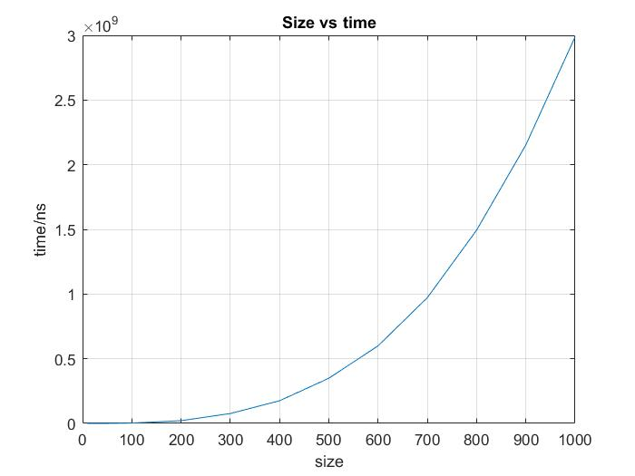
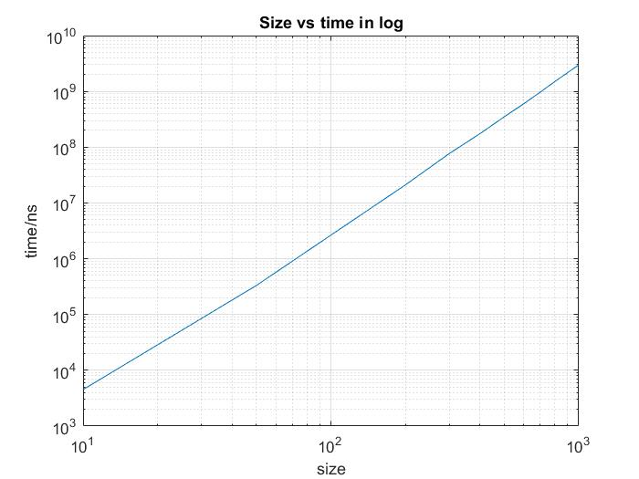

<center> <h1 style="margin-bottom: 0">BEng Project Daybook</h1> </center>
<center> <h2>Yichen Zhang</h2> </center>

# 07/10/2021
- Search for essays about LU decomposition on DiscoverEd and IEEE.
- Write the mission statement.

# 08/10/2021
- Learn the basic grammar of C++.

# 09/10/2021
- Learn something about the memory allocation in C++.

Typically, all memory needs were determined before program execution by defining the variables needed. Therefore, it is not recommended to use dynamic array, although some compiler like *gcc* allows the dynamic array initialization.

In C, we usually use ==malloc== to allocate memory. However, in C++, ==new== and ==delete== are used.

```cpp
int *a;
a = new int[10];
```

## Dynamic 2D array
Although dynamic array is not allowed, C++11 allows the below initialization if the row length is a compile time constant.

```cpp
auto arr2d = new int [nrows][CONSTANT];
```

If not, we can use the code below, which creates an array of pointers to arrays to allow 2D syntax like contiguous 2D arrays.
```cpp
int** a = new int*[rowCount];
for(int i = 0; i < rowCount; ++i)
    a[i] = new int[colCount];
```


Although this method gives us the desired indexing syntax, it is doubly inefficient: big and slow both in space and time. It creates a dynamic array of pointers, then initializing each pointer to its own, independent dynamic array. Each "row" in the matrix is a separately allocated dynamic array. Making a heap allocation is expensive both in time and space. The allocator takes time to make the allocation, sometimes running O(n) algorithms to do it. And the allocator "pads" each of your row arrays with extra bytes for bookkeeping and alignment. That extra space costs...well...extra space. The deallocator will also take extra time when you go to deallocate the matrix, painstakingly free-ing up each individual row allocation.

The better solution is to allocate your whole matrix as a single dynamic array, then use (slightly) clever indexing math of your own to access cells.

```cpp
class Matrix
{
    int *array;
    int m_width;

public:
    Matrix(int w, int h) : m_width(w), array(new int[w * h]) {}
    ~Matrix() { delete[] array; }
    int at(int y, int x) const { return array[index(y, x)]; }
    void set(int t, int y, int x) { array[index(y, x)] = t; }
    int getwidth() { return m_width; }
    void display()
    {
        for (int i = 0; i < m_width; i++)
        {
            for (int j = 0; j < m_width; j++)
                cout << array[index(i, j)] << " ";
            cout << endl;
        }
    }

protected:
    int index(int y, int x) const { return x + m_width * y; }
};
```

# 10/10/2021
## Time in C++
The chrono library, a flexible collection of types that track time with varying degrees of precision.

```cpp
#include <chrono>

std::chrono::steady_clock::time_point begin = std::chrono::steady_clock::now();
std::chrono::steady_clock::time_point end = std::chrono::steady_clock::now();

std::cout << "Time difference = " << std::chrono::duration_cast<std::chrono::microseconds>(end - begin).count() << "[µs]" << std::endl;
std::cout << "Time difference = " << std::chrono::duration_cast<std::chrono::nanoseconds> (end - begin).count() << "[ns]" << std::endl;
```
Class std::chrono::steady_clock represents a monotonic clock. The time points of this clock cannot decrease as physical time moves forward and the time between ticks of this clock is constant. This clock is not related to wall clock time (for example, it can be time since last reboot), and is **most suitable for measuring intervals**.

## Random Number
- Mersenne Twister 19937 generator
A Mersenne Twister pseudo-random generator of 32-bit numbers with a state size of 19937 bits.

```cpp
#include <iostream>
#include <random>
int main()
{
    int seed = 2021;

    std::random_device rd;
    std::mt19937 gen(seed);
    std::uniform_int_distribution<unsigned> distrib(1, 10);

    std::cout << distrib(gen);

    return 0;
}
```

## oneAPI
Setup oneAPI in VSCode according to the [official document](https://devcloud.intel.com/oneapi/get_started/hpcToolkitSamples/).


# 11/10/2021
## Subsystem for Windows -- WSL2
- Install wsl2 - ubuntu 20.04 LTS according to the [official document](https://docs.microsoft.com/en-gb/windows/wsl/install-manual#step-4---download-the-linux-kernel-update-package).
```bash
sudo apt install build-essential cmake zlib1g
```

- [CUDA installation in ubuntu](https://docs.nvidia.com/cuda/wsl-user-guide/index.html#wsl2-system-requirements).

### Install Clang in wsl2 according to the [official document](https://clang.llvm.org/get_started.html).

- XShell connect for wsl2

```bash
sudo apt update
sudo apt upgrade
sudo apt autoremove --purge openssh-server -y && sudo apt install openssh-server -y
sudo vim /etc/ssh/sshd_config
# change port to 2222
sudo service ssh --full-restart
```
Then use Xshell to connect the Subsystem.

# 12/10/2021
If you want to move WSL2 Linux distro(Ubuntu) from C: drive D: below are the steps.

**Export Ubuntu**
```bash
mkdir D:\backup
wsl --export Ubuntu D:\backup\ubuntu.tar
```

**Unregister the same distribution to remove it from the C: drive:**
```bash
wsl --unregister Ubuntu
```

**Import Ubuntu**
```bash
mkdir D:\wsl
wsl --import Ubuntu D:\wsl\ D:\backup\ubuntu.tar
```

**By default Ubuntu will use root as the default user, to switch back to previous user. Go to the Ubuntu App Folder run command to set default user.**
```bash
cd %userprofile%\AppData\Local\Microsoft\WindowsApps
ubuntu.exe config --default-user <username>
```

## Modify the method of [install clang in Ubuntu](#install-clang-in-wsl2-according-to-the-official-document)
The installation of clang from source code would cause some strange problem. It almost takes me about 100Gb space.
In fact, ubuntu distribution provides the easy way to install clang through apt. The detail step can be found [here](https://apt.llvm.org/).
```bash
wget -O - https://apt.llvm.org/llvm-snapshot.gpg.key|sudo apt-key add -
sudo add-apt-repository "deb http://apt.llvm.org/focal/ llvm-toolchain-focal-13 main"
sudo apt update
# LLVM
sudo apt-get install libllvm-13-ocaml-dev libllvm13 llvm-13 llvm-13-dev llvm-13-doc llvm-13-examples llvm-13-runtime
# Clang and co, the package python-clang-13 may be unavailable
sudo apt-get install clang-13 clang-tools-13 clang-13-doc libclang-common-13-dev libclang-13-dev libclang1-13 clang-format-13 python-clang-13 clangd-13
# libfuzzer
sudo apt-get install libfuzzer-13-dev
# lldb
sudo apt-get install lldb-13
# lld (linker)
sudo apt-get install lld-13
# libc++
sudo apt-get install libc++-13-dev libc++abi-13-dev
# OpenMP
sudo apt-get install libomp-13-dev
# libclc
sudo apt-get install libclc-13-dev
# libunwind
sudo apt-get install libunwind-13-dev


sudo apt-get install libllvm-13-ocaml-dev libllvm13 llvm-13 llvm-13-dev llvm-13-doc llvm-13-examples llvm-13-runtime clang-13 clang-tools-13 clang-13-doc libclang-common-13-dev libclang-13-dev libclang1-13 clang-format-13 clangd-13 libfuzzer-13-dev lldb-13 lld-13 libc++-13-dev libc++abi-13-dev libomp-13-dev libclc-13-dev libunwind-13-dev
```

# 13/10/2021
## Basic use of clang
- Compile C
The compilation of C language is performed by command *clang-13*.

- Compile C++
The compilation of C language is performed by command *clang++-13*.


# 14/10/2021
Today, I move the project to wsl and setup clang in Ubuntu.

## Vector
The vector template class is similar to the string class in that it is a dynamic array.You
can set the size of a vector object during runtime, and you can append new data to the
end or insert new data in the middle. Basically, it’s an alternative to using new to create a
dynamic array.Actually, the vector class does use new and delete to manage memory,
but it does so automatically.
```cpp
#include <vector>
...
using namespace std;
vector<int> vi; // create a zero-size array of int
int n;
cin >> n;
vector<double> vd(n); // create an array of n doubles
```

## Array
The vector class has more capabilities than the built-in array type, but this comes at a
cost of slightly less efficiency. If all you need is a fixed-size array, it could be advantageous
to use the built-in type. However, that has its own costs of lessened convenience and
safety.
```cpp
#include <array>
...
using namespace std;
array<int, 5> ai; // create array object of 5 ints
array<double, 4> ad = {1.2, 2.1, 3.43. 4.3};
```

# 18/10/2021

## LU decomposition
In numerical analysis and linear algebra, lower–upper (LU) decomposition or factorization factors a matrix as the product of a lower triangular matrix and an upper triangular matrix. The product sometimes includes a permutation matrix as well. LU decomposition can be viewed as the matrix form of Gaussian elimination. Computers usually solve square systems of linear equations using LU decomposition, and it is also a key step when inverting a matrix or computing the determinant of a matrix.

The basic procedure is shown in the figure below. We can calculate the coefficients according to the order of colour.

We can see from the figure that elements of the same color can be calculated parallelly. For example, $u_{11}\ u_{12}\ u_{13}$ and $u_{14}$ can be obtained at the same time. After we obtain $u_{11}$, we can simultaneously get the value of the first column, that is to say $l_{21}\ l_{31}$ and $l_{41}$.


The prerequisite of LU decomposition can be seen [here](http://arxiv.org/pdf/math/0506382v1.pdf).

- Create a 2D array
```cpp
vector<vector<double>> matrix(SIZE, vector<double>(SIZE));
```

- Pass a 2D array to function
```cpp
void LUdecomposition(vector<vector<double>> &a, vector<vector<double>> &l, vector<vector<double>> &u);
```

# 19/10/2021
- Read and write the basic LU decomposition code in C++ and time it, seen in [here](C/vector2D2.cpp).
This method is also called Doolittle decomposition.


# 20/10/2021
Explore some other methods to realize LU decomposition.
- **Crout matrix decomposition**

    The Crout matrix decomposition algorithm differs slightly from the Doolittle method. Doolittle's method returns a unit lower triangular matrix and an upper triangular matrix, while the Crout method returns a lower triangular matrix and a unit upper triangular matrix.

    The code can be seen [here](C/vector2D.cpp).

- **Tridiagonal matrix algorithm**

  In numerical linear algebra, the tridiagonal matrix algorithm, also known as the Thomas algorithm (named after Llewellyn Thomas), is a simplified form of Gaussian elimination that can be used to solve tridiagonal systems of equations. A tridiagonal system for n unknowns may be written as

    $a_{i}x_{i-1}+b_{i}x_{i}+c_{i}x_{i+1}=d_{i},$
    where $a_1 = 0$ and $c_{n}=0$.

    $
    \begin{bmatrix}
    b_{1} & c_{1} &        &        & 0       \\
    a_{2} & b_{2} & c_{2}  &        &         \\
          & a_{3} & b_{3}  & \ddots &         \\
          &       & \ddots & \ddots & c_{n-1} \\
    0     &       &        & a_{n}  & b_{n}
    \end{bmatrix}
    \begin{bmatrix}
        x_{1}  \\
        x_{2}  \\
        x_{3}  \\
        \vdots \\
        x_{n}
    \end{bmatrix}=
    \begin{bmatrix}
        d_{1}  \\
        d_{2}  \\
        d_{3}  \\
        \vdots \\
        d_{n}
    \end{bmatrix}
    $

    By Gaussian elimination, we only need to eliminate one elements per step. The procedure is shown below.
    $
    \begin{cases}
        \beta_1=b_1,\quad y_1=d_1;\\
        l_i=\frac{a_i}{\beta_{i-1}},\quad \beta_i=b_i-l_ic_{i-1},\quad y_i=d_i-l_iy_{i-1}\qquad (i=2,3,\dots,n)
    \end{cases}
    $
    Then, we can obtain the following result.
    $\begin{bmatrix}
        \beta_{1} & c_{1}     &           &        & 0         & y_1     \\
                  & \beta_{2} & c_{2}     &        &           & y_2     \\
                  &           & \beta_{3} & \ddots &           & \vdots  \\
                  &           &           & \ddots & c_{n-1}   & y_{n-1} \\
        0         &           &           &        & \beta_{n} & y_n
    \end{bmatrix}
    $

# 21/20/2021
- **Pivot element**

    The pivot or pivot element is the element of a matrix, or an array, which is selected first by an algorithm (e.g. Gaussian elimination, simplex algorithm, etc.), to do certain calculations. In the case of matrix algorithms, a pivot entry is usually required to be at least distinct from zero, and often distant from it; in this case finding this element is called pivoting. Pivoting may be followed by an interchange of rows or columns to bring the pivot to a fixed position and allow the algorithm to proceed successfully, and possibly to reduce round-off error. It is often used for verifying row echelon form.

    Pivoting might be thought of as swapping or sorting rows or columns in a matrix, and thus it can be represented as multiplication by permutation matrices. However, algorithms rarely move the matrix elements because this would cost too much time; instead, they just keep track of the permutations.

    Overall, pivoting adds more operations to the computational cost of an algorithm. These additional operations are sometimes necessary for the algorithm to work at all. Other times these additional operations are worthwhile because they add numerical stability to the final result.

- In the case of Gaussian elimination, the algorithm requires that pivot elements not be zero. Interchanging rows or columns in the case of a zero pivot element is necessary.
- In Gaussian elimination, it is generally desirable to choose a pivot element with large absolute value. This improves the numerical stability.

**Implement LU decomposition with partial pivoting**
The strategy we use for swapping rows in step k is to find the largest element in column k below (and including) the diagonal — the so-called pivot element — and swap its row with row k. This process is referred to as partial (row) pivoting. Partial column pivoting and complete (row and column) pivoting are also possible, but not very popular.

During coding, I think it is not suitable to swap the rows as it will cost much memory to store and move the array. Therefore, I use the pointers to point to the certain row.
```cpp
vector<double> *pivot[SIZE];
```

To sort the first column of the 2D array, I define the following template.
```cpp
template <typename T>
vector<size_t> sort_indexes(const vector<T> &v)
{

    // initialize original index locations
    vector<size_t> idx(v.size());
    iota(idx.begin(), idx.end(), 0);

    // sort indexes based on comparing values in v
    // using std::stable_sort instead of std::sort
    // to avoid unnecessary index re-orderings
    // when v contains elements of equal values
    stable_sort(idx.begin(), idx.end(),
                [&v](size_t i1, size_t i2)
                { return v[i1] > v[i2]; });

    return idx;
}
```

The complete code can be seen [here](C/lupivot.cpp).


# 22/20/2021
## Eigen Library
*Eigen* is a C++ template library for linear algebra: matrices, vectors, numerical solvers, and related algorithms.

You can download Eigen from [here](https://gitlab.com/libeigen/eigen.git).


# 25/20/2021
- Meeting
    Blas library, SIMD, Godbolt, addressSanitzer


# 26/20/2021
## Call program in C++
The **popen()** function shall execute the command specified by the string command. It shall create a pipe between the calling program and the executed command, and shall return a pointer to a stream that can be used to either read from or write to the pipe.

FILE *popen(const char *command, const char *mode);


```cpp
#include <string>
#include <iostream>
#include <array>

int main()
{
    std::string command("ls");

    std::array<char, 128> buffer;
    std::string result;

    std::cout << "Opening reading pipe" << std::endl;
    FILE* pipe = popen(command.c_str(), "r");
    if (!pipe)
    {
        std::cerr << "Couldn't start command." << std::endl;
        return 0;
    }
    while (fgets(buffer.data(), 128, pipe) != NULL) {
        std::cout << "Reading..." << std::endl;
        result += buffer.data();
    }
    auto returnCode = pclose(pipe);

    std::cout << result << std::endl;
    std::cout << returnCode << std::endl;

    return 0;
}
```

To open the popen multiple times, just assign *pipe=popen(command.c_str(),"r")*.


# 27/20/2021
## regex in C++
A regular expression or regex is an expression containing a sequence of characters that define a particular search pattern that can be used in string searching algorithms, find or find/replace algorithms, etc. Regexes are also used for input validation. From C++11 onwards, C++ provides regex support by means of the standard library via the <regex> header.

- regex_match()

    Returns whether the target sequence matches the regular expression rgx. The target sequence is either s or the character sequence between first and last, depending on the version used.
See [here](C/regex.cpp) as an example.

- regex_search()

    Returns whether some sub-sequence in the target sequence (the subject) matches the regular expression rgx (the pattern). The target sequence is either s or the character sequence between first and last, depending on the version used.

```cpp
#include <iostream>
#include <regex>
#include<string.h>
using namespace std;

int main()
{
    //string to be searched
    string mystr = "She sells_sea shells in the sea shore";

    // regex expression for pattern to be searched
    regex regexp("s[a-z_]+");

    // flag type for determining the matching behavior (in this case on string objects)
     smatch m;

    // regex_search that searches pattern regexp in the string mystr
    regex_search(mystr, m, regexp);

    cout<<"String that matches the pattern:"<<endl;
    for (auto x : m)
        cout << x << " ";
    return 0;
}
```

- Iterative search

    The function *regex_serach()* stops after the first match is found. In order to find all the matches, we need to iterate the string.
    ```cpp
    string::const_iterator searchStart(str.cbegin());
    ```
    See [here](C/regex2.cpp) as an example.

### Implementation - Read stdout from popen and calculate average running time
Now we have obtain the stdout from popen, we can just use the regex to find the digits in the stdout. As it is of string type, we use function *stoi()* to change it to int type.
Some similar functions are also available, which convert string to different types of data: *stoi(),stol(),stoll(),stof(),stod()*

Here I use [vector2D2.cpp](C/vector2D2.cpp) as an example to calculate its average running time in nanoseconds. The code can be seen [here](C/average.cpp).

## Command line arguments in C++
```cpp
int main(int argc, char *argv[]) { /* ... */ }
```
- **argc (ARGument Count)** is int and stores number of command-line arguments passed by the user including the name of the program. So if we pass a value to a program, value of argc would be 2 (one for argument and one for program name)
- The value of argc should be non negative.
- **argv(ARGument Vector)** is array of character pointers listing all the arguments.
- If argc is greater than zero,the array elements from argv[0] to argv[argc-1] will contain pointers to strings.
- **argv[0]** is the name of the program , After that till argv[argc-1] every element is command -line arguments.

See [here](C/command.cpp) and [here](C/command2.cpp) as examples.

When pharsing the command arguments, we should pay attention to the string literal. We should not directly compare string literal like *"abc"==str*, else it would generate the warning *warning: result of comparison against a string literal is unspecified (use an explicit string comparison function instead) [-Wstring-compare]*.

To convert string literal to basic string, we can use the following expression.
```cpp
std::string{"--size"};
\\ Then we can compare two strings like this
if (std::string{"--size"}.compare(argv[1]) == 0 || std::string{"-t"}.compare(argv[1]) == 0)
    size = std::stoi(argv[2]);
```


# 28/10/2021
## Modify sorting method
Before, I use the lambda function *[&v](size_t i1, size_t i2) { return v[i1] > v[i2]; }* to sort the 2D vector *v*. It is really a waste of resource as when pivoting, we only need to sort the elements in the first column. Therefore, I change the lambda function to
```cpp
[&v](size_t i1, size_t i2) { return v[i1][0] > v[i2][0]
```

## Improve pivoting method
Referring to the this [picture](#lu-decomposition), as we can see we that the pivoting only change the order of rows. Therefore, instead of using the confusing double pointers, we can just improve the index method in the function that processes the LU decomposition.


# 29/10/2021
## Average Time
Run [this file](C/average.cpp) and use this [python file](C/plot.py) to do the data analysis, we can get the following results.

- [Unit Upper Matrix](C/vector2D_cmd.cpp)

| Size  |     1      |     2      |     3      |     4      |     5      |     6      |     7      |     8      |     9      |     10     | Average/ns |
| :---: | :--------: | :--------: | :--------: | :--------: | :--------: | :--------: | :--------: | :--------: | :--------: | :--------: | :--------: |
|  10   |    7500    |    7400    |    7500    |    7600    |    7600    |    7700    |    7600    |    7700    |    7500    |    7500    |    7560    |
|  100  |  5354600   |  5635400   |  6103100   |  5618200   |  5535400   |  5595800   |  5493700   |  5529800   |  5481500   |  5521000   |  5586850   |
| 1000  | 6296450000 | 5933703900 | 5817111600 | 6171353100 | 6404558300 | 6327489400 | 6148815500 | 5859176300 | 6250348000 | 5936436600 | 6114544270 |

- [Unit Lower Matrix](C/vector2D2_cmd.cpp)

| Size  |     1      |     2      |     3      |     4      |     5      |     6      |     7      |     8      |     9      |     10     | Average/ns |
| :---: | :--------: | :--------: | :--------: | :--------: | :--------: | :--------: | :--------: | :--------: | :--------: | :--------: | :--------: |
|  10   |    4600    |    4600    |    4700    |    4500    |    4500    |    4500    |    4500    |    4500    |    4400    |    4400    |    4520    |
|  100  |  2519500   |  2524500   |  2644500   |  2611600   |  2612100   |  2640300   |  2678100   |  2624900   |  2692200   |  2630800   |  2617850   |
| 1000  | 3113208100 | 2988923000 | 3269425400 | 3286484600 | 3148100500 | 2992652400 | 2955939200 | 2924984400 | 3067201200 | 2982538000 | 3072945680 |

We can see that generating the unit lower matrix takes only half of the time used to generating unit upper matrix.

## Plotting size vs. time



|    Size    |   10    |   50    |     100     |     200     |     300     |     400     |     500     |     600     |     700     |     800     |     900     |    1000     |
| :--------: | :-----: | :-----: | :---------: | :---------: | :---------: | :---------: | :---------: | :---------: | :---------: | :---------: | :---------: | :---------: |
|   Min/ns   |  4200   | 325400  | 2.6079e+06  | 2.02028e+07 | 7.02289e+07 | 1.69538e+08 | 3.37447e+08 | 5.87493e+08 | 9.45789e+08 | 1.4328e+09  | 2.06449e+09 | 2.88108e+09 |
|   Max/ns   |  5500   | 344700  | 2.7748e+06  | 2.20007e+07 | 9.23483e+07 | 1.87164e+08 | 3.80535e+08 | 6.29523e+08 | 1.01735e+09 | 1.58730e+09 | 2.30508e+09 | 3.14836e+09 |
| Average/ns |  4510   | 330980  | 2.64886e+06 | 2.11262e+07 | 7.65326e+07 | 1.75259e+08 | 3.49224e+08 | 5.99978e+08 | 9.72344e+08 | 1.49411e+09 | 2.15321e+09 | 2.98877e+09 |
|    Std     | 366.515 | 7136.88 |   48600.8   |   665218    |  6.52e+06   | 5.47941e+06 | 1.36531e+07 | 1.52711e+07 | 2.83089e+07 |  4.968e+07  | 6.99554e+07 | 9.31581e+07 |

The raw data can be seen [here](C/data_vector2D2_cmd.csv).

## Applying Pivoting
Complie [this file](C/lupivot_cmd.cpp) and benchmark it.

|    Size    |   10    |   50    |     100     |     200     |     300     |     400     |     500     |     600     |     700     |     800     |     900     |    1000     |
| :--------: | :-----: | :-----: | :---------: | :---------: | :---------: | :---------: | :---------: | :---------: | :---------: | :---------: | :---------: | :---------: |
|   Min/ns   |  6900   | 351600  | 2.6485e+06  | 1.99546e+07 | 6.82955e+07 | 1.6605e+08  | 3.30141e+08 | 5.76617e+08 | 9.46854e+08 | 1.39773e+09 | 2.00769e+09 | 2.83992e+09 |
|   Max/ns   |  7400   | 433400  | 3.0041e+06  | 2.14507e+07 | 7.29326e+07 | 1.74053e+08 | 3.48167e+08 | 6.13007e+08 | 1.01966e+09 | 1.49614e+09 | 2.18191e+09 | 3.1699e+09  |
| Average/ns |  7050   | 367440  | 2.76871e+06 | 2.05085e+07 | 7.03571e+07 | 1.69232e+08 | 3.37246e+08 | 5.88005e+08 | 9.76316e+08 | 1.44798e+09 | 2.0887e+09  | 2.9219e+09  |
|    Std     | 190.029 | 24797.8 |   126962    |   564074    | 1.50051e+06 | 2.59775e+06 | 6.96796e+06 | 1.14664e+07 | 2.26643e+07 | 3.71105e+07 | 6.27895e+07 | 9.96861e+07 |

We can see from this table, for smaller matrix, direct calculation without pivoting takes shorter time. However, when the matrix becomes larger, applying pivoting seems to take shorter time.

## Applying Pivoting with Optimiaztion
Code Generation Options
**-O0, -O1, -O2, -O3, -Ofast, -Os, -Oz, -Og, -O, -O4**
Specify which optimization level to use:

- -O0 Means “no optimization”: this level compiles the fastest and generates the most debuggable code.

- -O1 Somewhere between -O0 and -O2.

- -O2 Moderate level of optimization which enables most optimizations.

- -O3 Like -O2, except that it enables optimizations that take longer to perform or that may generate larger code (in an attempt to make the program run faster).

- -Ofast Enables all the optimizations from -O3 along with other aggressive optimizations that may violate strict compliance with language standards.

- -Os Like -O2 with extra optimizations to reduce code size.

- -Oz Like -Os (and thus -O2), but reduces code size further.

- -Og Like -O1. In future versions, this option might disable different optimizations in order to improve debuggability.

- -O Equivalent to -O1.

- -O4 and higher: Currently equivalent to -O3

Here, I just use -O1 -O2 and -O3 to compare their optimization performance, using the pivoting version.
### -O1
Generated program file size: 239,792 bytes.
|    Size    |   10    |   50    |   100   |     200     |     300     |     400     |     500     |     600     |     700     |     800     |     900     |    1000     |
| :--------: | :-----: | :-----: | :-----: | :---------: | :---------: | :---------: | :---------: | :---------: | :---------: | :---------: | :---------: | :---------: |
|   Min/ns   |  1600   |  35200  | 276300  | 2.5227e+06  | 9.1234e+06  | 2.13975e+07 | 4.25958e+07 | 7.32642e+07 | 1.17447e+08 | 1.76958e+08 | 2.53966e+08 | 3.54493e+08 |
|   Max/ns   |  11600  |  35800  | 405200  | 2.9081e+06  | 9.5569e+06  | 2.42021e+07 | 4.43788e+07 | 7.83985e+07 | 1.2809e+08  | 1.95221e+08 | 2.65873e+08 | 3.90405e+08 |
| Average/ns |  2710   |  35400  | 294150  | 2.72036e+06 | 9.26022e+06 | 2.25599e+07 | 4.37749e+07 | 7.58599e+07 | 1.21271e+08 | 1.83169e+08 | 2.59565e+08 | 3.6739e+08  |
|    Std     | 3124.26 | 176.383 | 39683.5 |   130428    |   128625    |   883427    |   632262    | 1.67641e+06 | 3.17307e+06 | 5.90221e+06 | 4.42041e+06 | 1.17483e+07 |

For -O1 optimization, although it is the lowest level optimization which may even be disabled in future versions, it still can have a huge improvement on the code running speed.

### -O2
Generated program file size: 246,592 bytes.
|    Size    |   10    |   50    |   100   |     200     |     300     |     400     |     500     |     600     |     700     |     800     |     900     |    1000     |
| :--------: | :-----: | :-----: | :-----: | :---------: | :---------: | :---------: | :---------: | :---------: | :---------: | :---------: | :---------: | :---------: |
|   Min/ns   |  1700   |  34000  | 263400  | 2.4344e+06  | 8.8094e+06  | 2.17311e+07 | 4.36713e+07 | 7.40188e+07 | 1.18953e+08 | 1.76504e+08 | 2.53805e+08 | 3.51842e+08 |
|   Max/ns   |  2300   |  48900  | 486300  | 2.7194e+06  | 9.2639e+06  | 2.56107e+07 | 5.50271e+07 | 8.57368e+07 | 1.37359e+08 | 1.82409e+08 | 2.6272e+08  | 3.76579e+08 |
| Average/ns |  1820   |  35550  | 286630  | 2.54913e+06 | 9.00811e+06 | 2.28296e+07 | 4.63671e+07 | 7.85138e+07 | 1.2542e+08  | 1.79779e+08 | 2.57425e+08 | 3.58207e+08 |
|    Std     | 175.119 | 4690.95 | 70158.5 |   96246.8   |   140801    | 1.46566e+06 | 3.58374e+06 | 4.01635e+06 | 7.2362e+06  | 2.14714e+06 | 3.08569e+06 | 7.62912e+06 |

For -O2 optimization, we can see that it only improves a little bit compared with -O1 optimiazation. For matrix of small size, it may even take longer time that -O1.

### -O3
Generated program file size: 239,664 bytes.
|    Size    |   10    |   50    |   100   |     200     |     300     |     400     |     500     |     600     |     700     |     800     |     900     |    1000     |
| :--------: | :-----: | :-----: | :-----: | :---------: | :---------: | :---------: | :---------: | :---------: | :---------: | :---------: | :---------: | :---------: |
|   Min/ns   |  1700   |  35200  | 272300  | 2.4862e+06  | 9.1195e+06  | 2.26536e+07 | 4.41742e+07 | 7.38106e+07 | 1.18794e+08 | 1.79443e+08 | 2.5895e+08  | 3.54238e+08 |
|   Max/ns   |  2000   |  45300  | 287100  | 2.9811e+06  |  9.898e+06  | 2.75894e+07 | 6.2371e+07  | 8.64118e+07 | 1.35811e+08 | 1.95474e+08 | 2.68321e+08 | 4.00137e+08 |
| Average/ns |  1820   |  36490  | 275000  | 2.65022e+06 | 9.46781e+06 | 2.44977e+07 | 4.76217e+07 | 7.84136e+07 | 1.25075e+08 | 1.85405e+08 | 2.64357e+08 | 3.66971e+08 |
|    Std     | 91.8937 | 3101.06 | 4470.89 |   173349    |   230121    | 1.65124e+06 | 5.68526e+06 | 3.63261e+06 | 5.61578e+06 | 4.75985e+06 | 3.1652e+06  | 1.36055e+07 |

-O3 optimization does not actually optimizes the program better. On the contrary, it even takes longer time than -O2 optimization, or even -O1 optimization.

### -Os
Generated program file size: 234,952 bytes.
|    Size    |   10    |   50    |   100   |     200     |     300     |     400     |     500     |     600     |     700     |     800     |     900     |    1000     |
| :--------: | :-----: | :-----: | :-----: | :---------: | :---------: | :---------: | :---------: | :---------: | :---------: | :---------: | :---------: | :---------: |
|   Min/ns   |  1600   |  33700  | 265200  | 2.4934e+06  | 8.5937e+06  | 2.13379e+07 | 4.16037e+07 | 7.26023e+07 | 1.16742e+08 | 1.75238e+08 | 2.5293e+08  | 3.48717e+08 |
|   Max/ns   |  1700   |  33900  | 345600  | 2.6767e+06  | 9.5606e+06  | 2.49337e+07 | 4.62225e+07 | 7.69927e+07 | 1.30668e+08 | 1.82161e+08 | 2.70754e+08 | 3.64464e+08 |
| Average/ns |  1630   |  33810  | 279760  | 2.56172e+06 | 8.91332e+06 | 2.29585e+07 | 4.41619e+07 | 7.52562e+07 | 1.21375e+08 | 1.78978e+08 | 2.57203e+08 | 3.57016e+08 |
|    Std     | 48.3046 | 73.7865 | 23717.4 |   61534.3   |   291454    | 1.24339e+06 | 1.4083e+06  | 1.47241e+06 | 4.50567e+06 | 2.14677e+06 | 5.24742e+06 | 5.51337e+06 |

The performance of -Os optimization is very similar to -O2 optimization. However, it reduces the size of the generated program by about 5kb.


# 01/11/2021
## Compile with different standard
### C++11
|    Size    |   10    |   50    |   100   |     200     |     300     |     400     |     500     |     600     |     700     |     800     |     900     |    1000     |
| :--------: | :-----: | :-----: | :-----: | :---------: | :---------: | :---------: | :---------: | :---------: | :---------: | :---------: | :---------: | :---------: |
|   Min/ns   |  1700   |  34800  | 270600  | 2.5062e+06  | 8.6776e+06  | 2.10601e+07 |  4.154e+07  | 7.46669e+07 | 1.17799e+08 | 1.80553e+08 | 2.51407e+08 | 3.52575e+08 |
|   Max/ns   |  2000   |  66700  | 351900  | 2.6425e+06  | 9.2882e+06  | 2.47463e+07 | 4.43749e+07 | 7.7746e+07  | 1.26106e+08 | 1.93509e+08 | 2.70951e+08 | 3.64018e+08 |
| Average/ns |  1790   |  38120  | 287350  | 2.56744e+06 | 9.01914e+06 | 2.24233e+07 | 4.32516e+07 | 7.63582e+07 | 1.20325e+08 | 1.83182e+08 | 2.60746e+08 | 3.58944e+08 |
|    Std     | 87.5595 | 10042.7 | 24365.8 |   42555.1   |   224584    | 1.21243e+06 |   965939    | 1.03681e+06 | 2.58775e+06 | 3.81194e+06 | 5.28702e+06 | 3.71737e+06 |

### C++14
|    Size    |   10    |   50    |  100   |     200     |    300     |     400     |     500     |     600     |     700     |     800     |     900     |    1000     |
| :--------: | :-----: | :-----: | :----: | :---------: | :--------: | :---------: | :---------: | :---------: | :---------: | :---------: | :---------: | :---------: |
|   Min/ns   |  1700   |  34600  | 271600 | 2.5254e+06  | 8.668e+06  | 2.1762e+07  | 4.17012e+07 | 7.24273e+07 | 1.17847e+08 | 1.78933e+08 | 2.54939e+08 | 3.52455e+08 |
|   Max/ns   |  2000   |  34900  | 325600 | 2.7572e+06  | 9.5465e+06 | 2.59562e+07 | 4.4946e+07  | 7.86332e+07 | 1.29241e+08 | 2.02413e+08 | 2.7213e+08  | 3.70173e+08 |
| Average/ns |  1750   |  34770  | 285810 | 2.61206e+06 | 9.1346e+06 | 2.31099e+07 | 4.30997e+07 | 7.54767e+07 | 1.20593e+08 | 1.85676e+08 | 2.6215e+08  | 3.59197e+08 |
|    Std     | 97.1825 | 105.935 | 19387  |   70620.6   |   326047   | 1.47201e+06 | 1.26094e+06 | 2.14597e+06 | 3.40838e+06 | 6.79542e+06 | 6.96695e+06 | 5.76997e+06 |

### C++17
Refer [here](#applying-pivoting-with-optimiaztion)

### C++20
|    Size    |   10    |   50    |   100   |     200     |     300     |     400     |     500     |     600     |     700     |     800     |     900     |    1000     |
| :--------: | :-----: | :-----: | :-----: | :---------: | :---------: | :---------: | :---------: | :---------: | :---------: | :---------: | :---------: | :---------: |
|   Min/ns   |  1600   |  33900  | 264800  | 2.3803e+06  | 8.8654e+06  | 2.08456e+07 | 4.14196e+07 | 7.35763e+07 | 1.16468e+08 | 1.76526e+08 | 2.53443e+08 | 3.53943e+08 |
|   Max/ns   |  1900   |  43800  | 328400  | 4.0596e+06  | 9.3003e+06  | 2.22409e+07 | 4.7719e+07  | 7.71021e+07 | 1.19692e+08 | 1.83057e+08 | 2.67842e+08 | 3.62242e+08 |
| Average/ns |  1710   |  34980  | 277150  | 2.63536e+06 | 8.99809e+06 | 2.13074e+07 | 4.33129e+07 | 7.50939e+07 | 1.1805e+08  | 1.79617e+08 | 2.60511e+08 | 3.5812e+08  |
|    Std     | 73.7865 | 3100.47 | 18870.7 |   502715    |   136289    |   393494    | 1.87443e+06 | 1.15114e+06 |   997693    | 2.16933e+06 | 4.42652e+06 | 2.84784e+06 |


We can see that the standard version of C++ has limited impact on the running speed.

# 05 - 07/11/2021
Prepare for the first presentation

# 09/11/2021
Cleaning up the code.

- Create the header [file](C/lu.h) for all the files.
    Defined some functions
```cpp
// Normal LU decomposition without pivoting
void LUdecomposition(std::vector<std::vector<double>> &a, std::vector<std::vector<double>> &l, std::vector<std::vector<double>> &u)


// LU decomposition with partial pivoting
void LUPivot(std::vector<std::vector<double>> &a, std::vector<std::vector<double>> &l, std::vector<std::vector<double>> &u)


// Index sort the first column of a 2D matrix
template <typename T>
std::vector<size_t> sort_indexes(const std::vector<std::vector<T>> &v)

```

- Fix a problem with previous code.

    In the file [lupivot_cmd](C/lupivot_cmd.cpp), when generating the random matrix, I constantly used the fixed seed, which may bring out much coincidence when measuring the average time. To fix it, I choose to randomly generating the seed as I have done before, by useing the command
    ```cpp
    int seed = std::time(0);
    ```

    When I use the random seed, the average running time increases by about 20%.

# 10/11/2021
## Change the pipe output method.
Set the output of the program that is called inside the master program to the text file using the output redirection.
- ">": overwrite the file.
- ">>": Append write to the previous file.

After changing the output method, the average time drop down again to what I have measured [here](#applying-pivoting-with-optimiaztion) before changing the seed. This is mainly because the program does not need to read the stdout from pipe anymore.

## Looking for some library
- [SuiteSpare](https://github.com/DrTimothyAldenDavis/SuiteSparse)
- [Lapacke](https://github.com/Reference-LAPACK/lapack)
- [Eigen3](https://gitlab.com/libeigen/eigen.git)

```bash
sudo apt install libsuitesparse-dev libmpfr-dev libmpfrc++-dev libsuperlu-dev
```

## Try to create a class for matrix
- Create a class called *Matrix* in [here](C/luclass.cpp).
- Overload the output stream for easy output.


# 11/11/2021
## Looking for method to deploy sparse matrix
Found an example [here](https://github.com/uestla/Sparse-Matrix)

- [HLS](https://www.xilinx.com/support/documentation-navigation/design-hubs/dh0090-vitis-hls-hub.html)
- [Datatype](https://www.xilinx.com/html_docs/xilinx2020_2/vitis_doc/vitis_hls_coding_styles.html#iyg1582649282811)
- [Circuit Matrix](https://sparse.tamu.edu/Freescale/)

## Clean up the code again
- Create a **data** folder to store all the experiment data.
- Create a folder **LU** to store the header file for LU decomposition.
- Create folder **try** and **archive** to store some cpp files which are used to try some features of cpp.

## Improve the measure method
Instead of compiling the source code to program, I choose to measure the time directly in program by calling the function. Therefore, I need to clear the vector when I change the size of the matrix. Using the code below:
```cpp
matrix.clear();
l.clear();
u.clear();
matrix.resize(size, std::vector<double>(size));
l.resize(size, std::vector<double>(size));
u.resize(size, std::vector<double>(size));
```

# 13/11/2021
## Vitis HLS
- Learn the basic use of **HLS**
## vitis_hls Command
To use vitis_hls command, we should first open the *Vitis HLS 2021.2 Command Prompt* from the start window.
- add_files

    Adds design source files to the current project.
    ```tcl
    add_files [OPTIONS] <src_files>
    ```
- cosim_design

    Executes post-synthesis co-simulation of the synthesized RTL with the original C/C++-based test
bench.
    ```tcl
    cosim_design [OPTIONS]
    ```
    **Options**
    - -O: Enables optimized compilation of the C/C++ test bench and RTL wrapper. This increases
compilation time, but results in better runtime performance.
    - -argv <string>: The <string> is passed onto the main C/C++ function.

- csim_design

    Compiles and runs pre-synthesis C/C++ simulation using the provided C/C++ test bench.
    ```tcl
    csim_design [OPTIONS]
    ```
    **Options**
    - -O: Enables optimized compilation of the C/C++ test bench. This increases compilation time,
but results in better runtime performance.
    - -argv <string>: Specifies the argument list for the behavioral test bench. The <string> is passed onto the main() C/C++ function of the test bench.

- csynth_design

    Synthesizes the Vitis HLS project for the active solution.

    The command can be executed only in the context of an active solution. The elaborated design in the database is scheduled and mapped onto RTL, based on any constraints that are set.
    ```tcl
    csynth_design [OPTIONS]
    ```

    **Options**
    -


## Vitis HLS Coding Styles
### Unsupported C/C++ Constructs
While Vitis HLS supports a wide range of the C/C++ languages, some constructs are not synthesizable, or can result in errors further down the design flow. This section discusses areas in which coding changes must be made for the function to be synthesized and implemented in a device.

To be synthesized:
- The function must contain the entire functionality of the design.
- None of the functionality can be performed by system calls to the operating system.
- The C/C++ constructs must be of a fixed or bounded size.
- The implementation of those constructs must be unambiguous.

### System Calls
System calls cannot be synthesized because they are actions that relate to performing some task upon the operating system in which the C/C++ program is running.

Vitis HLS ignores commonly-used system calls that display only data and that have no impact on the execution of the algorithm, such as printf() and fprintf(stdout,). In general, calls to the system cannot be synthesized and should be removed from the function before synthesis. Other examples of such calls are getc(), time(), sleep(), all of which make calls to the operating system.

### Dynamic Memory Usage
Any system calls that manage memory allocation within the system, for example, malloc(), alloc(), and free(), are using resources that exist in the memory of the operating system and are created and released during runtime. To be able to synthesize a hardware implementation the design must be fully self-contained, specifying all required resources.

Memory allocation system calls must be removed from the design code before synthesis. Because dynamic memory operations are used to define the functionality of the design, they must be transformed into equivalent bounded representations.

### Pointer Limitations
- General Pointer Casting
    Vitis HLS does not support general pointer casting, but supports pointer casting between native C/C++ types.
- Pointer Arrays
    Vitis HLS supports pointer arrays for synthesis, provided that each pointer points to a scalar or an array of scalars. Arrays of pointers cannot point to additional pointers.
- Function Pointers
    Function pointers are not supported.

### Standard Template Libraries
Many of the C++ Standard Template Libraries (STLs) contain function recursion and use dynamic memory allocation. For this reason, the STLs cannot be synthesized by Vitis HLS. The solution for STLs is to create a local function with identical functionality that does not feature recursion, dynamic memory allocation, or the dynamic creation and destruction of objects.

---
## Data Types
Vitis HLS supports the synthesis of all standard C/C++ types, including exact-width integer types.
- (unsigned) char, (unsigned) short, (unsigned) int
- (unsigned) long, (unsigned) long long
- (unsigned) intN_t (where N is 8, 16, 32, and 64, as defined in stdint.h)
- float, double

Exact-width integers types are useful for ensuring designs are portable across all types of system.

## C++ Classes and Templates
C++ classes are fully supported for synthesis with Vitis HLS. The top-level for synthesis must be a function. A class cannot be the top-level for synthesis. To synthesize a class member function, instantiate the class itself into function. Do not simply instantiate the top-level class into the testbench.

# 14/11/2021
## Inverse matrix and LU decomposition
Actually, the inverse matrix can also be calculated from LU decomposition, and MATLAB also calculates the inverse matrix by LU decomposition. See [here](https://uk.mathworks.com/help/matlab/ref/inv.html)


To calculate the inverse matrix using LU decomposition, we can follow the procedure below.

$$
A=LU\Rightarrow A^{-1}=\left( LU \right) ^{-1}=U^{-1}L^{-1}
$$

Therefore, we can first obtain the lower matrix *L* and upper matrix *U* first. Then find the inverse matrix of the two matrices respectively, $L_{inv}$ and $U_{inv}$. In this substitution,we let the right-hand vector to be all ones. That is to say:

$$
\begin{aligned}
&l_{11}y_1&&=1\\
&l_{21}y_1+l_{22}y_2&&=1\\
&\phantom{l_{31}}\vdots\phantom{y+l_{32}}\vdots\phantom{y+l}\ddots&&\phantom{=}\vdots \\
&l_{n1}y_1+l_{n2}y_2+\dots+l_{nn}y_n&&=1
\end{aligned}
$$

Then apply [forward substitution](https://en.wikipedia.org/wiki/Triangular_matrix#Forward_and_back_substitution) for *L* and back substitution for *U* to get the inverse matrix for them.

Forward substitution:$\hspace{2cm}
L_{inv\left( i,j \right)}=\left\{ \begin{aligned}
	&1&&,i=j\\
	&0&&,i<j\\
	&-L_{inv\left( i,j \right)}\sum_{k=j}^{i-1}{\left( L_{i,k}L_{inv\left( k,j \right)} \right) } &&,i>j\\
\end{aligned} \right.
$

Backward substitution:$\hspace{1.9cm}
U_{inv\left( i,j \right)}=\left\{ \begin{aligned}
	&U_{i,j}^{-1}&&,i=j\\
	&0&&,i<j\\
	&-U_{inv\left( i,j \right)}\sum_{k=i+1}^{j}{\left( U_{i,k}U_{inv\left( k,j \right)} \right) } &&,i>j\\
\end{aligned} \right.$

Then multiply them together, we can get the inverse matrix.


# 15/11/2021
- Write some codes in HLS
```cpp
#include <hls_vector.h>
#include "ap_int.h"

typedef ap_uint<4> sizet;
const int SIZE = 5;

void LUdecomposition(hls::vector<hls::vector<double,SIZE>,SIZE> &a, hls::vector<hls::vector<double,SIZE>,SIZE> &l, hls::vector<hls::vector<double,SIZE>,SIZE> &u)
{
    // Decomposing matrix into Upper and Lower
    // triangular matrix
	sizet n = SIZE;
    for (sizet i = 0; i < n; i++)
    {
        // Upper Triangular
        for (sizet k = i; k < n; k++)
        {
            // Summation of L(i, j) * U(j, k)
            double sum = 0;
            for (sizet j = 0; j < i; j++)
                sum += (l[i][j] * u[j][k]);

            // Evaluating U(i, k)
            u[i][k] = a[i][k] - sum;
        }

        // Lower Triangular
        for (sizet k = i; k < n; k++)
        {
            if (i == k)
                l[i][i] = 1; // Diagonal as 1
            else
            {
                // Summation of L(k, j) * U(j, i)
                double sum = 0;
                for (sizet j = 0; j < i; j++)
                    sum += (l[k][j] * u[j][i]);

                // Evaluating L(k, i)
                l[k][i] = (a[k][i] - sum) / u[i][i];
            }
        }
    }
}
```

Here, I can only set the size of the matrix to be small. Otherwise, it will pop up an error:
<span style="color:red">ERROR: [HLS 214-256] in function 'LUdecomposition(hls::vector<hls::vector<double, 10ul>, 10ul>&, hls::vector<hls::vector<double, 10ul>, 10ul>&, hls::vector<hls::vector<double, 10ul>, 10ul>&)': Unsupported aggregate pragma/directive on variable 'a' as the bit-width after aggregation (6400) is larger than 4096</span>


## Therfore, for size of **3**, we have:
</center><h2 style="background-color:#f7f7ff;">All Compared Solutions</h2>	<b style="padding-left:20px;">solution1:</b> xcvu11p-flga2577-1-e<br><h2 style="background-color:#f7f7ff;">Performance Estimates</h2><ul><li><b>Timing</b><br><br><ul><table border="1" " cellspacing="0"><th align="center" style="background-color:#CCECFF;">Clock</th><th align="center" style="background-color:#CCECFF;"></th><th align="center" style="background-color:#CCECFF;">solution1</th><tr><td align="null" style="background-color:#CCECFF;">ap_clk</td><td align="null" style="background-color:#CCECFF;">Target</td><td align="null" style="background-color:#CCECFF;">10.00 ns</td></tr><tr><td align="null" style="background-color:#CCECFF;"></td><td align="null" style="background-color:#CCECFF;">Estimated</td><td align="null" style="background-color:#CCECFF;">7.170 ns</td></tr></table></ul></li></ul><ul><li><b>Latency</b><br><br><ul><table border="1" " cellspacing="0"><th align="center" style="background-color:#CCECFF;"></th><th align="center" style="background-color:#CCECFF;"></th><th align="center" style="background-color:#CCECFF;">solution1</th><tr><td align="null" style="background-color:#CCECFF;">Latency (cycles)</td><td align="null" style="background-color:#CCECFF;">min</td><td align="null" style="background-color:#CCECFF;">13</td></tr><tr><td align="null" style="background-color:#CCECFF;"></td><td align="null" style="background-color:#CCECFF;">max</td><td align="null" style="background-color:#CCECFF;">13</td></tr><tr><td align="null" style="background-color:#CCECFF;">Latency (absolute)</td><td align="null" style="background-color:#CCECFF;">min</td><td align="null" style="background-color:#CCECFF;">0.130 us</td></tr><tr><td align="null" style="background-color:#CCECFF;"></td><td align="null" style="background-color:#CCECFF;">max</td><td align="null" style="background-color:#CCECFF;">0.130 us</td></tr><tr><td align="null" style="background-color:#CCECFF;">Interval (cycles)</td><td align="null" style="background-color:#CCECFF;">min</td><td align="null" style="background-color:#CCECFF;">14</td></tr><tr><td align="null" style="background-color:#CCECFF;"></td><td align="null" style="background-color:#CCECFF;">max</td><td align="null" style="background-color:#CCECFF;">14</td></tr></table></ul></li></ul><h2 style="background-color:#f7f7ff;">Utilization Estimates</h2><table border="1" " cellspacing="0"><th align="center" style="background-color:#CCECFF;"></th><th align="center" style="background-color:#CCECFF;">solution1</th><tr><td align="null" style="background-color:#CCECFF;">BRAM_18K</td><td align="null" style="background-color:#CCECFF;">0</td></tr><tr><td align="null" style="background-color:#CCECFF;">DSP</td><td align="null" style="background-color:#CCECFF;">11</td></tr><tr><td align="null" style="background-color:#CCECFF;">FF</td><td align="null" style="background-color:#CCECFF;">9639</td></tr><tr><td align="null" style="background-color:#CCECFF;">LUT</td><td align="null" style="background-color:#CCECFF;">70527</td></tr><tr><td align="null" style="background-color:#CCECFF;">URAM</td><td align="null" style="background-color:#CCECFF;">0</td></tr></table><h2 style="background-color:#f7f7ff;">Resource Usage Implementation</h2><table border="1" " cellspacing="0"><th align="center" style="background-color:#CCECFF;"></th><th align="center" style="background-color:#CCECFF;">solution1</th><tr><td align="null" style="background-color:#CCECFF;">RTL</td><td align="null" style="background-color:#CCECFF;">verilog</td></tr><tr><td align="null" style="background-color:#CCECFF;">SLICE</td><td align="center" style="background-color:#CCECFF;">-</td></tr><tr><td align="null" style="background-color:#CCECFF;">LUT</td><td align="center" style="background-color:#CCECFF;">-</td></tr><tr><td align="null" style="background-color:#CCECFF;">FF</td><td align="center" style="background-color:#CCECFF;">-</td></tr><tr><td align="null" style="background-color:#CCECFF;">DSP</td><td align="center" style="background-color:#CCECFF;">-</td></tr><tr><td align="null" style="background-color:#CCECFF;">SRL</td><td align="center" style="background-color:#CCECFF;">-</td></tr><tr><td align="null" style="background-color:#CCECFF;">BRAM</td><td align="center" style="background-color:#CCECFF;">-</td></tr></table>	<b style="padding-left:20px;"></b> Need to run vivado synthesis/implementation to populate the real data for "-"<br><h2 style="background-color:#f7f7ff;">Final Timing Implementation</h2><table border="1" " cellspacing="0"><th align="center" style="background-color:#CCECFF;"></th><th align="center" style="background-color:#CCECFF;">solution1</th><tr><td align="null" style="background-color:#CCECFF;">RTL</td><td align="null" style="background-color:#CCECFF;">verilog</td></tr><tr><td align="null" style="background-color:#CCECFF;">CP required</td><td align="center" style="background-color:#CCECFF;">-</td></tr><tr><td align="null" style="background-color:#CCECFF;">CP achieved post-synthesis</td><td align="center" style="background-color:#CCECFF;">-</td></tr><tr><td align="null" style="background-color:#CCECFF;">CP achieved post-implementation</td><td align="center" style="background-color:#CCECFF;">-</td></tr></table>	<b style="padding-left:20px;"></b> Need to run vivado synthesis/implementation to populate the real data for "-"<br>

---

## For size of **4**, we have:
</center><h2 style="background-color:#f7f7ff;">All Compared Solutions</h2>	<b style="padding-left:20px;">solution1:</b> xcvu11p-flga2577-1-e<br><h2 style="background-color:#f7f7ff;">Performance Estimates</h2><ul><li><b>Timing</b><br><br><ul><table border="1" " cellspacing="0"><th align="center" style="background-color:#CCECFF;">Clock</th><th align="center" style="background-color:#CCECFF;"></th><th align="center" style="background-color:#CCECFF;">solution1</th><tr><td align="null" style="background-color:#CCECFF;">ap_clk</td><td align="null" style="background-color:#CCECFF;">Target</td><td align="null" style="background-color:#CCECFF;">10.00 ns</td></tr><tr><td align="null" style="background-color:#CCECFF;"></td><td align="null" style="background-color:#CCECFF;">Estimated</td><td align="null" style="background-color:#CCECFF;">7.158 ns</td></tr></table></ul></li></ul><ul><li><b>Latency</b><br><br><ul><table border="1" " cellspacing="0"><th align="center" style="background-color:#CCECFF;"></th><th align="center" style="background-color:#CCECFF;"></th><th align="center" style="background-color:#CCECFF;">solution1</th><tr><td align="null" style="background-color:#CCECFF;">Latency (cycles)</td><td align="null" style="background-color:#CCECFF;">min</td><td align="null" style="background-color:#CCECFF;">?</td></tr><tr><td align="null" style="background-color:#CCECFF;"></td><td align="null" style="background-color:#CCECFF;">max</td><td align="null" style="background-color:#CCECFF;">?</td></tr><tr><td align="null" style="background-color:#CCECFF;">Latency (absolute)</td><td align="null" style="background-color:#CCECFF;">min</td><td align="null" style="background-color:#CCECFF;">?</td></tr><tr><td align="null" style="background-color:#CCECFF;"></td><td align="null" style="background-color:#CCECFF;">max</td><td align="null" style="background-color:#CCECFF;">?</td></tr><tr><td align="null" style="background-color:#CCECFF;">Interval (cycles)</td><td align="null" style="background-color:#CCECFF;">min</td><td align="null" style="background-color:#CCECFF;">?</td></tr><tr><td align="null" style="background-color:#CCECFF;"></td><td align="null" style="background-color:#CCECFF;">max</td><td align="null" style="background-color:#CCECFF;">?</td></tr></table></ul></li></ul><h2 style="background-color:#f7f7ff;">Utilization Estimates</h2><table border="1" " cellspacing="0"><th align="center" style="background-color:#CCECFF;"></th><th align="center" style="background-color:#CCECFF;">solution1</th><tr><td align="null" style="background-color:#CCECFF;">BRAM_18K</td><td align="null" style="background-color:#CCECFF;">0</td></tr><tr><td align="null" style="background-color:#CCECFF;">DSP</td><td align="null" style="background-color:#CCECFF;">11</td></tr><tr><td align="null" style="background-color:#CCECFF;">FF</td><td align="null" style="background-color:#CCECFF;">16981</td></tr><tr><td align="null" style="background-color:#CCECFF;">LUT</td><td align="null" style="background-color:#CCECFF;">80336</td></tr><tr><td align="null" style="background-color:#CCECFF;">URAM</td><td align="null" style="background-color:#CCECFF;">0</td></tr></table><h2 style="background-color:#f7f7ff;">Resource Usage Implementation</h2><table border="1" " cellspacing="0"><th align="center" style="background-color:#CCECFF;"></th><th align="center" style="background-color:#CCECFF;">solution1</th><tr><td align="null" style="background-color:#CCECFF;">RTL</td><td align="null" style="background-color:#CCECFF;">verilog</td></tr><tr><td align="null" style="background-color:#CCECFF;">SLICE</td><td align="center" style="background-color:#CCECFF;">-</td></tr><tr><td align="null" style="background-color:#CCECFF;">LUT</td><td align="center" style="background-color:#CCECFF;">-</td></tr><tr><td align="null" style="background-color:#CCECFF;">FF</td><td align="center" style="background-color:#CCECFF;">-</td></tr><tr><td align="null" style="background-color:#CCECFF;">DSP</td><td align="center" style="background-color:#CCECFF;">-</td></tr><tr><td align="null" style="background-color:#CCECFF;">SRL</td><td align="center" style="background-color:#CCECFF;">-</td></tr><tr><td align="null" style="background-color:#CCECFF;">BRAM</td><td align="center" style="background-color:#CCECFF;">-</td></tr></table>	<b style="padding-left:20px;"></b> Need to run vivado synthesis/implementation to populate the real data for "-"<br><h2 style="background-color:#f7f7ff;">Final Timing Implementation</h2><table border="1" " cellspacing="0"><th align="center" style="background-color:#CCECFF;"></th><th align="center" style="background-color:#CCECFF;">solution1</th><tr><td align="null" style="background-color:#CCECFF;">RTL</td><td align="null" style="background-color:#CCECFF;">verilog</td></tr><tr><td align="null" style="background-color:#CCECFF;">CP required</td><td align="center" style="background-color:#CCECFF;">-</td></tr><tr><td align="null" style="background-color:#CCECFF;">CP achieved post-synthesis</td><td align="center" style="background-color:#CCECFF;">-</td></tr><tr><td align="null" style="background-color:#CCECFF;">CP achieved post-implementation</td><td align="center" style="background-color:#CCECFF;">-</td></tr></table>	<b style="padding-left:20px;"></b> Need to run vivado synthesis/implementation to populate the real data for "-"<br>

---

## For size of **5**, we have:
<h2 style="background-color:#f7f7ff;">All Compared Solutions</h2>	<b style="padding-left:20px;">solution1:</b> xcvu11p-flga2577-1-e<br><h2 style="background-color:#f7f7ff;">Performance Estimates</h2><ul><li><b>Timing</b><br><br><ul><table border="1" " cellspacing="0"><th align="center" style="background-color:#CCECFF;">Clock</th><th align="center" style="background-color:#CCECFF;"></th><th align="center" style="background-color:#CCECFF;">solution1</th><tr><td align="null" style="background-color:#CCECFF;">ap_clk</td><td align="null" style="background-color:#CCECFF;">Target</td><td align="null" style="background-color:#CCECFF;">10.00 ns</td></tr><tr><td align="null" style="background-color:#CCECFF;"></td><td align="null" style="background-color:#CCECFF;">Estimated</td><td align="null" style="background-color:#CCECFF;">7.158 ns</td></tr></table></ul></li></ul><ul><li><b>Latency</b><br><br><ul><table border="1" " cellspacing="0"><th align="center" style="background-color:#CCECFF;"></th><th align="center" style="background-color:#CCECFF;"></th><th align="center" style="background-color:#CCECFF;">solution1</th><tr><td align="null" style="background-color:#CCECFF;">Latency (cycles)</td><td align="null" style="background-color:#CCECFF;">min</td><td align="null" style="background-color:#CCECFF;">21</td></tr><tr><td align="null" style="background-color:#CCECFF;"></td><td align="null" style="background-color:#CCECFF;">max</td><td align="null" style="background-color:#CCECFF;">21</td></tr><tr><td align="null" style="background-color:#CCECFF;">Latency (absolute)</td><td align="null" style="background-color:#CCECFF;">min</td><td align="null" style="background-color:#CCECFF;">0.210 us</td></tr><tr><td align="null" style="background-color:#CCECFF;"></td><td align="null" style="background-color:#CCECFF;">max</td><td align="null" style="background-color:#CCECFF;">0.210 us</td></tr><tr><td align="null" style="background-color:#CCECFF;">Interval (cycles)</td><td align="null" style="background-color:#CCECFF;">min</td><td align="null" style="background-color:#CCECFF;">22</td></tr><tr><td align="null" style="background-color:#CCECFF;"></td><td align="null" style="background-color:#CCECFF;">max</td><td align="null" style="background-color:#CCECFF;">22</td></tr></table></ul></li></ul><h2 style="background-color:#f7f7ff;">Utilization Estimates</h2><table border="1" " cellspacing="0"><th align="center" style="background-color:#CCECFF;"></th><th align="center" style="background-color:#CCECFF;">solution1</th><tr><td align="null" style="background-color:#CCECFF;">BRAM_18K</td><td align="null" style="background-color:#CCECFF;">0</td></tr><tr><td align="null" style="background-color:#CCECFF;">DSP</td><td align="null" style="background-color:#CCECFF;">11</td></tr><tr><td align="null" style="background-color:#CCECFF;">FF</td><td align="null" style="background-color:#CCECFF;">23423</td></tr><tr><td align="null" style="background-color:#CCECFF;">LUT</td><td align="null" style="background-color:#CCECFF;">95015</td></tr><tr><td align="null" style="background-color:#CCECFF;">URAM</td><td align="null" style="background-color:#CCECFF;">0</td></tr></table><h2 style="background-color:#f7f7ff;">Resource Usage Implementation</h2><table border="1" " cellspacing="0"><th align="center" style="background-color:#CCECFF;"></th><th align="center" style="background-color:#CCECFF;">solution1</th><tr><td align="null" style="background-color:#CCECFF;">RTL</td><td align="null" style="background-color:#CCECFF;">verilog</td></tr><tr><td align="null" style="background-color:#CCECFF;">SLICE</td><td align="center" style="background-color:#CCECFF;">-</td></tr><tr><td align="null" style="background-color:#CCECFF;">LUT</td><td align="center" style="background-color:#CCECFF;">-</td></tr><tr><td align="null" style="background-color:#CCECFF;">FF</td><td align="center" style="background-color:#CCECFF;">-</td></tr><tr><td align="null" style="background-color:#CCECFF;">DSP</td><td align="center" style="background-color:#CCECFF;">-</td></tr><tr><td align="null" style="background-color:#CCECFF;">SRL</td><td align="center" style="background-color:#CCECFF;">-</td></tr><tr><td align="null" style="background-color:#CCECFF;">BRAM</td><td align="center" style="background-color:#CCECFF;">-</td></tr></table>	<b style="padding-left:20px;"></b> Need to run vivado synthesis/implementation to populate the real data for "-"<br><h2 style="background-color:#f7f7ff;">Final Timing Implementation</h2><table border="1" " cellspacing="0"><th align="center" style="background-color:#CCECFF;"></th><th align="center" style="background-color:#CCECFF;">solution1</th><tr><td align="null" style="background-color:#CCECFF;">RTL</td><td align="null" style="background-color:#CCECFF;">verilog</td></tr><tr><td align="null" style="background-color:#CCECFF;">CP required</td><td align="center" style="background-color:#CCECFF;">-</td></tr><tr><td align="null" style="background-color:#CCECFF;">CP achieved post-synthesis</td><td align="center" style="background-color:#CCECFF;">-</td></tr><tr><td align="null" style="background-color:#CCECFF;">CP achieved post-implementation</td><td align="center" style="background-color:#CCECFF;">-</td></tr></table>	<b style="padding-left:20px;"></b> Need to run vivado synthesis/implementation to populate the real data for "-"<br>

---

## For size of **6**, we have:
<h2 style="background-color:#f7f7ff;">All Compared Solutions</h2>	<b style="padding-left:20px;">solution1:</b> xcvu11p-flga2577-1-e<br><h2 style="background-color:#f7f7ff;">Performance Estimates</h2><ul><li><b>Timing</b><br><br><ul><table border="1" " cellspacing="0"><th align="center" style="background-color:#CCECFF;">Clock</th><th align="center" style="background-color:#CCECFF;"></th><th align="center" style="background-color:#CCECFF;">solution1</th><tr><td align="null" style="background-color:#CCECFF;">ap_clk</td><td align="null" style="background-color:#CCECFF;">Target</td><td align="null" style="background-color:#CCECFF;">10.00 ns</td></tr><tr><td align="null" style="background-color:#CCECFF;"></td><td align="null" style="background-color:#CCECFF;">Estimated</td><td align="null" style="background-color:#CCECFF;">7.158 ns</td></tr></table></ul></li></ul><ul><li><b>Latency</b><br><br><ul><table border="1" " cellspacing="0"><th align="center" style="background-color:#CCECFF;"></th><th align="center" style="background-color:#CCECFF;"></th><th align="center" style="background-color:#CCECFF;">solution1</th><tr><td align="null" style="background-color:#CCECFF;">Latency (cycles)</td><td align="null" style="background-color:#CCECFF;">min</td><td align="null" style="background-color:#CCECFF;">25</td></tr><tr><td align="null" style="background-color:#CCECFF;"></td><td align="null" style="background-color:#CCECFF;">max</td><td align="null" style="background-color:#CCECFF;">25</td></tr><tr><td align="null" style="background-color:#CCECFF;">Latency (absolute)</td><td align="null" style="background-color:#CCECFF;">min</td><td align="null" style="background-color:#CCECFF;">0.250 us</td></tr><tr><td align="null" style="background-color:#CCECFF;"></td><td align="null" style="background-color:#CCECFF;">max</td><td align="null" style="background-color:#CCECFF;">0.250 us</td></tr><tr><td align="null" style="background-color:#CCECFF;">Interval (cycles)</td><td align="null" style="background-color:#CCECFF;">min</td><td align="null" style="background-color:#CCECFF;">26</td></tr><tr><td align="null" style="background-color:#CCECFF;"></td><td align="null" style="background-color:#CCECFF;">max</td><td align="null" style="background-color:#CCECFF;">26</td></tr></table></ul></li></ul><h2 style="background-color:#f7f7ff;">Utilization Estimates</h2><table border="1" " cellspacing="0"><th align="center" style="background-color:#CCECFF;"></th><th align="center" style="background-color:#CCECFF;">solution1</th><tr><td align="null" style="background-color:#CCECFF;">BRAM_18K</td><td align="null" style="background-color:#CCECFF;">0</td></tr><tr><td align="null" style="background-color:#CCECFF;">DSP</td><td align="null" style="background-color:#CCECFF;">11</td></tr><tr><td align="null" style="background-color:#CCECFF;">FF</td><td align="null" style="background-color:#CCECFF;">29286</td></tr><tr><td align="null" style="background-color:#CCECFF;">LUT</td><td align="null" style="background-color:#CCECFF;">103868</td></tr><tr><td align="null" style="background-color:#CCECFF;">URAM</td><td align="null" style="background-color:#CCECFF;">0</td></tr></table><h2 style="background-color:#f7f7ff;">Resource Usage Implementation</h2><table border="1" " cellspacing="0"><th align="center" style="background-color:#CCECFF;"></th><th align="center" style="background-color:#CCECFF;">solution1</th><tr><td align="null" style="background-color:#CCECFF;">RTL</td><td align="null" style="background-color:#CCECFF;">verilog</td></tr><tr><td align="null" style="background-color:#CCECFF;">SLICE</td><td align="center" style="background-color:#CCECFF;">-</td></tr><tr><td align="null" style="background-color:#CCECFF;">LUT</td><td align="center" style="background-color:#CCECFF;">-</td></tr><tr><td align="null" style="background-color:#CCECFF;">FF</td><td align="center" style="background-color:#CCECFF;">-</td></tr><tr><td align="null" style="background-color:#CCECFF;">DSP</td><td align="center" style="background-color:#CCECFF;">-</td></tr><tr><td align="null" style="background-color:#CCECFF;">SRL</td><td align="center" style="background-color:#CCECFF;">-</td></tr><tr><td align="null" style="background-color:#CCECFF;">BRAM</td><td align="center" style="background-color:#CCECFF;">-</td></tr></table>	<b style="padding-left:20px;"></b> Need to run vivado synthesis/implementation to populate the real data for "-"<br><h2 style="background-color:#f7f7ff;">Final Timing Implementation</h2><table border="1" " cellspacing="0"><th align="center" style="background-color:#CCECFF;"></th><th align="center" style="background-color:#CCECFF;">solution1</th><tr><td align="null" style="background-color:#CCECFF;">RTL</td><td align="null" style="background-color:#CCECFF;">verilog</td></tr><tr><td align="null" style="background-color:#CCECFF;">CP required</td><td align="center" style="background-color:#CCECFF;">-</td></tr><tr><td align="null" style="background-color:#CCECFF;">CP achieved post-synthesis</td><td align="center" style="background-color:#CCECFF;">-</td></tr><tr><td align="null" style="background-color:#CCECFF;">CP achieved post-implementation</td><td align="center" style="background-color:#CCECFF;">-</td></tr></table>	<b style="padding-left:20px;"></b> Need to run vivado synthesis/implementation to populate the real data for "-"<br>

---

## For size of **7**, we have:
<h2 style="background-color:#f7f7ff;">All Compared Solutions</h2>	<b style="padding-left:20px;">solution1:</b> xcvu11p-flga2577-1-e<br><h2 style="background-color:#f7f7ff;">Performance Estimates</h2><ul><li><b>Timing</b><br><br><ul><table border="1" " cellspacing="0"><th align="center" style="background-color:#CCECFF;">Clock</th><th align="center" style="background-color:#CCECFF;"></th><th align="center" style="background-color:#CCECFF;">solution1</th><tr><td align="null" style="background-color:#CCECFF;">ap_clk</td><td align="null" style="background-color:#CCECFF;">Target</td><td align="null" style="background-color:#CCECFF;">10.00 ns</td></tr><tr><td align="null" style="background-color:#CCECFF;"></td><td align="null" style="background-color:#CCECFF;">Estimated</td><td align="null" style="background-color:#CCECFF;">7.158 ns</td></tr></table></ul></li></ul><ul><li><b>Latency</b><br><br><ul><table border="1" " cellspacing="0"><th align="center" style="background-color:#CCECFF;"></th><th align="center" style="background-color:#CCECFF;"></th><th align="center" style="background-color:#CCECFF;">solution1</th><tr><td align="null" style="background-color:#CCECFF;">Latency (cycles)</td><td align="null" style="background-color:#CCECFF;">min</td><td align="null" style="background-color:#CCECFF;">29</td></tr><tr><td align="null" style="background-color:#CCECFF;"></td><td align="null" style="background-color:#CCECFF;">max</td><td align="null" style="background-color:#CCECFF;">29</td></tr><tr><td align="null" style="background-color:#CCECFF;">Latency (absolute)</td><td align="null" style="background-color:#CCECFF;">min</td><td align="null" style="background-color:#CCECFF;">0.290 us</td></tr><tr><td align="null" style="background-color:#CCECFF;"></td><td align="null" style="background-color:#CCECFF;">max</td><td align="null" style="background-color:#CCECFF;">0.290 us</td></tr><tr><td align="null" style="background-color:#CCECFF;">Interval (cycles)</td><td align="null" style="background-color:#CCECFF;">min</td><td align="null" style="background-color:#CCECFF;">30</td></tr><tr><td align="null" style="background-color:#CCECFF;"></td><td align="null" style="background-color:#CCECFF;">max</td><td align="null" style="background-color:#CCECFF;">30</td></tr></table></ul></li></ul><h2 style="background-color:#f7f7ff;">Utilization Estimates</h2><table border="1" " cellspacing="0"><th align="center" style="background-color:#CCECFF;"></th><th align="center" style="background-color:#CCECFF;">solution1</th><tr><td align="null" style="background-color:#CCECFF;">BRAM_18K</td><td align="null" style="background-color:#CCECFF;">0</td></tr><tr><td align="null" style="background-color:#CCECFF;">DSP</td><td align="null" style="background-color:#CCECFF;">11</td></tr><tr><td align="null" style="background-color:#CCECFF;">FF</td><td align="null" style="background-color:#CCECFF;">40681</td></tr><tr><td align="null" style="background-color:#CCECFF;">LUT</td><td align="null" style="background-color:#CCECFF;">133850</td></tr><tr><td align="null" style="background-color:#CCECFF;">URAM</td><td align="null" style="background-color:#CCECFF;">0</td></tr></table><h2 style="background-color:#f7f7ff;">Resource Usage Implementation</h2><table border="1" " cellspacing="0"><th align="center" style="background-color:#CCECFF;"></th><th align="center" style="background-color:#CCECFF;">solution1</th><tr><td align="null" style="background-color:#CCECFF;">RTL</td><td align="null" style="background-color:#CCECFF;">verilog</td></tr><tr><td align="null" style="background-color:#CCECFF;">SLICE</td><td align="center" style="background-color:#CCECFF;">-</td></tr><tr><td align="null" style="background-color:#CCECFF;">LUT</td><td align="center" style="background-color:#CCECFF;">-</td></tr><tr><td align="null" style="background-color:#CCECFF;">FF</td><td align="center" style="background-color:#CCECFF;">-</td></tr><tr><td align="null" style="background-color:#CCECFF;">DSP</td><td align="center" style="background-color:#CCECFF;">-</td></tr><tr><td align="null" style="background-color:#CCECFF;">SRL</td><td align="center" style="background-color:#CCECFF;">-</td></tr><tr><td align="null" style="background-color:#CCECFF;">BRAM</td><td align="center" style="background-color:#CCECFF;">-</td></tr></table>	<b style="padding-left:20px;"></b> Need to run vivado synthesis/implementation to populate the real data for "-"<br><h2 style="background-color:#f7f7ff;">Final Timing Implementation</h2><table border="1" " cellspacing="0"><th align="center" style="background-color:#CCECFF;"></th><th align="center" style="background-color:#CCECFF;">solution1</th><tr><td align="null" style="background-color:#CCECFF;">RTL</td><td align="null" style="background-color:#CCECFF;">verilog</td></tr><tr><td align="null" style="background-color:#CCECFF;">CP required</td><td align="center" style="background-color:#CCECFF;">-</td></tr><tr><td align="null" style="background-color:#CCECFF;">CP achieved post-synthesis</td><td align="center" style="background-color:#CCECFF;">-</td></tr><tr><td align="null" style="background-color:#CCECFF;">CP achieved post-implementation</td><td align="center" style="background-color:#CCECFF;">-</td></tr></table>	<b style="padding-left:20px;"></b> Need to run vivado synthesis/implementation to populate the real data for "-"<br>


# 19/11/2021
## Pipeline Constraint Violation
- **Description**
    This message reports that the design is violating the user-specified constraint.
- **Explanation**
    The II violation message is issued when the tool cannot satisfy the user-specified hard constraint. II violation conceptually occurs because of the hardware dependencies generated by the HLS from user code when the function/loop is pipelined with II=1. These dependencies are the same as the processor dependencies as explained in this [wiki](https://en.wikipedia.org/wiki/Data_dependency).

    These dependencies can be categorized into three sections:

1. **Memory dependencies**
    Memory dependencies arise when there is memory port contention. This contention only occurs if the loop is pipelined with II=1 and the number of access per loop iteration > 2. This limitation of memory ports is a hardware limit of a storage resource - BRAM/URAM.

2. **Data dependencies**
    A data dependence is a property of the program, where the current instruction uses the value produced by an earlier instruction. There are 3 main scenarios where these dependencies can arise.
    - The current loop iteration uses the value generated by an earlier loop iteration. and this value takes N cycles to be generated by the earlier iteration. This prevents the current iteration starting at the next cycle.
    ```cpp
        float a;
        float b;
        for(...)
        {
        #pragma HLS pipeline II=1
        val *= a*b;

        }
    ```
    - The current loop iteration uses the value generated by an earlier loop iteration but in infrequent terms. and this value takes N cycles to be generated by the earlier iteration. This prevents the current iteration starting at the next cycle.

    - The current loop iteration exit condition uses the value generated by an earlier loop iteration. and this value takes N cycles to be generated by the earlier iteration. This prevents the current iteration starting at the next cycle.
    The following code snippet shows the behavior.
    ```cpp
        float a;
        float b;
        for(...)
        {
        #pragma HLS pipeline II=1
        if(val==3.69)
            break;
        val *= a*b;

        }
    ```

3. **False dependencies**

## pragma HLS array_partition
### Description
Partitions an array into smaller arrays or individual elements and provides the following:
- Results in RTL with multiple small memories or multiple registers instead of one large memory.
- Effectively increases the amount of read and write ports for the storage.
- Potentially improves the throughput of the design.
- Requires more memory instances or registers.

### Syntax
```cpp
#pragma HLS array_partition variable=<name> type=<type> factor=<int> dim=<int>
```

- `variable=<name>`: A required argument that specifies the array variable to be partitioned.
- `type=<type>`: Optionally specifies the partition type. The default type is complete. The following types are supported:
  - *cyclic*: Cyclic partitioning creates smaller arrays by interleaving elements from the original array. The array is partitioned cyclically by putting one element into each new array before coming back to the first array to repeat the cycle until the array is fully partitioned.
  For example, if factor=3 is used:
    - Element 0 is assigned to the first new array
    - Element 1 is assigned to the second new array.
    - Element 2 is assigned to the third new array.
    - Element 3 is assigned to the first new array again.
  - *block*: Block partitioning creates smaller arrays from consecutive blocks of the original
  array. This effectively splits the array into N equal blocks, where N is the integer defined by
  the factor= argument.
  - *complete*: Complete partitioning decomposes the array into individual elements. For a
  one-dimensional array, this corresponds to resolving a memory into individual registers.
  This is the default \<type>.
- `factor=<int>`: Specifies the number of smaller arrays that are to be created.
  For complete type partitioning, the factor is not specified. For block and cyclic partitioning, the factor= is required.
- `dim=<int>`: Specifies which dimension of a multi-dimensional array to partition. Specified as an integer from 0 to \<N>, for an array with \<N> dimensions:
	- If a value of 0 is used, all dimensions of a multi-dimensional array are partitioned with the specified type and factor options.
	- Any non-zero value partitions only the specified dimension. For example, if a value 1 is used, only the first dimension is partitioned.


## pragma HLS loop_tripcount
### Description
When manually applied to a loop, specifies the total number of iterations performed by a loop.

**The LOOP_TRIPCOUNT pragma or directive is for analysis only, and does not impact the results of synthesis.**

The Vitis HLS tool reports the total latency of each loop, which is the number of clock cycles to execute all iterations of the loop. Therefore, the loop latency is a function of the number of loop iterations, or tripcount.

### Syntax
```cpp
#pragma HLS loop_tripcount min=<int> max=<int> avg=<int>
```

- max=\<int>: Specifies the maximum number of loop iterations.
- min=\<int>: Specifies the minimum number of loop iterations.
- avg=\<int>: Specifies the average number of loop iterations.

### Examples
In the following example, loop_1 in function foo is specified to have a minimum tripcount of 12, and a maximum tripcount of 16:

```cpp
void foo (num_samples, ...) {
int i;
...
loop_1: for(i=0;i< num_samples;i++) {
#pragma HLS loop_tripcount min=12 max=16
...
result = a + b;
}
}
```

## pragma HLS unroll
You can unroll loops to create multiple independent operations rather than a single collection of operations. The UNROLL pragma transforms loops by creating multiples copies of the loop body in the RTL design, which allows some or all loop iterations to occur in parallel.

Loops in the C/C++ functions are kept rolled by default. When loops are rolled, synthesis creates the logic for one iteration of the loop, and the RTL design executes this logic for each iteration of the loop in sequence. A loop is executed for the number of iterations specified by the loop induction variable. The number of iterations might also be impacted by logic inside the loop body (for example, break conditions or modifications to a loop exit variable). Using the UNROLL pragma you can unroll loops to increase data access and throughput.

The UNROLL pragma allows the loop to be fully or partially unrolled. Fully unrolling the loop creates a copy of the loop body in the RTL for each loop iteration, so the entire loop can be run concurrently. Partially unrolling a loop lets you specify a factor N, to create N copies of the loop body and reduce the loop iterations accordingly.

# 20/11/2021
## Vitis
- Download XRT for Embedded Platforms

    Can be found [here](https://www.xilinx.com/support/download/index.html/content/xilinx/en/downloadNav/embedded-platforms.html)

    I downloaded the ZCU104 Base 2021.2 ZCU104 Base 2021.2(ZIP - 47.29 MB).

    For the common images, I selected the ZYNQMP common image (TAR/GZIP - 1.56 GB).

    The ‘common image’ packages contain a prebuilt Linux kernel and root file system.

    After downloading the common images, the

# 21/11/2021
## KLU
KLU stands for Clark Kent LU, since it is based on Gilbert-Peierls' algorithm, a non-supernodal algorithm, which is the predecessor to SuperLU, a supernodal algorithm. KLU is a sparse high performance linear solver that employs hybrid ordering mechanisms and elegant factorization and solve algorithms. It achieves high quality ll-in rate and beats many existing solvers in run time, when used for matrices arising in circuit simulation.

