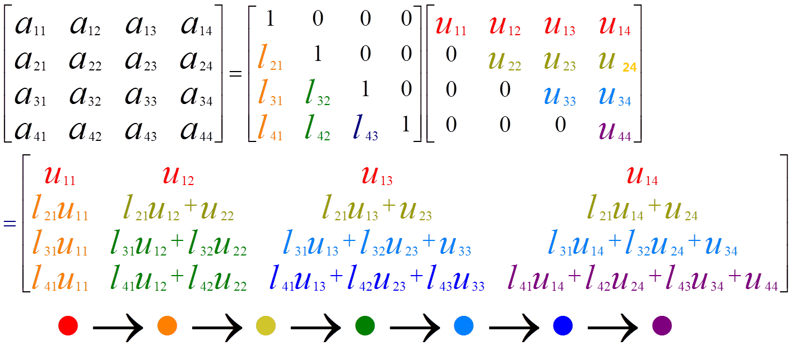

<center> <h1 style="margin-bottom: 0">BEng Project Daybook</h1> </center>
<center> <h2>Yichen Zhang</h2> </center>

# 07/10/2021
- Search for essays about LU decomposition on DiscoverEd and IEEE.
- Write the mission statement.

# 08/10/2021
- Learn the basic grammar of C++.

# 09/10/2021
- Learn something about the memory allocation in C++.

Typically, all memory needs were determined before program execution by defining the variables needed. Therefore, it is not recommended to use dynamic array, although some compiler like *gcc* allows the dynamic array initialization.

In C, we usually use ==malloc== to allocate memory. However, in C++, ==new== and ==delete== are used.

```cpp
int *a;
a = new int[10];
```

## Dynamic 2D array
Although dynamic array is not allowed, C++11 allows the below initialization if the row length is a compile time constant.

```cpp
auto arr2d = new int [nrows][CONSTANT];
```

If not, we can use the code below, which creates an array of pointers to arrays to allow 2D syntax like contiguous 2D arrays.
```cpp
int** a = new int*[rowCount];
for(int i = 0; i < rowCount; ++i)
    a[i] = new int[colCount];
```


Although this method gives us the desired indexing syntax, it is doubly inefficient: big and slow both in space and time. It creates a dynamic array of pointers, then initializing each pointer to its own, independent dynamic array. Each "row" in the matrix is a separately allocated dynamic array. Making a heap allocation is expensive both in time and space. The allocator takes time to make the allocation, sometimes running O(n) algorithms to do it. And the allocator "pads" each of your row arrays with extra bytes for bookkeeping and alignment. That extra space costs...well...extra space. The deallocator will also take extra time when you go to deallocate the matrix, painstakingly free-ing up each individual row allocation.

The better solution is to allocate your whole matrix as a single dynamic array, then use (slightly) clever indexing math of your own to access cells.

```cpp
class Matrix
{
    int *array;
    int m_width;

public:
    Matrix(int w, int h) : m_width(w), array(new int[w * h]) {}
    ~Matrix() { delete[] array; }
    int at(int y, int x) const { return array[index(y, x)]; }
    void set(int t, int y, int x) { array[index(y, x)] = t; }
    int getwidth() { return m_width; }
    void display()
    {
        for (int i = 0; i < m_width; i++)
        {
            for (int j = 0; j < m_width; j++)
                cout << array[index(i, j)] << " ";
            cout << endl;
        }
    }

protected:
    int index(int y, int x) const { return x + m_width * y; }
};
```

# 10/10/2021
## Time in C++
The chrono library, a flexible collection of types that track time with varying degrees of precision.

```cpp
#include <chrono>

std::chrono::steady_clock::time_point begin = std::chrono::steady_clock::now();
std::chrono::steady_clock::time_point end = std::chrono::steady_clock::now();

std::cout << "Time difference = " << std::chrono::duration_cast<std::chrono::microseconds>(end - begin).count() << "[µs]" << std::endl;
std::cout << "Time difference = " << std::chrono::duration_cast<std::chrono::nanoseconds> (end - begin).count() << "[ns]" << std::endl;
```
Class std::chrono::steady_clock represents a monotonic clock. The time points of this clock cannot decrease as physical time moves forward and the time between ticks of this clock is constant. This clock is not related to wall clock time (for example, it can be time since last reboot), and is **most suitable for measuring intervals**.

## Random Number
- Mersenne Twister 19937 generator
A Mersenne Twister pseudo-random generator of 32-bit numbers with a state size of 19937 bits.

```cpp
#include <iostream>
#include <random>
int main()
{
    int seed = 2021;

    std::random_device rd;
    std::mt19937 gen(seed);
    std::uniform_int_distribution<unsigned> distrib(1, 10);

    std::cout << distrib(gen);

    return 0;
}
```

## oneAPI
Setup oneAPI in VSCode according to the [official document](https://devcloud.intel.com/oneapi/get_started/hpcToolkitSamples/).


# 11/10/2021
## Subsystem for Windows -- WSL2
- Install wsl2 - ubuntu 20.04 LTS according to the [official document](https://docs.microsoft.com/en-gb/windows/wsl/install-manual#step-4---download-the-linux-kernel-update-package).
```bash
sudo apt install build-essential cmake zlib1g
```

- [CUDA installation in ubuntu](https://docs.nvidia.com/cuda/wsl-user-guide/index.html#wsl2-system-requirements).

### Install Clang in wsl2 according to the [official document](https://clang.llvm.org/get_started.html).

- XShell connect for wsl2

```bash
sudo apt update
sudo apt upgrade
sudo apt autoremove --purge openssh-server -y && sudo apt install openssh-server -y
sudo vim /etc/ssh/sshd_config
# change port to 2222
sudo service ssh --full-restart
```
Then use Xshell to connect the Subsystem.

# 12/10/2021
If you want to move WSL2 Linux distro(Ubuntu) from C: drive D: below are the steps.

**Export Ubuntu**
```bash
mkdir D:\backup
wsl --export Ubuntu D:\backup\ubuntu.tar
```

**Unregister the same distribution to remove it from the C: drive:**
```bash
wsl --unregister Ubuntu
```

**Import Ubuntu**
```bash
mkdir D:\wsl
wsl --import Ubuntu D:\wsl\ D:\backup\ubuntu.tar
```

**By default Ubuntu will use root as the default user, to switch back to previous user. Go to the Ubuntu App Folder run command to set default user.**
```bash
cd %userprofile%\AppData\Local\Microsoft\WindowsApps
ubuntu.exe config --default-user <username>
```

## Modify the method of [install clang in Ubuntu](#install-clang-in-wsl2-according-to-the-official-document)
The installation of clang from source code would cause some strange problem. It almost takes me about 100Gb space.
In fact, ubuntu distribution provides the easy way to install clang through apt. The detail step can be found [here](https://apt.llvm.org/).
```bash
sudo add-apt-repository "deb http://apt.llvm.org/focal/ llvm-toolchain-focal-13 main"
sudo apt update
# LLVM
sudo apt-get install libllvm-13-ocaml-dev libllvm13 llvm-13 llvm-13-dev llvm-13-doc llvm-13-examples llvm-13-runtime
# Clang and co, the package python-clang-13 may be unavailable
sudo apt-get install clang-13 clang-tools-13 clang-13-doc libclang-common-13-dev libclang-13-dev libclang1-13 clang-format-13 python-clang-13 clangd-13
# libfuzzer
sudo apt-get install libfuzzer-13-dev
# lldb
sudo apt-get install lldb-13
# lld (linker)
sudo apt-get install lld-13
# libc++
sudo apt-get install libc++-13-dev libc++abi-13-dev
# OpenMP
sudo apt-get install libomp-13-dev
# libclc
sudo apt-get install libclc-13-dev
# libunwind
sudo apt-get install libunwind-13-dev
```

# 13/10/2021
## Basic use of clang
- Compile C
The compilation of C language is performed by command *clang-13*.

- Compile C++
The compilation of C language is performed by command *clang++-13*.


# 14/10/2021
Today, I move the project to wsl and setup clang in Ubuntu.

## Vector
The vector template class is similar to the string class in that it is a dynamic array.You
can set the size of a vector object during runtime, and you can append new data to the
end or insert new data in the middle. Basically, it’s an alternative to using new to create a
dynamic array.Actually, the vector class does use new and delete to manage memory,
but it does so automatically.
```cpp
#include <vector>
...
using namespace std;
vector<int> vi; // create a zero-size array of int
int n;
cin >> n;
vector<double> vd(n); // create an array of n doubles
```

## Array
The vector class has more capabilities than the built-in array type, but this comes at a
cost of slightly less efficiency. If all you need is a fixed-size array, it could be advantageous
to use the built-in type. However, that has its own costs of lessened convenience and
safety.
```cpp
#include <array>
...
using namespace std;
array<int, 5> ai; // create array object of 5 ints
array<double, 4> ad = {1.2, 2.1, 3.43. 4.3};
```

# 18/10/2021

## LU decomposition
In numerical analysis and linear algebra, lower–upper (LU) decomposition or factorization factors a matrix as the product of a lower triangular matrix and an upper triangular matrix. The product sometimes includes a permutation matrix as well. LU decomposition can be viewed as the matrix form of Gaussian elimination. Computers usually solve square systems of linear equations using LU decomposition, and it is also a key step when inverting a matrix or computing the determinant of a matrix.

The basic procedure is shown in the figure below. We can calculate the coefficients according to the order of colour.


The prerequisite of LU decomposition can be seen [here](http://arxiv.org/pdf/math/0506382v1.pdf).

- Create a 2D array
```cpp
vector<vector<double>> matrix(SIZE, vector<double>(SIZE));
```

- Pass a 2D array to function
```cpp
void LUdecomposition(vector<vector<double>> &a, vector<vector<double>> &l, vector<vector<double>> &u);
```

# 19/10/2021
- Read and write the basic LU decomposition code in C++ and time it, seen in [here](C/vector2D2.cpp).
This method is also called Doolittle decomposition.


# 20/10/2021
Explore some other methods to realize LU decomposition.
- **Crout matrix decomposition**

    The Crout matrix decomposition algorithm differs slightly from the Doolittle method. Doolittle's method returns a unit lower triangular matrix and an upper triangular matrix, while the Crout method returns a lower triangular matrix and a unit upper triangular matrix.

    The code can be seen [here](C/vector2D.cpp).

- **Tridiagonal matrix algorithm**

  In numerical linear algebra, the tridiagonal matrix algorithm, also known as the Thomas algorithm (named after Llewellyn Thomas), is a simplified form of Gaussian elimination that can be used to solve tridiagonal systems of equations. A tridiagonal system for n unknowns may be written as

    $a_{i}x_{i-1}+b_{i}x_{i}+c_{i}x_{i+1}=d_{i},$
    where $a_1 = 0$ and $c_{n}=0$.

    $
    \begin{bmatrix}
    b_{1} & c_{1} &        &        & 0       \\
    a_{2} & b_{2} & c_{2}  &        &         \\
          & a_{3} & b_{3}  & \ddots &         \\
          &       & \ddots & \ddots & c_{n-1} \\
    0     &       &        & a_{n}  & b_{n}
    \end{bmatrix}
    \begin{bmatrix}
        x_{1}  \\
        x_{2}  \\
        x_{3}  \\
        \vdots \\
        x_{n}
    \end{bmatrix}=
    \begin{bmatrix}
        d_{1}  \\
        d_{2}  \\
        d_{3}  \\
        \vdots \\
        d_{n}
    \end{bmatrix}
    $

    By Gaussian elimination, we only need to eliminate one elements per step. The procedure is shown below.
    $
    \begin{cases}
        \beta_1=b_1,\quad y_1=d_1;\\
        l_i=\frac{a_i}{\beta_{i-1}},\quad \beta_i=b_i-l_ic_{i-1},\quad y_i=d_i-l_iy_{i-1}\qquad (i=2,3,\dots,n)
    \end{cases}
    $
    Then, we can obtain the following result.
    $\begin{bmatrix}
        \beta_{1} & c_{1}     &           &        & 0         & y_1     \\
                  & \beta_{2} & c_{2}     &        &           & y_2     \\
                  &           & \beta_{3} & \ddots &           & \vdots  \\
                  &           &           & \ddots & c_{n-1}   & y_{n-1} \\
        0         &           &           &        & \beta_{n} & y_n
    \end{bmatrix}
    $

# 21/20/2021
- **Pivot element**

    The pivot or pivot element is the element of a matrix, or an array, which is selected first by an algorithm (e.g. Gaussian elimination, simplex algorithm, etc.), to do certain calculations. In the case of matrix algorithms, a pivot entry is usually required to be at least distinct from zero, and often distant from it; in this case finding this element is called pivoting. Pivoting may be followed by an interchange of rows or columns to bring the pivot to a fixed position and allow the algorithm to proceed successfully, and possibly to reduce round-off error. It is often used for verifying row echelon form.

    Pivoting might be thought of as swapping or sorting rows or columns in a matrix, and thus it can be represented as multiplication by permutation matrices. However, algorithms rarely move the matrix elements because this would cost too much time; instead, they just keep track of the permutations.

    Overall, pivoting adds more operations to the computational cost of an algorithm. These additional operations are sometimes necessary for the algorithm to work at all. Other times these additional operations are worthwhile because they add numerical stability to the final result.

- In the case of Gaussian elimination, the algorithm requires that pivot elements not be zero. Interchanging rows or columns in the case of a zero pivot element is necessary.
- In Gaussian elimination, it is generally desirable to choose a pivot element with large absolute value. This improves the numerical stability.

**Implement LU decomposition with partial pivoting**
The strategy we use for swapping rows in step k is to find the largest element in column k below (and including) the diagonal — the so-called pivot element — and swap its row with row k. This process is referred to as partial (row) pivoting. Partial column pivoting and complete (row and column) pivoting are also possible, but not very popular.

During coding, I think it is not suitable to swap the rows as it will cost much memory to store and move the array. Therefore, I use the pointers to point to the certain row.
```cpp
vector<double> *pivot[SIZE];
```

To sort the first column of the 2D array, I define the following template.
```cpp
template <typename T>
vector<size_t> sort_indexes(const vector<T> &v)
{

    // initialize original index locations
    vector<size_t> idx(v.size());
    iota(idx.begin(), idx.end(), 0);

    // sort indexes based on comparing values in v
    // using std::stable_sort instead of std::sort
    // to avoid unnecessary index re-orderings
    // when v contains elements of equal values
    stable_sort(idx.begin(), idx.end(),
                [&v](size_t i1, size_t i2)
                { return v[i1] > v[i2]; });

    return idx;
}
```

The complete code can be seen [here](C/lupivot.cpp).


# 22/20/2021
## Eigen Library
*Eigen* is a C++ template library for linear algebra: matrices, vectors, numerical solvers, and related algorithms.

You can download Eigen from [here](https://gitlab.com/libeigen/eigen.git).

