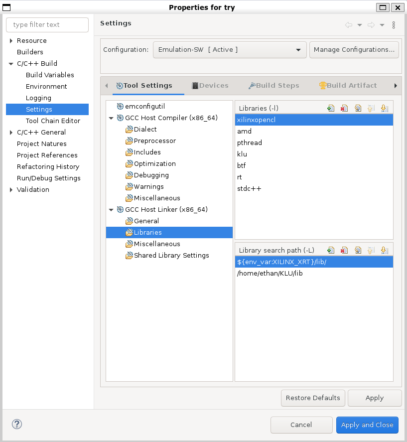
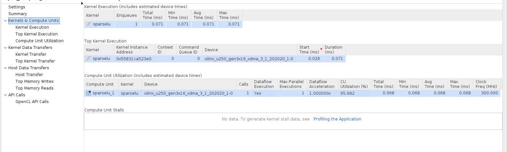
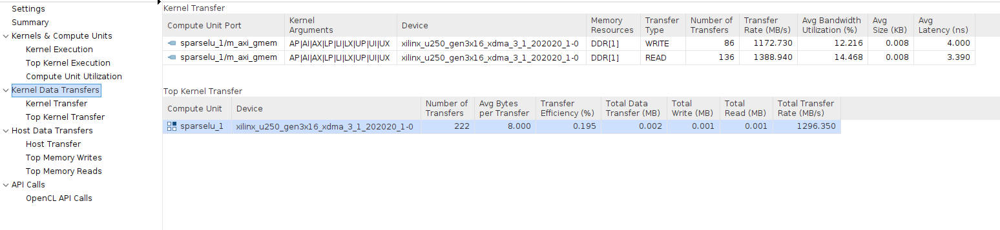
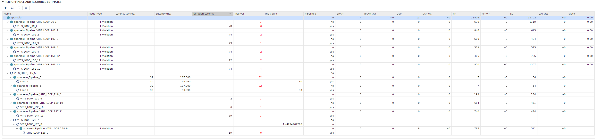
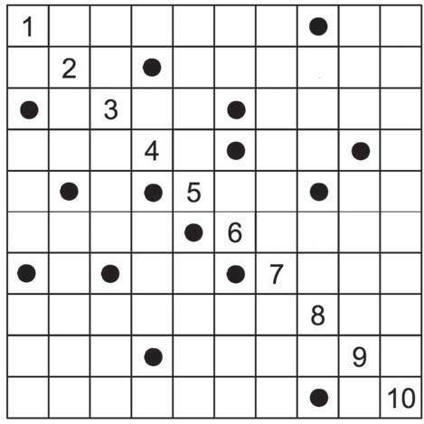
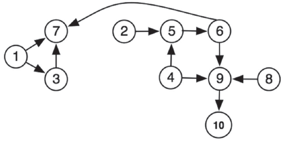

# 29/12/2021
[Online Tutorial](https://xilinxcustomertraining.netexam.com/?tkn=92697314-9F12-463F-8268-80D79E2ED373#:ct54538)


# 11/01/2022
## Error
```log
INFO: [IP_Flow 19-1686] Generating 'Simulation' target for IP 'lu_kernel_sitofp_32ns_32_5_no_dsp_1_ip'...
ERROR: '2201112057' is an invalid argument. Please specify an integer value.
    while executing
"rdi::set_property core_revision 2201112057 {component component_1}"
    invoked from within
"set_property core_revision $Revision $core"
    (file "run_ippack.tcl" line 1612)
INFO: [Common 17-206] Exiting Vivado at Tue Jan 11 20:57:59 2022...
ERROR: [IMPL 213-28] Failed to generate IP.
INFO: [HLS 200-111] Finished Command export_design CPU user time: 23.4 seconds. CPU system time: 1.52 seconds. Elapsed time: 48.34 seconds; current allocated memory: 7.418 MB.
```

**[Solution](https://support.xilinx.com/s/article/76960?language=en_US)**


# Adding Libraries and Library Paths to Vitis
You can add libraries and library paths for Application projects. If you have a custom library to link against, you should specify the library path and the library name to the linker.

To set properties for your Application project:

1. Right-click your Application project (Host one) and select **C/C++ Build Settings**. Alternatively, select **Properties** and navigate to **C/C++ Build > Settings**.

2. Expand the target linker section and select the libraries to which you want to add the custom library path and library name.


3. We can also add the header search path from the option *GCC Host Compiler/Includes*.


# 12/01/2022
## Runtime Initialization & Device Configuration
```cpp
// OPENCL HOST CODE AREA START
// get_xil_devices() is a utility API which will find the xilinx
// platforms and will return list of devices connected to Xilinx platform
auto devices = xcl::get_xil_devices();
// read_binary_file() is a utility API which will load the binaryFile
// and will return the pointer to file buffer.
auto fileBuf = xcl::read_binary_file(binaryFile);
cl::Program::Binaries bins{{fileBuf.data(), fileBuf.size()}};
bool valid_device = false;
for (unsigned int i = 0; i < devices.size(); i++)
{
    auto device = devices[i];
    // Creating Context and Command Queue for selected Device
    OCL_CHECK(err, context = cl::Context(device, nullptr, nullptr, nullptr, &err));
    OCL_CHECK(err, q = cl::CommandQueue(context, device, CL_QUEUE_PROFILING_ENABLE, &err));
    std::cout << "Trying to program device[" << i << "]: " << device.getInfo<CL_DEVICE_NAME>() << std::endl;
    cl::Program program(context, {device}, bins, nullptr, &err);
    if (err != CL_SUCCESS)
    {
        std::cout << "Failed to program device[" << i << "] with xclbin file!\n";
    }
    else
    {
        std::cout << "Device[" << i << "]: program successful!\n";
        OCL_CHECK(err, krnl_vector_add = cl::Kernel(program, "lu_kernel", &err));
        valid_device = true;
        break; // we break because we found a valid device
    }
}
if (!valid_device)
{
    std::cout << "Failed to program any device found, exit!\n";
    exit(EXIT_FAILURE);
}
```

## Buffer Allocation
```cpp
// Allocate Buffer in Global Memory
// Buffers are allocated using CL_MEM_USE_HOST_PTR for efficient memory and
// Device-to-host communication
OCL_CHECK(err, cl::Buffer buffer_in1(context, CL_MEM_USE_HOST_PTR | CL_MEM_READ_ONLY, vector_size_bytes,
                                        host_matrix.data(), &err));
OCL_CHECK(err, cl::Buffer buffer_output1(context, CL_MEM_USE_HOST_PTR | CL_MEM_WRITE_ONLY, vectorout_size_bytes,
                                            source_hw_l.data(), &err));
OCL_CHECK(err, cl::Buffer buffer_output2(context, CL_MEM_USE_HOST_PTR | CL_MEM_WRITE_ONLY, vectorout_size_bytes,
                                            source_hw_u.data(), &err));
```

## Setup Kernel Argument
```cpp
OCL_CHECK(err, err = krnl_vector_add.setArg(0, buffer_in1));
OCL_CHECK(err, err = krnl_vector_add.setArg(1, buffer_output1));
OCL_CHECK(err, err = krnl_vector_add.setArg(2, buffer_output2));
OCL_CHECK(err, err = krnl_vector_add.setArg(3, size));
```

## Writing Buffers to FPGA Memory
```cpp
// Copy input data to device global memory
OCL_CHECK(err, err = q.enqueueMigrateMemObjects({buffer_in1}, 0 /* 0 means from host*/));
```

## Running the Accelerators
```cpp
cl::Event event;
uint64_t nstimestart, nstimeend;

// Launch the Kernel
// For HLS kernels global and local size is always (1,1,1). So, it is
// recommended
// to always use enqueueTask() for invoking HLS kernel
OCL_CHECK(err, err = q.enqueueTask(krnl_vector_add, nullptr, &event));
```
### Running the Accelerators (Out-of-order)
```cpp
// Alternative out-of-order queue events control
cl::Event event_sp;
q.enqueueTask(krnl_vector_add, NULL, &event_sp);
clWaitForEvents(1, (const cl_event *) &event_sp);
```

## Reading Buffers from FPGA Mem
```cpp
// Copy Result from Device Global Memory to Host Local Memory
OCL_CHECK(err, err = q.enqueueMigrateMemObjects({buffer_output1, buffer_output2}, CL_MIGRATE_MEM_OBJECT_HOST));
q.finish();
OCL_CHECK(err, err = event.getProfilingInfo<uint64_t>(CL_PROFILING_COMMAND_START, &nstimestart));
OCL_CHECK(err, err = event.getProfilingInfo<uint64_t>(CL_PROFILING_COMMAND_END, &nstimeend));
// OPENCL HOST CODE AREA END
auto lu_time = nstimeend - nstimestart;

// Compare the results of the Device to the simulation
std::cout << "L:\n";
print(source_hw_l.data(), SIZE, SIZE);
std::cout << "U:\n";
print(source_hw_u.data(), SIZE, SIZE);
```

## FPGA Acceleration
See Host Code [here](C/vitis/host.cpp).

See Kernel Code [here](C/vitis/lu_kerenl.cpp).

# 13/01/2022
## Gilbert-Peierls' algorithm
Gilbert-Peierls left-looking algorithm factors the matrix column-by-column from left to right.
```cpp
L=I; // I=identity matrix
for k=1:N
b = A(:,k); // kth column of A
x = L \ b; // \ is Lx=b solve
U(1:k) = x(1:k);
L(k+1:N) = x(k+1:N) / U(k,k);
end;
// return L and U as result
```

For Sparse matrix, we can implement the algorithm with the following code. See [here](C/sparse.cpp).
```cpp
void SparseLU(int *Ap, int *Ai, double *Ax, int *Lp, int *Li, double *Lx, int *Up, int *Ui, double *Ux)
{
	int countL = 1, countU = 0;

	for (int i = 0; i < squareSize; i++)
	{
		Lp[i] = i;
		Li[i] = i;
		Lx[i] = 1;
	}

	for (i = 0; i < squareSize; i++)
	{
		double b[squareSize], x[squareSize];
		for (int j = 0; j < squareSize; j++)
		{
			b[j] = 0;
			x[j] = 0;
		}

		std::cout << i << std::endl;
		if (Ap[i] != Ap[i + 1])
		{
			for (int j = Ap[i]; j < Ap[i + 1]; j++)
				b[Ai[j]] = Ax[j];
		}
		else
		{
			// Lp[i] = 0;
			Up[i] = 0;
			continue;
		}
		for (int j = 0; j < squareSize; j++)
		{
			for (int k = 0; k <= j; k++)
			{
				double sum = 0;
				for (int t = Lp[k]; t < Lp[k + 1]; t++)
					if (Li[t] == j)
						sum += Lx[Li[t]] * x[k];
			}
			x[j] = b[j] - sum;
		}

		for (int j = 0; j <= i; j++)
		{
			if (std::abs(x[j]) < 1e-6)
				continue;
			else
			{
				Ui[countU] = j;
				Ux[countU++] = x[j];
			}
		}
		Up[i + 1] = countU;

		for (int j = i + 1; j < squareSize; j++)
		{
			if (std::abs(x[j]) < 1e-6)
				continue;
			else
			{
				Li[countL] = j;
				Lx[countL++] = x[j] / Ux[Up[i + 1] - 1];
			}
		}
		Lp[i + 1] = countL;
		if (i < squareSize - 1)
		{
			Li[countL] = i + 1;
			Lx[countL++] = 1;
		}
	}
}
```


## Block LU Decomposition
$$
\left[ \begin{matrix}
	A_{11}&		A_{12}\\
	A_{21}&		A_{22}\\
\end{matrix} \right] =\left[ \begin{matrix}
	L_{11}&		0\\
	L_{21}&		L_{22}\\
\end{matrix} \right] \times \left[ \begin{matrix}
	U_{11}&		U_{12}\\
	0&		U_{22}\\
\end{matrix} \right]
$$


# 15/01/2021
## Improve Gilbert-Peierls' algorithm
As the elements in the **L** and **U** is fixed, we can preallocate the indexes using the function below.

See [here](C/sparse2.cpp) for more detail.
```cpp
void analyse(int *Ap, int *Ai, int *Up, int *Ui, int *Lp, int *Li, double *Lx, int *lnz, int *unz, int n)
{
	for (int i = 0, count = 0; i < n; i++)
	{
		for (int j = Ap[i]; j < Ap[i + 1]; j++)
		{
			if (Ai[j] < i)
			{
				Ui[*unz] = Ai[count];
				(*unz)++;
			}
			else if (Ai[j] == i)
			{
				Li[*lnz] = i;
				Lx[(*lnz)++] = 1;
				Ui[(*unz)++] = i;
			}
			else
			{
				Li[*lnz] = Ai[count];
				(*lnz)++;
			}
			count++;
		}
		Lp[i + 1] = *lnz;
		Up[i + 1] = *unz;
	}
}
```

## Implement in Vitis
[Host code](C/vitis/sparse/host.cpp).

[Kernel code](C/vitis/sparse/sparse.cpp).


# 21/01/2022
## Benchmark
**[File here](C/sparse3.c)**

First, we use a small  5x5 sparse [matrix](Matrix_Sample/test.mtx) with 12 nonzeros to test.
Run for ten times and it takes about **0.9us** to decompose on average.

Then, we use a 10x10 sparse [matrix](Matrix_Sample/test4.mtx) with 24 to test.
Run for ten times and it takes about **2.9us** to decompose on average.

Then, we try a little large matrix [HB/bcspwr01](https://sparse.tamu.edu/HB/bcspwr01). It is a 39x39 matrix with 131 nonzeros.
Run for ten times and it takes about **61.5us** to decompose on average. It is much longer that the 5x5 sparse matrix.


**[With KLU](C/KLU/kluldemo.c)**

KLU itself is more stable. For the 5x5 sparse matrix, it takes about **2.3us** to decompose on average.

For the 10x10 sparse matrix, it takes about **2.9us** to decompose on average.

For the *HB/bcspwr01* matrix, it takes about **3us**. Only 0.3us longer that the size of 5.


# 22/01/2022
## Emulation on FPGA
The reason that *the simulation exited unexpectedly* previously is that the memory migration error.
As the kernel requires 10 arguments in total, shown below, not only the first four arguments are initialized, part of the other parameters are also initialized, which also are needed to transfer to the kernel.
```c
void sparselu(int squareSize, int *AP, int *AI, double *AX, int *LP, int *LI, double *LX, int *UP, int *UI, double *UX)
```

Therefore, the memory migration should be written as:
```cpp
OCL_CHECK(err, err = q.enqueueMigrateMemObjects({buffer_output1, buffer_output2, buffer_output3, buffer_output4, buffer_output5, buffer_output6}, CL_MIGRATE_MEM_OBJECT_HOST));
```

## Emulation Result




# 25/01/2022
## Improved - Reachability
The main reason that what I have written is much slower is that it does not know the data index in a row. Therefore, when implementing the Gilbert-Peierls, especially when solving
$$
x=L\backslash A(:,k)
$$
Much of the time is spent on searching for data when may exist in a certain row.

Therefore, to solve this problem, we need to have a knowledge about how the data is distributed.


For example, if we have a matrix like this



We can derive its reachability



# 28/01/2022
## Improved timing method
Using `<chrono>` timing method in C++ instead of `<time.h>`
is C, Benchmark the code.

For the [HB/ash85](https://sparse.tamu.edu/HB/ash85) matrix, which is 85x85 with 523 entries, it will take my code about 30us to finish.


For KLU, it will take about 3.2us to finish.

This result is better than the timing result is `C`.

# 29/01/2022
## Unroll loop in Kernel
Loop Unrolling
The compiler can also unroll a loop, either partially or completely to perform multiple loop
iterations in parallel. This is done using the pragma HLS unroll. Unrolling a loop can lead to a very
fast design, with significant parallelism. However, because all the operations of the loop
iterations are executed in parallel, a large amount of programmable logic resource are required to
implement the hardware. As a result, the compiler can face challenges dealing with such a large
number of resources and can face capacity problems that slow down the kernel compilation
process. It is a good guideline to unroll loops that have a small loop body, or a small number of
iterations.

```c
vadd: for(int i = 0; i < 20; i++) {
#pragma HLS UNROLL
c[i] = a[i] + b[i];
}
```

In the preceding example, you can see `pragma HLS UNROLL` has been inserted into the body of
the loop to instruct the compiler to unroll the loop completely. All 20 iterations of the loop are
executed in parallel if that is permitted by any data dependency.

Completely unrolling a loop can consume significant device resources, while partially unrolling the
loop provides some performance improvement while using fewer hardware resources.

**My code**

In my code, I apply the `unroll` pragma during the data reading from the global memory as well as the writing to memory process.

In addition, I also apply `unroll` for the last two steps of the Gilbert-Peierls' algorithm, i.e.
```cpp
L=I; // I=identity matrix
for k=1:N
b = A(:,k); // kth column of A
x = L \ b; // \ is Lx=b solve
U(1:k) = x(1:k); 	<--
L(k+1:N) = x(k+1:N) / U(k,k); <--
end;
// return L and U as result
```

With unroll, we can see that the kernel time decreases from 71us to 50us.


# 02/02/2022
## Further deep in KLU
To implement KLU factorization in FPGA, I find that the function
```c
static void factor2
(
    /* inputs, not modified */
    Int Ap [ ],         /* size n+1, column pointers */
    Int Ai [ ],         /* size nz, row indices */
    Entry Ax [ ],
    KLU_symbolic *Symbolic,

    /* inputs, modified on output: */
    KLU_numeric *Numeric,
    KLU_common *Common
)
```

mainly performs the factorization process in KLU.

This function mainly takes 6 parameters, where the first three is the input matrix, `KLU_symbolic *Symbolic` is the result from symbolic analysis, `KLU_numeric *Numeric` is the factorization result, and ` KLU_numeric *Numeric` stores the control parameters of the factorization.


# 06/02/2022
## [PLRAM](https://xilinx.github.io/Vitis_Accel_Examples/2020.2/html/plram_access.html)

PLRAM is small shared memory which is built using the on-chip memory resources of the FPGA fabric. It is intended to provide a small amount of data storage that application kernels can share and access rapidly(lowest latency). PLRAM behaves just like the DDR memory resources managed by the Vitis memory subsystem.

PLRAM can be assigned to a buffer by using sp tags in the `mmult.cfg` file along with the port name and kernel name.
```json
[connectivity]
sp=mmult_1.a:PLRAM[0]
sp=mmult_1.b:DDR[0]
sp=mmult_1.c:PLRAM[1]
```

# 18/02/2022
Write a small program that can read `.mtx` matrix file from matrix market. See [here](C/myKLU/mmio.h)

# 22/02/2022
## [PLRAM Config](https://xilinx.github.io/Vitis_Accel_Examples/2021.2/html/plram_config.html)

We can use a Tcl script to configure the `PLRAM` before system linking occurs. The use of the Tcl script can be enabled on the v++ command line as follows:

```tcl
# Setup PLRAM
sdx_memory_subsystem::update_plram_specification [get_bd_cells /memory_subsystem] PLRAM_MEM00 { SIZE 2M AXI_DATA_WIDTH 512
SLR_ASSIGNMENT SLR0 READ_LATENCY 10 MEMORY_PRIMITIVE URAM}

sdx_memory_subsystem::update_plram_specification [get_bd_cells /memory_subsystem] PLRAM_MEM01 { SIZE 2M AXI_DATA_WIDTH 512
SLR_ASSIGNMENT SLR1 READ_LATENCY 10 MEMORY_PRIMITIVE URAM}

validate_bd_design -force
save_bd_design
```

In the example above, PLRAM_MEM00 is changed to be 2 MB in size and composed of UltraRAM; PLRAM_MEM01 is changed to be 2 MB in size and composed of UltraRAM.

PLRAM can be assigned to a buffer by using `sp` tags in the vadd.cfg file along with the port name and kernel name.

```cfg
[connectivity]
sp=vadd_1.in1:PLRAM[0]
sp=vadd_1.in2:PLRAM[1]
sp=vadd_1.out:PLRAM[1]
```

# 24/02/2022

## Warning message

*The II Violation in module 'lu_Pipeline_VITIS_LOOP_84_1' (loop 'VITIS_LOOP_84_1'): Unable to schedule bus request operation ('gmem_load_3_req', klu_kernel.cpp:88) on port 'gmem' (klu_kernel.cpp:88) due to limited memory ports (II = 1). Please consider using a memory core with more ports or partitioning the array.*

### Explanation

This message informs that the resource is being accessed multiple times in a single cycle which results in a resource conflict and performance degradation.

In the below code, the resource conflict is showing in two scenarios:

- At the interface:
	In the sfunc1, the inputs - a and b are mapped to the same bundle - gmem which maps to a single AXI Interface port. For more information, see [AXI4 Master Interface](https://www.xilinx.com/htmldocs/xilinx2020_1/hls-guidance/qoa1585574520885.html). When both the inputs a and b are accessed at the same time, this results in a resource conflict and results in performance degradation. You would see the above warning message:

- In the local array - AuxBuffer:
	The same resource conflict issue is seen with the array. Here would be the below warning message:

```log
Message
WARNING: [HLS 200-885] Unable to schedule 'load' operation ('AuxBuffer1_load_7', ./kernel.c:39) on array 'AuxBuffer1', ./kernel.c:59 due to limited memory ports. Please consider using a memory core with more ports or partitioning the array 'AuxBuffer1'.
Resolution: For help on HLS 200-885 see www.xilinx.com/html_docs/xilinx2020_1/hls-guidance/200-885.html
```

### Solution

When there are resource conflict issues because of multiple loads and store. The user needs to increase the number of ports or a different resource.

```c
#pragma HLS INTERFACE m_axi depth=10    port=in1    offset=slave    bundle=gmem1 num_write_outstanding=300
#pragma HLS INTERFACE m_axi depth=10    port=in2    offset=slave    bundle=gmem0 num_write_outstanding =300
```

A solution to the array is to increase the number of ports that can be accessed in one cycle. You can either:

- Partition the array as shown in the following code.

- Refactor the code to use multiple data in one signle cycle.

```c
accel_label0 : for (int i = 0; i < N; i++)
{
#pragma HLS pipeline II = 1
    int AuxBuffer1[N];
#pragma HLS array_partition complete varialbe=AuxBuffer1
    sfunc1(Iter, in1, in2, AuxBuffer1);
    sfunc3(Iter, AuxBuffer1, output);
}
```


# 25/02/2022
## Mapping Kernel Ports to Memory
The link phase is when the memory ports of the kernels are connected to memory resources which include DDR, HBM, and PLRAM. By default, when the `xclbin` file is produced during the v++ linking process, all kernel memory interfaces are connected to the same global memory bank (or `gmem`). As a result, only one kernel interface can transfer data to/from the memory bank at one time, limiting the performance of the application due to memory access.

While the Vitis compiler can automatically connect CU to global memory resources, you can also manually specify which global memory bank each kernel argument (or interface) is connected to. Proper configuration of kernel to memory connectivity is important to maximize bandwidth, optimize data transfers, and improve overall performance. Even if there is only one compute unit in the device, mapping its input and output arguments to different global memory banks can improve performance by enabling simultaneous accesses to input and output data.

**Important**: *Up to 15 kernel interfaces can be connected to a single global memory bank. Therefore, if there are more than 15 memory interfaces, then you must explicitly perform the memory mapping as described here, using the `--conectivity.sp` option to distribute connections across different memory banks.*

The following example is based on the [Kernel Interfaces](https://docs.xilinx.com/r/e0yeNYHBEoTuQopmlaaYEg/HlijeTUwgDsxMLDGGuYE7A) example code. Start by assigning the kernel arguments to separate bundles to increase the available interface ports, then assign the arguments to separate memory banks:

1. In C/C++ kernels, assign arguments to separate bundles in the kernel code prior to compiling them:
```c
void cnn( int *pixel, // Input pixel
  int *weights, // Input Weight Matrix
  int *out, // Output pixel
  ... // Other input or Output ports


#pragma HLS INTERFACE m_axi port=pixel offset=slave bundle=gmem
#pragma HLS INTERFACE m_axi port=weights offset=slave bundle=gmem1
#pragma HLS INTERFACE m_axi port=out offset=slave bundle=gmem
```

	Note that the memory interface inputs pixel and weights are assigned different bundle names in the example above, while out is bundled with pixel. This creates two separate interface ports.

	Important: You must specify bundle= names using all lowercase characters to be able to assign it to a specific memory bank using the `--connectivity.sp` option.

2. Edit a config file to include the `--connectivity.sp` option, and specify it in the v++ command line with the --config option, as described in [Vitis Compiler Command](https://docs.xilinx.com/r/e0yeNYHBEoTuQopmlaaYEg/R7wXTCybMYmxPhp_CBLWnw).
For example, for the cnn kernel shown above, the connectivity.sp option in the config file would be as follows:

```tcl
[connectivity]
#sp=<compute_unit_name>.<argument>:<bank name>
sp=cnn_1.pixel:DDR[0]
sp=cnn_1.weights:DDR[1]
sp=cnn_1.out:DDR[2]
```

Where:

`<compute_unit_name>` is an instance name of the CU as determined by the connectivity.nk option, described in [Creating Multiple Instances of a Kernel](https://docs.xilinx.com/r/e0yeNYHBEoTuQopmlaaYEg/2Oot6TAZfqvlxXu6YGNTdA), or is simply `<kernel_name>_1` if multiple CUs are not specified.

`<argument>` is the name of the kernel argument. Alternatively, you can specify the name of the kernel interface as defined by the HLS INTERFACE pragma for C/C++ kernels, including m_axi_ and the bundle name. In the cnn kernel above, the ports would be m_axi_gmem and m_axi_gmem1.

**Tip**: For RTL kernels, the interface is specified by the interface name defined in the kernel.xml file.

`<bank_name>` is denoted as DDR[0], DDR[1], DDR[2], and DDR[3] for a platform with four DDR banks. You can also specify the memory as a contiguous range of banks, such as DDR[0:2], in which case XRT will assign the memory bank at run time.

Some platforms also provide support for PLRAM, HBM, HP or MIG memory, in which case you would use PLRAM[0], HBM[0], HP[0] or MIG[0]. You can use the `platforminfo` utility to get information on the global memory banks available in a specified platform. Refer to platforminfo Utility for more information.

In platforms that include both DDR and HBM memory banks, kernels must use separate AXI interfaces to access the different memories. DDR and PLRAM access can be shared from a single port.

**Important**: Customized bank assignments might also need to be reflected in the host code in some cases, as described in [Assigning DDR Bank in Host Code](https://docs.xilinx.com/r/e0yeNYHBEoTuQopmlaaYEg/Iv9NBXHU~SN_ETIp9hGhRA).

**Connecting Directly to Host Memory**

The PCIe® Slave-Bridge IP is provided on some data center platforms to let kernels access directly to host memory. Configuring the device binary to connect to memory requires changing the link specified by the --connectivity.sp command below. It also requires changes to the accelerator card setup and your host application as described at [Host-Memory Access](https://xilinx.github.io/XRT/2021.1/html/hm.html#host-memory-access) in the XRT documentation.

```tcl
[connectivity]
## Syntax
##sp=<cu_name>.<interface_name>:HOST[0]
sp=cnn_1.m_axi_gmem:HOST[0]
```

In the command syntax above, the CU name and interface name are the same, but the bank name is hard-coded to HOST[0].


# 01/03/2022
## [Example: Vitis Hardware Acceleration on Cholesky Algorithm](https://github.com/Xilinx/Vitis-Tutorials/tree/2021.2/Hardware_Acceleration/Design_Tutorials/06-cholesky-accel)

The kernel code can be seen [here](C/vitis/vitis_export_archive.ide/cholesky/src/cholesky_kernel.cpp)

We can see it uses `INTERFACE` pragma.

```c
#pragma HLS INTERFACE m_axi offset = slave bundle = gmem0 port = matrixA latency = 64 \
  num_read_outstanding = 16 num_write_outstanding = 16 \
  max_read_burst_length = 64 max_write_burst_length = 64 depth = 256
```

**`INTERFACE` Pragma**
The `INTERFACE` pragma specifies the physical adapters for the kernel C ports and how they attach to the platform during what's referred to as "interface synthesis" in HLS.

These physical adapters and their associated RTL implementation are derived from the following:

- Any function-level protocol that is specified: Function-level protocols, also called block-level I/O protocols, provide signals to control when the function starts operation, and indicate when function operation ends, is idle, and is ready for new inputs. The implementation of a function-level protocol is: Specified by the values ap_ctrl_none, ap_ctrl_hs or ap_ctrl_chain. The ap_ctrl_hs block-level I/O protocol is the default. Are associated with the function name.

- Function arguments: Each function argument can be specified to have its own port-level (I/O) interface protocol, such as valid handshake (ap_vld), or acknowledge handshake (ap_ack). Port-level interface protocols are created for each argument in the top-level function and the function return, if the function returns a value. The default I/O protocol created depends on the type of C argument. After the block-level protocol has been used to start the operation of the block, the port-level I/O protocols are used to sequence data into and out of the block.

- Global variables accessed by the top-level function, and defined outside its scope:

- If a global variable is accessed, but all read and write operations are local to the function, the resource is created in the RTL design. There is no need for an I/O port in the RTL. If the global variable is expected to be an external source or destination, specify its interface in a similar manner as standard function arguments. See the Examples below.
-
When the `INTERFACE` pragma is used on sub-functions, only the register option can be used. The option is not supported on sub-functions. TIP: The Vivado High-Level Synthesis (HLS) tool automatically determines the I/O protocol used by any sub-functions. You cannot control these ports except to specify whether the port is registered.

Specifying Burst Mode

When specifying burst-mode for interfaces, using the max_read_burst_length or max_write_burst_length options (as described in the Syntax section) there are limitations and related considerations that are derived from the AXI standard:

The burst length should be less than, or equal to 256 words per transaction, because ARLEN & AWLEN are 8 bits; the actual burst length is AxLEN+1. In total, less than 4 KB is transferred per burst transaction. Do not cross the 4 KB address boundary. The bus width is specified as a power of 2, between 32-bits and 512-bits (i.e. 32, 64, 128, 256, 512 bits) or in bytes: 4, 8, 16, 32, 64.

Given the 4 KB limit, the maximum burst length for a single transaction for a bus width of:

- 32-bits is 256 words for 1024 total bytes transferred per transaction.
- 64-bits is 256 words for 2048 total bytes transferred per transaction.
- 128-bits is 256 words for 4096 total bytes transferred per transaction.
- 256-bits is 128 words for 4096 total bytes transferred per transaction.
- 512-bits is 64 words for 4096 total bytes transferred per transaction.

**Note**: The actual transactions are design dependent, for example, pipelined accesses from a for-loop of 100 iterations when max_read_burst_length or max_write_burst_length is set to 128, will not fill the max burst length. However, if accesses are longer than the specified maximum burst length, some accesses will be split into smaller bursts.

For example, a pipelined for-loop with 100 accesses and max_read_burst_length or max_write_burst_length set to 64, will be split into 2 transactions, one of the max burst length (or 64) and one transaction of the remaining data (burst of length 36 words).

