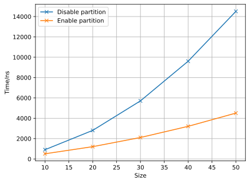
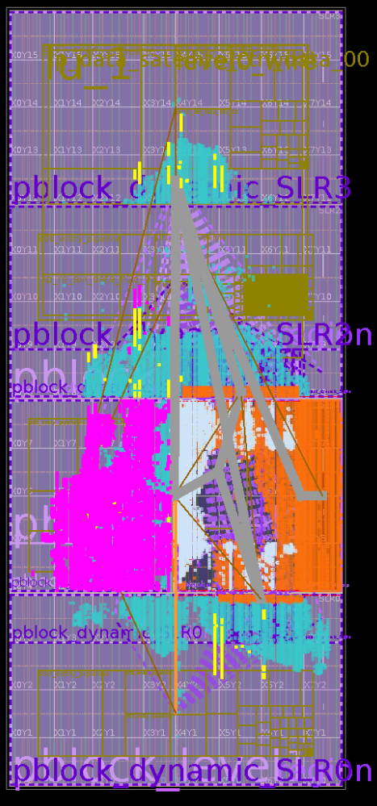
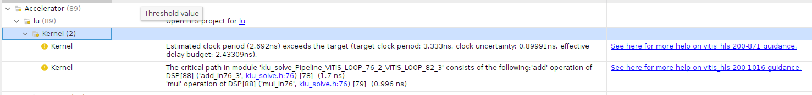

<center> <h1 style="margin-bottom: 0">BEng Project Daybook</h1> </center>
<center> <h2>Yichen Zhang</h2> </center>

# 07/10/2021
- Search for essays about LU decomposition on DiscoverEd and IEEE.
- Write the mission statement.

# 08/10/2021
- Learn the basic grammar of C++.

# 09/10/2021
- Learn something about the memory allocation in C++.

Typically, all memory needs were determined before program execution by defining the variables needed. Therefore, it is not recommended to use dynamic array, although some compiler like *gcc* allows the dynamic array initialization.

In C, we usually use ==malloc== to allocate memory. However, in C++, ==new== and ==delete== are used.

```cpp
int *a;
a = new int[10];
```

## Dynamic 2D array
Although dynamic array is not allowed, C++11 allows the below initialization if the row length is a compile time constant.

```cpp
auto arr2d = new int [nrows][CONSTANT];
```

If not, we can use the code below, which creates an array of pointers to arrays to allow 2D syntax like contiguous 2D arrays.
```cpp
int** a = new int*[rowCount];
for(int i = 0; i < rowCount; ++i)
    a[i] = new int[colCount];
```


Although this method gives us the desired indexing syntax, it is doubly inefficient: big and slow both in space and time. It creates a dynamic array of pointers, then initializing each pointer to its own, independent dynamic array. Each "row" in the matrix is a separately allocated dynamic array. Making a heap allocation is expensive both in time and space. The allocator takes time to make the allocation, sometimes running O(n) algorithms to do it. And the allocator "pads" each of your row arrays with extra bytes for bookkeeping and alignment. That extra space costs...well...extra space. The deallocator will also take extra time when you go to deallocate the matrix, painstakingly free-ing up each individual row allocation.

The better solution is to allocate your whole matrix as a single dynamic array, then use (slightly) clever indexing math of your own to access cells.

```cpp
class Matrix
{
    int *array;
    int m_width;

public:
    Matrix(int w, int h) : m_width(w), array(new int[w * h]) {}
    ~Matrix() { delete[] array; }
    int at(int y, int x) const { return array[index(y, x)]; }
    void set(int t, int y, int x) { array[index(y, x)] = t; }
    int getwidth() { return m_width; }
    void display()
    {
        for (int i = 0; i < m_width; i++)
        {
            for (int j = 0; j < m_width; j++)
                cout << array[index(i, j)] << " ";
            cout << endl;
        }
    }

protected:
    int index(int y, int x) const { return x + m_width * y; }
};
```

# 10/10/2021
## Time in C++
The chrono library, a flexible collection of types that track time with varying degrees of precision.

```cpp
#include <chrono>

std::chrono::steady_clock::time_point begin = std::chrono::steady_clock::now();
std::chrono::steady_clock::time_point end = std::chrono::steady_clock::now();

std::cout << "Time difference = " << std::chrono::duration_cast<std::chrono::microseconds>(end - begin).count() << "[µs]" << std::endl;
std::cout << "Time difference = " << std::chrono::duration_cast<std::chrono::nanoseconds> (end - begin).count() << "[ns]" << std::endl;
```
Class std::chrono::steady_clock represents a monotonic clock. The time points of this clock cannot decrease as physical time moves forward and the time between ticks of this clock is constant. This clock is not related to wall clock time (for example, it can be time since last reboot), and is **most suitable for measuring intervals**.

## Random Number
- Mersenne Twister 19937 generator
A Mersenne Twister pseudo-random generator of 32-bit numbers with a state size of 19937 bits.

```cpp
#include <iostream>
#include <random>
int main()
{
    int seed = 2021;

    std::random_device rd;
    std::mt19937 gen(seed);
    std::uniform_int_distribution<unsigned> distrib(1, 10);

    std::cout << distrib(gen);

    return 0;
}
```

## oneAPI
Setup oneAPI in VSCode according to the [official document](https://devcloud.intel.com/oneapi/get_started/hpcToolkitSamples/).


# 11/10/2021
## Subsystem for Windows -- WSL2
- Install wsl2 - ubuntu 20.04 LTS according to the [official document](https://docs.microsoft.com/en-gb/windows/wsl/install-manual#step-4---download-the-linux-kernel-update-package).
```bash
sudo apt install build-essential cmake zlib1g
```

- [CUDA installation in ubuntu](https://docs.nvidia.com/cuda/wsl-user-guide/index.html#wsl2-system-requirements).

### Install Clang in wsl2 according to the [official document](https://clang.llvm.org/get_started.html).

- XShell connect for wsl2

```bash
sudo apt update
sudo apt upgrade
sudo apt autoremove --purge openssh-server -y && sudo apt install openssh-server -y
sudo vim /etc/ssh/sshd_config
# change port to 2222
sudo service ssh --full-restart
```
Then use Xshell to connect the Subsystem.

# 12/10/2021
If you want to move WSL2 Linux distro(Ubuntu) from C: drive D: below are the steps.

**Export Ubuntu**
```bash
mkdir D:\backup
wsl --export Ubuntu D:\backup\ubuntu.tar
```

**Unregister the same distribution to remove it from the C: drive:**
```bash
wsl --unregister Ubuntu
```

**Import Ubuntu**
```bash
mkdir D:\wsl
wsl --import Ubuntu D:\wsl\ D:\backup\ubuntu.tar
```

**By default Ubuntu will use root as the default user, to switch back to previous user. Go to the Ubuntu App Folder run command to set default user.**
```bash
cd %userprofile%\AppData\Local\Microsoft\WindowsApps
ubuntu.exe config --default-user <username>
```

## Modify the method of [install clang in Ubuntu](#install-clang-in-wsl2-according-to-the-official-document)
The installation of clang from source code would cause some strange problem. It almost takes me about 100Gb space.
In fact, ubuntu distribution provides the easy way to install clang through apt. The detail step can be found [here](https://apt.llvm.org/).
```bash
wget -O - https://apt.llvm.org/llvm-snapshot.gpg.key|sudo apt-key add -
sudo add-apt-repository "deb http://apt.llvm.org/focal/ llvm-toolchain-focal-13 main"
sudo apt update
# LLVM
sudo apt-get install libllvm-13-ocaml-dev libllvm13 llvm-13 llvm-13-dev llvm-13-doc llvm-13-examples llvm-13-runtime
# Clang and co, the package python-clang-13 may be unavailable
sudo apt-get install clang-13 clang-tools-13 clang-13-doc libclang-common-13-dev libclang-13-dev libclang1-13 clang-format-13 python-clang-13 clangd-13
# libfuzzer
sudo apt-get install libfuzzer-13-dev
# lldb
sudo apt-get install lldb-13
# lld (linker)
sudo apt-get install lld-13
# libc++
sudo apt-get install libc++-13-dev libc++abi-13-dev
# OpenMP
sudo apt-get install libomp-13-dev
# libclc
sudo apt-get install libclc-13-dev
# libunwind
sudo apt-get install libunwind-13-dev


sudo apt-get install libllvm-13-ocaml-dev libllvm13 llvm-13 llvm-13-dev llvm-13-doc llvm-13-examples llvm-13-runtime clang-13 clang-tools-13 clang-13-doc libclang-common-13-dev libclang-13-dev libclang1-13 clang-format-13 clangd-13 libfuzzer-13-dev lldb-13 lld-13 libc++-13-dev libc++abi-13-dev libomp-13-dev libclc-13-dev libunwind-13-dev
```

# 13/10/2021
## Basic use of clang
- Compile C
The compilation of C language is performed by command *clang-13*.

- Compile C++
The compilation of C language is performed by command *clang++-13*.


# 14/10/2021
Today, I move the project to wsl and setup clang in Ubuntu.

## Vector
The vector template class is similar to the string class in that it is a dynamic array.You
can set the size of a vector object during runtime, and you can append new data to the
end or insert new data in the middle. Basically, it’s an alternative to using new to create a
dynamic array.Actually, the vector class does use new and delete to manage memory,
but it does so automatically.
```cpp
#include <vector>
...
using namespace std;
vector<int> vi; // create a zero-size array of int
int n;
cin >> n;
vector<double> vd(n); // create an array of n doubles
```

## Array
The vector class has more capabilities than the built-in array type, but this comes at a
cost of slightly less efficiency. If all you need is a fixed-size array, it could be advantageous
to use the built-in type. However, that has its own costs of lessened convenience and
safety.
```cpp
#include <array>
...
using namespace std;
array<int, 5> ai; // create array object of 5 ints
array<double, 4> ad = {1.2, 2.1, 3.43. 4.3};
```

# 18/10/2021

## LU decomposition
In numerical analysis and linear algebra, lower–upper (LU) decomposition or factorization factors a matrix as the product of a lower triangular matrix and an upper triangular matrix. The product sometimes includes a permutation matrix as well. LU decomposition can be viewed as the matrix form of Gaussian elimination. Computers usually solve square systems of linear equations using LU decomposition, and it is also a key step when inverting a matrix or computing the determinant of a matrix.

The basic procedure is shown in the figure below. We can calculate the coefficients according to the order of colour.

We can see from the figure that elements of the same color can be calculated parallelly. For example, $u_{11}\ u_{12}\ u_{13}$ and $u_{14}$ can be obtained at the same time. After we obtain $u_{11}$, we can simultaneously get the value of the first column, that is to say $l_{21}\ l_{31}$ and $l_{41}$.


The prerequisite of LU decomposition can be seen [here](http://arxiv.org/pdf/math/0506382v1.pdf).

- Create a 2D array
```cpp
vector<vector<double>> matrix(SIZE, vector<double>(SIZE));
```

- Pass a 2D array to function
```cpp
void LUdecomposition(vector<vector<double>> &a, vector<vector<double>> &l, vector<vector<double>> &u);
```

# 19/10/2021
- Read and write the basic LU decomposition code in C++ and time it, seen in [here](C/vector2D2.cpp).
This method is also called Doolittle decomposition.


# 20/10/2021
Explore some other methods to realize LU decomposition.
- **Crout matrix decomposition**

    The Crout matrix decomposition algorithm differs slightly from the Doolittle method. Doolittle's method returns a unit lower triangular matrix and an upper triangular matrix, while the Crout method returns a lower triangular matrix and a unit upper triangular matrix.

    The code can be seen [here](C/vector2D.cpp).

- **Tridiagonal matrix algorithm**

  In numerical linear algebra, the tridiagonal matrix algorithm, also known as the Thomas algorithm (named after Llewellyn Thomas), is a simplified form of Gaussian elimination that can be used to solve tridiagonal systems of equations. A tridiagonal system for n unknowns may be written as

    $a_{i}x_{i-1}+b_{i}x_{i}+c_{i}x_{i+1}=d_{i},$
    where $a_1 = 0$ and $c_{n}=0$.

    $
    \begin{bmatrix}
    b_{1} & c_{1} &        &        & 0       \\
    a_{2} & b_{2} & c_{2}  &        &         \\
          & a_{3} & b_{3}  & \ddots &         \\
          &       & \ddots & \ddots & c_{n-1} \\
    0     &       &        & a_{n}  & b_{n}
    \end{bmatrix}
    \begin{bmatrix}
        x_{1}  \\
        x_{2}  \\
        x_{3}  \\
        \vdots \\
        x_{n}
    \end{bmatrix}=
    \begin{bmatrix}
        d_{1}  \\
        d_{2}  \\
        d_{3}  \\
        \vdots \\
        d_{n}
    \end{bmatrix}
    $

    By Gaussian elimination, we only need to eliminate one elements per step. The procedure is shown below.
    $
    \begin{cases}
        \beta_1=b_1,\quad y_1=d_1;\\
        l_i=\frac{a_i}{\beta_{i-1}},\quad \beta_i=b_i-l_ic_{i-1},\quad y_i=d_i-l_iy_{i-1}\qquad (i=2,3,\dots,n)
    \end{cases}
    $
    Then, we can obtain the following result.
    $\begin{bmatrix}
        \beta_{1} & c_{1}     &           &        & 0         & y_1     \\
                  & \beta_{2} & c_{2}     &        &           & y_2     \\
                  &           & \beta_{3} & \ddots &           & \vdots  \\
                  &           &           & \ddots & c_{n-1}   & y_{n-1} \\
        0         &           &           &        & \beta_{n} & y_n
    \end{bmatrix}
    $

# 21/20/2021
- **Pivot element**

    The pivot or pivot element is the element of a matrix, or an array, which is selected first by an algorithm (e.g. Gaussian elimination, simplex algorithm, etc.), to do certain calculations. In the case of matrix algorithms, a pivot entry is usually required to be at least distinct from zero, and often distant from it; in this case finding this element is called pivoting. Pivoting may be followed by an interchange of rows or columns to bring the pivot to a fixed position and allow the algorithm to proceed successfully, and possibly to reduce round-off error. It is often used for verifying row echelon form.

    Pivoting might be thought of as swapping or sorting rows or columns in a matrix, and thus it can be represented as multiplication by permutation matrices. However, algorithms rarely move the matrix elements because this would cost too much time; instead, they just keep track of the permutations.

    Overall, pivoting adds more operations to the computational cost of an algorithm. These additional operations are sometimes necessary for the algorithm to work at all. Other times these additional operations are worthwhile because they add numerical stability to the final result.

- In the case of Gaussian elimination, the algorithm requires that pivot elements not be zero. Interchanging rows or columns in the case of a zero pivot element is necessary.
- In Gaussian elimination, it is generally desirable to choose a pivot element with large absolute value. This improves the numerical stability.

**Implement LU decomposition with partial pivoting**
The strategy we use for swapping rows in step k is to find the largest element in column k below (and including) the diagonal — the so-called pivot element — and swap its row with row k. This process is referred to as partial (row) pivoting. Partial column pivoting and complete (row and column) pivoting are also possible, but not very popular.

During coding, I think it is not suitable to swap the rows as it will cost much memory to store and move the array. Therefore, I use the pointers to point to the certain row.
```cpp
vector<double> *pivot[SIZE];
```

To sort the first column of the 2D array, I define the following template.
```cpp
template <typename T>
vector<size_t> sort_indexes(const vector<T> &v)
{

    // initialize original index locations
    vector<size_t> idx(v.size());
    iota(idx.begin(), idx.end(), 0);

    // sort indexes based on comparing values in v
    // using std::stable_sort instead of std::sort
    // to avoid unnecessary index re-orderings
    // when v contains elements of equal values
    stable_sort(idx.begin(), idx.end(),
                [&v](size_t i1, size_t i2)
                { return v[i1] > v[i2]; });

    return idx;
}
```

The complete code can be seen [here](C/lupivot.cpp).


# 22/20/2021
## Eigen Library
*Eigen* is a C++ template library for linear algebra: matrices, vectors, numerical solvers, and related algorithms.

You can download Eigen from [here](https://gitlab.com/libeigen/eigen.git).


# 25/20/2021
- Meeting
    Blas library, SIMD, Godbolt, addressSanitzer


# 26/20/2021
## Call program in C++
The **popen()** function shall execute the command specified by the string command. It shall create a pipe between the calling program and the executed command, and shall return a pointer to a stream that can be used to either read from or write to the pipe.

FILE *popen(const char *command, const char *mode);


```cpp
#include <string>
#include <iostream>
#include <array>

int main()
{
    std::string command("ls");

    std::array<char, 128> buffer;
    std::string result;

    std::cout << "Opening reading pipe" << std::endl;
    FILE* pipe = popen(command.c_str(), "r");
    if (!pipe)
    {
        std::cerr << "Couldn't start command." << std::endl;
        return 0;
    }
    while (fgets(buffer.data(), 128, pipe) != NULL) {
        std::cout << "Reading..." << std::endl;
        result += buffer.data();
    }
    auto returnCode = pclose(pipe);

    std::cout << result << std::endl;
    std::cout << returnCode << std::endl;

    return 0;
}
```

To open the popen multiple times, just assign *pipe=popen(command.c_str(),"r")*.


# 27/20/2021
## regex in C++
A regular expression or regex is an expression containing a sequence of characters that define a particular search pattern that can be used in string searching algorithms, find or find/replace algorithms, etc. Regexes are also used for input validation. From C++11 onwards, C++ provides regex support by means of the standard library via the <regex> header.

- regex_match()

    Returns whether the target sequence matches the regular expression rgx. The target sequence is either s or the character sequence between first and last, depending on the version used.
See [here](C/regex.cpp) as an example.

- regex_search()

    Returns whether some sub-sequence in the target sequence (the subject) matches the regular expression rgx (the pattern). The target sequence is either s or the character sequence between first and last, depending on the version used.

```cpp
#include <iostream>
#include <regex>
#include<string.h>
using namespace std;

int main()
{
    //string to be searched
    string mystr = "She sells_sea shells in the sea shore";

    // regex expression for pattern to be searched
    regex regexp("s[a-z_]+");

    // flag type for determining the matching behavior (in this case on string objects)
     smatch m;

    // regex_search that searches pattern regexp in the string mystr
    regex_search(mystr, m, regexp);

    cout<<"String that matches the pattern:"<<endl;
    for (auto x : m)
        cout << x << " ";
    return 0;
}
```

- Iterative search

    The function *regex_serach()* stops after the first match is found. In order to find all the matches, we need to iterate the string.
    ```cpp
    string::const_iterator searchStart(str.cbegin());
    ```
    See [here](C/regex2.cpp) as an example.

### Implementation - Read stdout from popen and calculate average running time
Now we have obtain the stdout from popen, we can just use the regex to find the digits in the stdout. As it is of string type, we use function *stoi()* to change it to int type.
Some similar functions are also available, which convert string to different types of data: *stoi(),stol(),stoll(),stof(),stod()*

Here I use [vector2D2.cpp](C/vector2D2.cpp) as an example to calculate its average running time in nanoseconds. The code can be seen [here](C/average.cpp).

## Command line arguments in C++
```cpp
int main(int argc, char *argv[]) { /* ... */ }
```
- **argc (ARGument Count)** is int and stores number of command-line arguments passed by the user including the name of the program. So if we pass a value to a program, value of argc would be 2 (one for argument and one for program name)
- The value of argc should be non negative.
- **argv(ARGument Vector)** is array of character pointers listing all the arguments.
- If argc is greater than zero,the array elements from argv[0] to argv[argc-1] will contain pointers to strings.
- **argv[0]** is the name of the program , After that till argv[argc-1] every element is command -line arguments.

See [here](C/command.cpp) and [here](C/command2.cpp) as examples.

When pharsing the command arguments, we should pay attention to the string literal. We should not directly compare string literal like *"abc"==str*, else it would generate the warning *warning: result of comparison against a string literal is unspecified (use an explicit string comparison function instead) [-Wstring-compare]*.

To convert string literal to basic string, we can use the following expression.
```cpp
std::string{"--size"};
\\ Then we can compare two strings like this
if (std::string{"--size"}.compare(argv[1]) == 0 || std::string{"-t"}.compare(argv[1]) == 0)
    size = std::stoi(argv[2]);
```


# 28/10/2021
## Modify sorting method
Before, I use the lambda function *[&v](size_t i1, size_t i2) { return v[i1] > v[i2]; }* to sort the 2D vector *v*. It is really a waste of resource as when pivoting, we only need to sort the elements in the first column. Therefore, I change the lambda function to
```cpp
[&v](size_t i1, size_t i2) { return v[i1][0] > v[i2][0]
```

## Improve pivoting method
Referring to the this [picture](#lu-decomposition), as we can see we that the pivoting only change the order of rows. Therefore, instead of using the confusing double pointers, we can just improve the index method in the function that processes the LU decomposition.


# 29/10/2021
## Average Time
Run [this file](C/average.cpp) and use this [python file](C/plot.py) to do the data analysis, we can get the following results.

- [Unit Upper Matrix](C/vector2D_cmd.cpp)

| Size  |     1      |     2      |     3      |     4      |     5      |     6      |     7      |     8      |     9      |     10     | Average/ns |
| :---: | :--------: | :--------: | :--------: | :--------: | :--------: | :--------: | :--------: | :--------: | :--------: | :--------: | :--------: |
|  10   |    7500    |    7400    |    7500    |    7600    |    7600    |    7700    |    7600    |    7700    |    7500    |    7500    |    7560    |
|  100  |  5354600   |  5635400   |  6103100   |  5618200   |  5535400   |  5595800   |  5493700   |  5529800   |  5481500   |  5521000   |  5586850   |
| 1000  | 6296450000 | 5933703900 | 5817111600 | 6171353100 | 6404558300 | 6327489400 | 6148815500 | 5859176300 | 6250348000 | 5936436600 | 6114544270 |

- [Unit Lower Matrix](C/vector2D2_cmd.cpp)

| Size  |     1      |     2      |     3      |     4      |     5      |     6      |     7      |     8      |     9      |     10     | Average/ns |
| :---: | :--------: | :--------: | :--------: | :--------: | :--------: | :--------: | :--------: | :--------: | :--------: | :--------: | :--------: |
|  10   |    4600    |    4600    |    4700    |    4500    |    4500    |    4500    |    4500    |    4500    |    4400    |    4400    |    4520    |
|  100  |  2519500   |  2524500   |  2644500   |  2611600   |  2612100   |  2640300   |  2678100   |  2624900   |  2692200   |  2630800   |  2617850   |
| 1000  | 3113208100 | 2988923000 | 3269425400 | 3286484600 | 3148100500 | 2992652400 | 2955939200 | 2924984400 | 3067201200 | 2982538000 | 3072945680 |

We can see that generating the unit lower matrix takes only half of the time used to generating unit upper matrix.

## Plotting size vs. time


|    Size    |   10    |   50    |     100     |     200     |     300     |     400     |     500     |     600     |     700     |     800     |     900     |    1000     |
| :--------: | :-----: | :-----: | :---------: | :---------: | :---------: | :---------: | :---------: | :---------: | :---------: | :---------: | :---------: | :---------: |
|   Min/ns   |  4200   | 325400  | 2.6079e+06  | 2.02028e+07 | 7.02289e+07 | 1.69538e+08 | 3.37447e+08 | 5.87493e+08 | 9.45789e+08 | 1.4328e+09  | 2.06449e+09 | 2.88108e+09 |
|   Max/ns   |  5500   | 344700  | 2.7748e+06  | 2.20007e+07 | 9.23483e+07 | 1.87164e+08 | 3.80535e+08 | 6.29523e+08 | 1.01735e+09 | 1.58730e+09 | 2.30508e+09 | 3.14836e+09 |
| Average/ns |  4510   | 330980  | 2.64886e+06 | 2.11262e+07 | 7.65326e+07 | 1.75259e+08 | 3.49224e+08 | 5.99978e+08 | 9.72344e+08 | 1.49411e+09 | 2.15321e+09 | 2.98877e+09 |
|    Std     | 366.515 | 7136.88 |   48600.8   |   665218    |  6.52e+06   | 5.47941e+06 | 1.36531e+07 | 1.52711e+07 | 2.83089e+07 |  4.968e+07  | 6.99554e+07 | 9.31581e+07 |

The raw data can be seen [here](C/data_vector2D2_cmd.csv).

## Applying Pivoting
Complie [this file](C/lupivot_cmd.cpp) and benchmark it.

|    Size    |   10    |   50    |     100     |     200     |     300     |     400     |     500     |     600     |     700     |     800     |     900     |    1000     |
| :--------: | :-----: | :-----: | :---------: | :---------: | :---------: | :---------: | :---------: | :---------: | :---------: | :---------: | :---------: | :---------: |
|   Min/ns   |  6900   | 351600  | 2.6485e+06  | 1.99546e+07 | 6.82955e+07 | 1.6605e+08  | 3.30141e+08 | 5.76617e+08 | 9.46854e+08 | 1.39773e+09 | 2.00769e+09 | 2.83992e+09 |
|   Max/ns   |  7400   | 433400  | 3.0041e+06  | 2.14507e+07 | 7.29326e+07 | 1.74053e+08 | 3.48167e+08 | 6.13007e+08 | 1.01966e+09 | 1.49614e+09 | 2.18191e+09 | 3.1699e+09  |
| Average/ns |  7050   | 367440  | 2.76871e+06 | 2.05085e+07 | 7.03571e+07 | 1.69232e+08 | 3.37246e+08 | 5.88005e+08 | 9.76316e+08 | 1.44798e+09 | 2.0887e+09  | 2.9219e+09  |
|    Std     | 190.029 | 24797.8 |   126962    |   564074    | 1.50051e+06 | 2.59775e+06 | 6.96796e+06 | 1.14664e+07 | 2.26643e+07 | 3.71105e+07 | 6.27895e+07 | 9.96861e+07 |

We can see from this table, for smaller matrix, direct calculation without pivoting takes shorter time. However, when the matrix becomes larger, applying pivoting seems to take shorter time.

## Applying Pivoting with Optimiaztion
Code Generation Options
**-O0, -O1, -O2, -O3, -Ofast, -Os, -Oz, -Og, -O, -O4**
Specify which optimization level to use:

- -O0 Means “no optimization”: this level compiles the fastest and generates the most debuggable code.

- -O1 Somewhere between -O0 and -O2.

- -O2 Moderate level of optimization which enables most optimizations.

- -O3 Like -O2, except that it enables optimizations that take longer to perform or that may generate larger code (in an attempt to make the program run faster).

- -Ofast Enables all the optimizations from -O3 along with other aggressive optimizations that may violate strict compliance with language standards.

- -Os Like -O2 with extra optimizations to reduce code size.

- -Oz Like -Os (and thus -O2), but reduces code size further.

- -Og Like -O1. In future versions, this option might disable different optimizations in order to improve debuggability.

- -O Equivalent to -O1.

- -O4 and higher: Currently equivalent to -O3

Here, I just use -O1 -O2 and -O3 to compare their optimization performance, using the pivoting version.
### -O1
Generated program file size: 239,792 bytes.
|    Size    |   10    |   50    |   100   |     200     |     300     |     400     |     500     |     600     |     700     |     800     |     900     |    1000     |
| :--------: | :-----: | :-----: | :-----: | :---------: | :---------: | :---------: | :---------: | :---------: | :---------: | :---------: | :---------: | :---------: |
|   Min/ns   |  1600   |  35200  | 276300  | 2.5227e+06  | 9.1234e+06  | 2.13975e+07 | 4.25958e+07 | 7.32642e+07 | 1.17447e+08 | 1.76958e+08 | 2.53966e+08 | 3.54493e+08 |
|   Max/ns   |  11600  |  35800  | 405200  | 2.9081e+06  | 9.5569e+06  | 2.42021e+07 | 4.43788e+07 | 7.83985e+07 | 1.2809e+08  | 1.95221e+08 | 2.65873e+08 | 3.90405e+08 |
| Average/ns |  2710   |  35400  | 294150  | 2.72036e+06 | 9.26022e+06 | 2.25599e+07 | 4.37749e+07 | 7.58599e+07 | 1.21271e+08 | 1.83169e+08 | 2.59565e+08 | 3.6739e+08  |
|    Std     | 3124.26 | 176.383 | 39683.5 |   130428    |   128625    |   883427    |   632262    | 1.67641e+06 | 3.17307e+06 | 5.90221e+06 | 4.42041e+06 | 1.17483e+07 |

For -O1 optimization, although it is the lowest level optimization which may even be disabled in future versions, it still can have a huge improvement on the code running speed.

### -O2
Generated program file size: 246,592 bytes.
|    Size    |   10    |   50    |   100   |     200     |     300     |     400     |     500     |     600     |     700     |     800     |     900     |    1000     |
| :--------: | :-----: | :-----: | :-----: | :---------: | :---------: | :---------: | :---------: | :---------: | :---------: | :---------: | :---------: | :---------: |
|   Min/ns   |  1700   |  34000  | 263400  | 2.4344e+06  | 8.8094e+06  | 2.17311e+07 | 4.36713e+07 | 7.40188e+07 | 1.18953e+08 | 1.76504e+08 | 2.53805e+08 | 3.51842e+08 |
|   Max/ns   |  2300   |  48900  | 486300  | 2.7194e+06  | 9.2639e+06  | 2.56107e+07 | 5.50271e+07 | 8.57368e+07 | 1.37359e+08 | 1.82409e+08 | 2.6272e+08  | 3.76579e+08 |
| Average/ns |  1820   |  35550  | 286630  | 2.54913e+06 | 9.00811e+06 | 2.28296e+07 | 4.63671e+07 | 7.85138e+07 | 1.2542e+08  | 1.79779e+08 | 2.57425e+08 | 3.58207e+08 |
|    Std     | 175.119 | 4690.95 | 70158.5 |   96246.8   |   140801    | 1.46566e+06 | 3.58374e+06 | 4.01635e+06 | 7.2362e+06  | 2.14714e+06 | 3.08569e+06 | 7.62912e+06 |

For -O2 optimization, we can see that it only improves a little bit compared with -O1 optimiazation. For matrix of small size, it may even take longer time that -O1.

### -O3
Generated program file size: 239,664 bytes.
|    Size    |   10    |   50    |   100   |     200     |     300     |     400     |     500     |     600     |     700     |     800     |     900     |    1000     |
| :--------: | :-----: | :-----: | :-----: | :---------: | :---------: | :---------: | :---------: | :---------: | :---------: | :---------: | :---------: | :---------: |
|   Min/ns   |  1700   |  35200  | 272300  | 2.4862e+06  | 9.1195e+06  | 2.26536e+07 | 4.41742e+07 | 7.38106e+07 | 1.18794e+08 | 1.79443e+08 | 2.5895e+08  | 3.54238e+08 |
|   Max/ns   |  2000   |  45300  | 287100  | 2.9811e+06  |  9.898e+06  | 2.75894e+07 | 6.2371e+07  | 8.64118e+07 | 1.35811e+08 | 1.95474e+08 | 2.68321e+08 | 4.00137e+08 |
| Average/ns |  1820   |  36490  | 275000  | 2.65022e+06 | 9.46781e+06 | 2.44977e+07 | 4.76217e+07 | 7.84136e+07 | 1.25075e+08 | 1.85405e+08 | 2.64357e+08 | 3.66971e+08 |
|    Std     | 91.8937 | 3101.06 | 4470.89 |   173349    |   230121    | 1.65124e+06 | 5.68526e+06 | 3.63261e+06 | 5.61578e+06 | 4.75985e+06 | 3.1652e+06  | 1.36055e+07 |

-O3 optimization does not actually optimizes the program better. On the contrary, it even takes longer time than -O2 optimization, or even -O1 optimization.

### -Os
Generated program file size: 234,952 bytes.
|    Size    |   10    |   50    |   100   |     200     |     300     |     400     |     500     |     600     |     700     |     800     |     900     |    1000     |
| :--------: | :-----: | :-----: | :-----: | :---------: | :---------: | :---------: | :---------: | :---------: | :---------: | :---------: | :---------: | :---------: |
|   Min/ns   |  1600   |  33700  | 265200  | 2.4934e+06  | 8.5937e+06  | 2.13379e+07 | 4.16037e+07 | 7.26023e+07 | 1.16742e+08 | 1.75238e+08 | 2.5293e+08  | 3.48717e+08 |
|   Max/ns   |  1700   |  33900  | 345600  | 2.6767e+06  | 9.5606e+06  | 2.49337e+07 | 4.62225e+07 | 7.69927e+07 | 1.30668e+08 | 1.82161e+08 | 2.70754e+08 | 3.64464e+08 |
| Average/ns |  1630   |  33810  | 279760  | 2.56172e+06 | 8.91332e+06 | 2.29585e+07 | 4.41619e+07 | 7.52562e+07 | 1.21375e+08 | 1.78978e+08 | 2.57203e+08 | 3.57016e+08 |
|    Std     | 48.3046 | 73.7865 | 23717.4 |   61534.3   |   291454    | 1.24339e+06 | 1.4083e+06  | 1.47241e+06 | 4.50567e+06 | 2.14677e+06 | 5.24742e+06 | 5.51337e+06 |

The performance of -Os optimization is very similar to -O2 optimization. However, it reduces the size of the generated program by about 5kb.


# 01/11/2021
## Compile with different standard
### C++11
|    Size    |   10    |   50    |   100   |     200     |     300     |     400     |     500     |     600     |     700     |     800     |     900     |    1000     |
| :--------: | :-----: | :-----: | :-----: | :---------: | :---------: | :---------: | :---------: | :---------: | :---------: | :---------: | :---------: | :---------: |
|   Min/ns   |  1700   |  34800  | 270600  | 2.5062e+06  | 8.6776e+06  | 2.10601e+07 |  4.154e+07  | 7.46669e+07 | 1.17799e+08 | 1.80553e+08 | 2.51407e+08 | 3.52575e+08 |
|   Max/ns   |  2000   |  66700  | 351900  | 2.6425e+06  | 9.2882e+06  | 2.47463e+07 | 4.43749e+07 | 7.7746e+07  | 1.26106e+08 | 1.93509e+08 | 2.70951e+08 | 3.64018e+08 |
| Average/ns |  1790   |  38120  | 287350  | 2.56744e+06 | 9.01914e+06 | 2.24233e+07 | 4.32516e+07 | 7.63582e+07 | 1.20325e+08 | 1.83182e+08 | 2.60746e+08 | 3.58944e+08 |
|    Std     | 87.5595 | 10042.7 | 24365.8 |   42555.1   |   224584    | 1.21243e+06 |   965939    | 1.03681e+06 | 2.58775e+06 | 3.81194e+06 | 5.28702e+06 | 3.71737e+06 |

### C++14
|    Size    |   10    |   50    |  100   |     200     |    300     |     400     |     500     |     600     |     700     |     800     |     900     |    1000     |
| :--------: | :-----: | :-----: | :----: | :---------: | :--------: | :---------: | :---------: | :---------: | :---------: | :---------: | :---------: | :---------: |
|   Min/ns   |  1700   |  34600  | 271600 | 2.5254e+06  | 8.668e+06  | 2.1762e+07  | 4.17012e+07 | 7.24273e+07 | 1.17847e+08 | 1.78933e+08 | 2.54939e+08 | 3.52455e+08 |
|   Max/ns   |  2000   |  34900  | 325600 | 2.7572e+06  | 9.5465e+06 | 2.59562e+07 | 4.4946e+07  | 7.86332e+07 | 1.29241e+08 | 2.02413e+08 | 2.7213e+08  | 3.70173e+08 |
| Average/ns |  1750   |  34770  | 285810 | 2.61206e+06 | 9.1346e+06 | 2.31099e+07 | 4.30997e+07 | 7.54767e+07 | 1.20593e+08 | 1.85676e+08 | 2.6215e+08  | 3.59197e+08 |
|    Std     | 97.1825 | 105.935 | 19387  |   70620.6   |   326047   | 1.47201e+06 | 1.26094e+06 | 2.14597e+06 | 3.40838e+06 | 6.79542e+06 | 6.96695e+06 | 5.76997e+06 |

### C++17
Refer [here](#applying-pivoting-with-optimiaztion)

### C++20
|    Size    |   10    |   50    |   100   |     200     |     300     |     400     |     500     |     600     |     700     |     800     |     900     |    1000     |
| :--------: | :-----: | :-----: | :-----: | :---------: | :---------: | :---------: | :---------: | :---------: | :---------: | :---------: | :---------: | :---------: |
|   Min/ns   |  1600   |  33900  | 264800  | 2.3803e+06  | 8.8654e+06  | 2.08456e+07 | 4.14196e+07 | 7.35763e+07 | 1.16468e+08 | 1.76526e+08 | 2.53443e+08 | 3.53943e+08 |
|   Max/ns   |  1900   |  43800  | 328400  | 4.0596e+06  | 9.3003e+06  | 2.22409e+07 | 4.7719e+07  | 7.71021e+07 | 1.19692e+08 | 1.83057e+08 | 2.67842e+08 | 3.62242e+08 |
| Average/ns |  1710   |  34980  | 277150  | 2.63536e+06 | 8.99809e+06 | 2.13074e+07 | 4.33129e+07 | 7.50939e+07 | 1.1805e+08  | 1.79617e+08 | 2.60511e+08 | 3.5812e+08  |
|    Std     | 73.7865 | 3100.47 | 18870.7 |   502715    |   136289    |   393494    | 1.87443e+06 | 1.15114e+06 |   997693    | 2.16933e+06 | 4.42652e+06 | 2.84784e+06 |


We can see that the standard version of C++ has limited impact on the running speed.

# 05 - 07/11/2021
Prepare for the first presentation

# 09/11/2021
Cleaning up the code.

- Create the header [file](C/lu.h) for all the files.
    Defined some functions
```cpp
// Normal LU decomposition without pivoting
void LUdecomposition(std::vector<std::vector<double>> &a, std::vector<std::vector<double>> &l, std::vector<std::vector<double>> &u)


// LU decomposition with partial pivoting
void LUPivot(std::vector<std::vector<double>> &a, std::vector<std::vector<double>> &l, std::vector<std::vector<double>> &u)


// Index sort the first column of a 2D matrix
template <typename T>
std::vector<size_t> sort_indexes(const std::vector<std::vector<T>> &v)

```

- Fix a problem with previous code.

    In the file [lupivot_cmd](C/lupivot_cmd.cpp), when generating the random matrix, I constantly used the fixed seed, which may bring out much coincidence when measuring the average time. To fix it, I choose to randomly generating the seed as I have done before, by useing the command
    ```cpp
    int seed = std::time(0);
    ```

    When I use the random seed, the average running time increases by about 20%.

# 10/11/2021
## Change the pipe output method.
Set the output of the program that is called inside the master program to the text file using the output redirection.
- ">": overwrite the file.
- ">>": Append write to the previous file.

After changing the output method, the average time drop down again to what I have measured [here](#applying-pivoting-with-optimiaztion) before changing the seed. This is mainly because the program does not need to read the stdout from pipe anymore.

## Looking for some library
- [SuiteSpare](https://github.com/DrTimothyAldenDavis/SuiteSparse)
- [Lapacke](https://github.com/Reference-LAPACK/lapack)
- [Eigen3](https://gitlab.com/libeigen/eigen.git)

```bash
sudo apt install libsuitesparse-dev libmpfr-dev libmpfrc++-dev libsuperlu-dev
```

## Try to create a class for matrix
- Create a class called *Matrix* in [here](C/luclass.cpp).
- Overload the output stream for easy output.


# 11/11/2021
## Looking for method to deploy sparse matrix
Found an example [here](https://github.com/uestla/Sparse-Matrix)

- [HLS](https://www.xilinx.com/support/documentation-navigation/design-hubs/dh0090-vitis-hls-hub.html)
- [Datatype](https://www.xilinx.com/html_docs/xilinx2020_2/vitis_doc/vitis_hls_coding_styles.html#iyg1582649282811)
- [Circuit Matrix](https://sparse.tamu.edu/Freescale/)

## Clean up the code again
- Create a **data** folder to store all the experiment data.
- Create a folder **LU** to store the header file for LU decomposition.
- Create folder **try** and **archive** to store some cpp files which are used to try some features of cpp.

## Improve the measure method
Instead of compiling the source code to program, I choose to measure the time directly in program by calling the function. Therefore, I need to clear the vector when I change the size of the matrix. Using the code below:
```cpp
matrix.clear();
l.clear();
u.clear();
matrix.resize(size, std::vector<double>(size));
l.resize(size, std::vector<double>(size));
u.resize(size, std::vector<double>(size));
```

# 13/11/2021
## Vitis HLS
- Learn the basic use of **HLS**
## vitis_hls Command
To use vitis_hls command, we should first open the *Vitis HLS 2021.2 Command Prompt* from the start window.
- add_files

    Adds design source files to the current project.
    ```tcl
    add_files [OPTIONS] <src_files>
    ```
- cosim_design

    Executes post-synthesis co-simulation of the synthesized RTL with the original C/C++-based test
bench.
    ```tcl
    cosim_design [OPTIONS]
    ```
    **Options**
    - -O: Enables optimized compilation of the C/C++ test bench and RTL wrapper. This increases
compilation time, but results in better runtime performance.
    - -argv <string>: The <string> is passed onto the main C/C++ function.

- csim_design

    Compiles and runs pre-synthesis C/C++ simulation using the provided C/C++ test bench.
    ```tcl
    csim_design [OPTIONS]
    ```
    **Options**
    - -O: Enables optimized compilation of the C/C++ test bench. This increases compilation time,
but results in better runtime performance.
    - -argv <string>: Specifies the argument list for the behavioral test bench. The <string> is passed onto the main() C/C++ function of the test bench.

- csynth_design

    Synthesizes the Vitis HLS project for the active solution.

    The command can be executed only in the context of an active solution. The elaborated design in the database is scheduled and mapped onto RTL, based on any constraints that are set.
    ```tcl
    csynth_design [OPTIONS]
    ```

    **Options**
    -


## Vitis HLS Coding Styles
### Unsupported C/C++ Constructs
While Vitis HLS supports a wide range of the C/C++ languages, some constructs are not synthesizable, or can result in errors further down the design flow. This section discusses areas in which coding changes must be made for the function to be synthesized and implemented in a device.

To be synthesized:
- The function must contain the entire functionality of the design.
- None of the functionality can be performed by system calls to the operating system.
- The C/C++ constructs must be of a fixed or bounded size.
- The implementation of those constructs must be unambiguous.

### System Calls
System calls cannot be synthesized because they are actions that relate to performing some task upon the operating system in which the C/C++ program is running.

Vitis HLS ignores commonly-used system calls that display only data and that have no impact on the execution of the algorithm, such as printf() and fprintf(stdout,). In general, calls to the system cannot be synthesized and should be removed from the function before synthesis. Other examples of such calls are getc(), time(), sleep(), all of which make calls to the operating system.

### Dynamic Memory Usage
Any system calls that manage memory allocation within the system, for example, malloc(), alloc(), and free(), are using resources that exist in the memory of the operating system and are created and released during runtime. To be able to synthesize a hardware implementation the design must be fully self-contained, specifying all required resources.

Memory allocation system calls must be removed from the design code before synthesis. Because dynamic memory operations are used to define the functionality of the design, they must be transformed into equivalent bounded representations.

### Pointer Limitations
- General Pointer Casting
    Vitis HLS does not support general pointer casting, but supports pointer casting between native C/C++ types.
- Pointer Arrays
    Vitis HLS supports pointer arrays for synthesis, provided that each pointer points to a scalar or an array of scalars. Arrays of pointers cannot point to additional pointers.
- Function Pointers
    Function pointers are not supported.

### Standard Template Libraries
Many of the C++ Standard Template Libraries (STLs) contain function recursion and use dynamic memory allocation. For this reason, the STLs cannot be synthesized by Vitis HLS. The solution for STLs is to create a local function with identical functionality that does not feature recursion, dynamic memory allocation, or the dynamic creation and destruction of objects.

---
## Data Types
Vitis HLS supports the synthesis of all standard C/C++ types, including exact-width integer types.
- (unsigned) char, (unsigned) short, (unsigned) int
- (unsigned) long, (unsigned) long long
- (unsigned) intN_t (where N is 8, 16, 32, and 64, as defined in stdint.h)
- float, double

Exact-width integers types are useful for ensuring designs are portable across all types of system.

## C++ Classes and Templates
C++ classes are fully supported for synthesis with Vitis HLS. The top-level for synthesis must be a function. A class cannot be the top-level for synthesis. To synthesize a class member function, instantiate the class itself into function. Do not simply instantiate the top-level class into the testbench.

# 14/11/2021
## Inverse matrix and LU decomposition
Actually, the inverse matrix can also be calculated from LU decomposition, and MATLAB also calculates the inverse matrix by LU decomposition. See [here](https://uk.mathworks.com/help/matlab/ref/inv.html)


To calculate the inverse matrix using LU decomposition, we can follow the procedure below.

$$
A=LU\Rightarrow A^{-1}=\left( LU \right) ^{-1}=U^{-1}L^{-1}
$$

Therefore, we can first obtain the lower matrix *L* and upper matrix *U* first. Then find the inverse matrix of the two matrices respectively, $L_{inv}$ and $U_{inv}$. In this substitution,we let the right-hand vector to be all ones. That is to say:

$$
\begin{aligned}
&l_{11}y_1&&=1\\
&l_{21}y_1+l_{22}y_2&&=1\\
&\phantom{l_{31}}\vdots\phantom{y+l_{32}}\vdots\phantom{y+l}\ddots&&\phantom{=}\vdots \\
&l_{n1}y_1+l_{n2}y_2+\dots+l_{nn}y_n&&=1
\end{aligned}
$$

Then apply [forward substitution](https://en.wikipedia.org/wiki/Triangular_matrix#Forward_and_back_substitution) for *L* and back substitution for *U* to get the inverse matrix for them.

Forward substitution:$\hspace{2cm}
L_{inv\left( i,j \right)}=\left\{ \begin{aligned}
	&1&&,i=j\\
	&0&&,i<j\\
	&-L_{inv\left( i,j \right)}\sum_{k=j}^{i-1}{\left( L_{i,k}L_{inv\left( k,j \right)} \right) } &&,i>j\\
\end{aligned} \right.
$

Backward substitution:$\hspace{1.9cm}
U_{inv\left( i,j \right)}=\left\{ \begin{aligned}
	&U_{i,j}^{-1}&&,i=j\\
	&0&&,i<j\\
	&-U_{inv\left( i,j \right)}\sum_{k=i+1}^{j}{\left( U_{i,k}U_{inv\left( k,j \right)} \right) } &&,i>j\\
\end{aligned} \right.$

Then multiply them together, we can get the inverse matrix.


# 15/11/2021
- Write some codes in HLS
```cpp
#include <hls_vector.h>
#include "ap_int.h"

typedef ap_uint<4> sizet;
const int SIZE = 5;

void LUdecomposition(hls::vector<hls::vector<double,SIZE>,SIZE> &a, hls::vector<hls::vector<double,SIZE>,SIZE> &l, hls::vector<hls::vector<double,SIZE>,SIZE> &u)
{
    // Decomposing matrix into Upper and Lower
    // triangular matrix
	sizet n = SIZE;
    for (sizet i = 0; i < n; i++)
    {
        // Upper Triangular
        for (sizet k = i; k < n; k++)
        {
            // Summation of L(i, j) * U(j, k)
            double sum = 0;
            for (sizet j = 0; j < i; j++)
                sum += (l[i][j] * u[j][k]);

            // Evaluating U(i, k)
            u[i][k] = a[i][k] - sum;
        }

        // Lower Triangular
        for (sizet k = i; k < n; k++)
        {
            if (i == k)
                l[i][i] = 1; // Diagonal as 1
            else
            {
                // Summation of L(k, j) * U(j, i)
                double sum = 0;
                for (sizet j = 0; j < i; j++)
                    sum += (l[k][j] * u[j][i]);

                // Evaluating L(k, i)
                l[k][i] = (a[k][i] - sum) / u[i][i];
            }
        }
    }
}
```

Here, I can only set the size of the matrix to be small. Otherwise, it will pop up an error:
<span style="color:red">ERROR: [HLS 214-256] in function 'LUdecomposition(hls::vector<hls::vector<double, 10ul>, 10ul>&, hls::vector<hls::vector<double, 10ul>, 10ul>&, hls::vector<hls::vector<double, 10ul>, 10ul>&)': Unsupported aggregate pragma/directive on variable 'a' as the bit-width after aggregation (6400) is larger than 4096</span>


## Therfore, for size of **3**, we have:
</center><h2 style="background-color:#f7f7ff;">All Compared Solutions</h2>	<b style="padding-left:20px;">solution1:</b> xcvu11p-flga2577-1-e<br><h2 style="background-color:#f7f7ff;">Performance Estimates</h2><ul><li><b>Timing</b><br><br><ul><table border="1" " cellspacing="0"><th align="center" style="background-color:#CCECFF;">Clock</th><th align="center" style="background-color:#CCECFF;"></th><th align="center" style="background-color:#CCECFF;">solution1</th><tr><td align="null" style="background-color:#CCECFF;">ap_clk</td><td align="null" style="background-color:#CCECFF;">Target</td><td align="null" style="background-color:#CCECFF;">10.00 ns</td></tr><tr><td align="null" style="background-color:#CCECFF;"></td><td align="null" style="background-color:#CCECFF;">Estimated</td><td align="null" style="background-color:#CCECFF;">7.170 ns</td></tr></table></ul></li></ul><ul><li><b>Latency</b><br><br><ul><table border="1" " cellspacing="0"><th align="center" style="background-color:#CCECFF;"></th><th align="center" style="background-color:#CCECFF;"></th><th align="center" style="background-color:#CCECFF;">solution1</th><tr><td align="null" style="background-color:#CCECFF;">Latency (cycles)</td><td align="null" style="background-color:#CCECFF;">min</td><td align="null" style="background-color:#CCECFF;">13</td></tr><tr><td align="null" style="background-color:#CCECFF;"></td><td align="null" style="background-color:#CCECFF;">max</td><td align="null" style="background-color:#CCECFF;">13</td></tr><tr><td align="null" style="background-color:#CCECFF;">Latency (absolute)</td><td align="null" style="background-color:#CCECFF;">min</td><td align="null" style="background-color:#CCECFF;">0.130 us</td></tr><tr><td align="null" style="background-color:#CCECFF;"></td><td align="null" style="background-color:#CCECFF;">max</td><td align="null" style="background-color:#CCECFF;">0.130 us</td></tr><tr><td align="null" style="background-color:#CCECFF;">Interval (cycles)</td><td align="null" style="background-color:#CCECFF;">min</td><td align="null" style="background-color:#CCECFF;">14</td></tr><tr><td align="null" style="background-color:#CCECFF;"></td><td align="null" style="background-color:#CCECFF;">max</td><td align="null" style="background-color:#CCECFF;">14</td></tr></table></ul></li></ul><h2 style="background-color:#f7f7ff;">Utilization Estimates</h2><table border="1" " cellspacing="0"><th align="center" style="background-color:#CCECFF;"></th><th align="center" style="background-color:#CCECFF;">solution1</th><tr><td align="null" style="background-color:#CCECFF;">BRAM_18K</td><td align="null" style="background-color:#CCECFF;">0</td></tr><tr><td align="null" style="background-color:#CCECFF;">DSP</td><td align="null" style="background-color:#CCECFF;">11</td></tr><tr><td align="null" style="background-color:#CCECFF;">FF</td><td align="null" style="background-color:#CCECFF;">9639</td></tr><tr><td align="null" style="background-color:#CCECFF;">LUT</td><td align="null" style="background-color:#CCECFF;">70527</td></tr><tr><td align="null" style="background-color:#CCECFF;">URAM</td><td align="null" style="background-color:#CCECFF;">0</td></tr></table><h2 style="background-color:#f7f7ff;">Resource Usage Implementation</h2><table border="1" " cellspacing="0"><th align="center" style="background-color:#CCECFF;"></th><th align="center" style="background-color:#CCECFF;">solution1</th><tr><td align="null" style="background-color:#CCECFF;">RTL</td><td align="null" style="background-color:#CCECFF;">verilog</td></tr><tr><td align="null" style="background-color:#CCECFF;">SLICE</td><td align="center" style="background-color:#CCECFF;">-</td></tr><tr><td align="null" style="background-color:#CCECFF;">LUT</td><td align="center" style="background-color:#CCECFF;">-</td></tr><tr><td align="null" style="background-color:#CCECFF;">FF</td><td align="center" style="background-color:#CCECFF;">-</td></tr><tr><td align="null" style="background-color:#CCECFF;">DSP</td><td align="center" style="background-color:#CCECFF;">-</td></tr><tr><td align="null" style="background-color:#CCECFF;">SRL</td><td align="center" style="background-color:#CCECFF;">-</td></tr><tr><td align="null" style="background-color:#CCECFF;">BRAM</td><td align="center" style="background-color:#CCECFF;">-</td></tr></table>	<b style="padding-left:20px;"></b> Need to run vivado synthesis/implementation to populate the real data for "-"<br><h2 style="background-color:#f7f7ff;">Final Timing Implementation</h2><table border="1" " cellspacing="0"><th align="center" style="background-color:#CCECFF;"></th><th align="center" style="background-color:#CCECFF;">solution1</th><tr><td align="null" style="background-color:#CCECFF;">RTL</td><td align="null" style="background-color:#CCECFF;">verilog</td></tr><tr><td align="null" style="background-color:#CCECFF;">CP required</td><td align="center" style="background-color:#CCECFF;">-</td></tr><tr><td align="null" style="background-color:#CCECFF;">CP achieved post-synthesis</td><td align="center" style="background-color:#CCECFF;">-</td></tr><tr><td align="null" style="background-color:#CCECFF;">CP achieved post-implementation</td><td align="center" style="background-color:#CCECFF;">-</td></tr></table>	<b style="padding-left:20px;"></b> Need to run vivado synthesis/implementation to populate the real data for "-"<br>

---

## For size of **4**, we have:
</center><h2 style="background-color:#f7f7ff;">All Compared Solutions</h2>	<b style="padding-left:20px;">solution1:</b> xcvu11p-flga2577-1-e<br><h2 style="background-color:#f7f7ff;">Performance Estimates</h2><ul><li><b>Timing</b><br><br><ul><table border="1" " cellspacing="0"><th align="center" style="background-color:#CCECFF;">Clock</th><th align="center" style="background-color:#CCECFF;"></th><th align="center" style="background-color:#CCECFF;">solution1</th><tr><td align="null" style="background-color:#CCECFF;">ap_clk</td><td align="null" style="background-color:#CCECFF;">Target</td><td align="null" style="background-color:#CCECFF;">10.00 ns</td></tr><tr><td align="null" style="background-color:#CCECFF;"></td><td align="null" style="background-color:#CCECFF;">Estimated</td><td align="null" style="background-color:#CCECFF;">7.158 ns</td></tr></table></ul></li></ul><ul><li><b>Latency</b><br><br><ul><table border="1" " cellspacing="0"><th align="center" style="background-color:#CCECFF;"></th><th align="center" style="background-color:#CCECFF;"></th><th align="center" style="background-color:#CCECFF;">solution1</th><tr><td align="null" style="background-color:#CCECFF;">Latency (cycles)</td><td align="null" style="background-color:#CCECFF;">min</td><td align="null" style="background-color:#CCECFF;">?</td></tr><tr><td align="null" style="background-color:#CCECFF;"></td><td align="null" style="background-color:#CCECFF;">max</td><td align="null" style="background-color:#CCECFF;">?</td></tr><tr><td align="null" style="background-color:#CCECFF;">Latency (absolute)</td><td align="null" style="background-color:#CCECFF;">min</td><td align="null" style="background-color:#CCECFF;">?</td></tr><tr><td align="null" style="background-color:#CCECFF;"></td><td align="null" style="background-color:#CCECFF;">max</td><td align="null" style="background-color:#CCECFF;">?</td></tr><tr><td align="null" style="background-color:#CCECFF;">Interval (cycles)</td><td align="null" style="background-color:#CCECFF;">min</td><td align="null" style="background-color:#CCECFF;">?</td></tr><tr><td align="null" style="background-color:#CCECFF;"></td><td align="null" style="background-color:#CCECFF;">max</td><td align="null" style="background-color:#CCECFF;">?</td></tr></table></ul></li></ul><h2 style="background-color:#f7f7ff;">Utilization Estimates</h2><table border="1" " cellspacing="0"><th align="center" style="background-color:#CCECFF;"></th><th align="center" style="background-color:#CCECFF;">solution1</th><tr><td align="null" style="background-color:#CCECFF;">BRAM_18K</td><td align="null" style="background-color:#CCECFF;">0</td></tr><tr><td align="null" style="background-color:#CCECFF;">DSP</td><td align="null" style="background-color:#CCECFF;">11</td></tr><tr><td align="null" style="background-color:#CCECFF;">FF</td><td align="null" style="background-color:#CCECFF;">16981</td></tr><tr><td align="null" style="background-color:#CCECFF;">LUT</td><td align="null" style="background-color:#CCECFF;">80336</td></tr><tr><td align="null" style="background-color:#CCECFF;">URAM</td><td align="null" style="background-color:#CCECFF;">0</td></tr></table><h2 style="background-color:#f7f7ff;">Resource Usage Implementation</h2><table border="1" " cellspacing="0"><th align="center" style="background-color:#CCECFF;"></th><th align="center" style="background-color:#CCECFF;">solution1</th><tr><td align="null" style="background-color:#CCECFF;">RTL</td><td align="null" style="background-color:#CCECFF;">verilog</td></tr><tr><td align="null" style="background-color:#CCECFF;">SLICE</td><td align="center" style="background-color:#CCECFF;">-</td></tr><tr><td align="null" style="background-color:#CCECFF;">LUT</td><td align="center" style="background-color:#CCECFF;">-</td></tr><tr><td align="null" style="background-color:#CCECFF;">FF</td><td align="center" style="background-color:#CCECFF;">-</td></tr><tr><td align="null" style="background-color:#CCECFF;">DSP</td><td align="center" style="background-color:#CCECFF;">-</td></tr><tr><td align="null" style="background-color:#CCECFF;">SRL</td><td align="center" style="background-color:#CCECFF;">-</td></tr><tr><td align="null" style="background-color:#CCECFF;">BRAM</td><td align="center" style="background-color:#CCECFF;">-</td></tr></table>	<b style="padding-left:20px;"></b> Need to run vivado synthesis/implementation to populate the real data for "-"<br><h2 style="background-color:#f7f7ff;">Final Timing Implementation</h2><table border="1" " cellspacing="0"><th align="center" style="background-color:#CCECFF;"></th><th align="center" style="background-color:#CCECFF;">solution1</th><tr><td align="null" style="background-color:#CCECFF;">RTL</td><td align="null" style="background-color:#CCECFF;">verilog</td></tr><tr><td align="null" style="background-color:#CCECFF;">CP required</td><td align="center" style="background-color:#CCECFF;">-</td></tr><tr><td align="null" style="background-color:#CCECFF;">CP achieved post-synthesis</td><td align="center" style="background-color:#CCECFF;">-</td></tr><tr><td align="null" style="background-color:#CCECFF;">CP achieved post-implementation</td><td align="center" style="background-color:#CCECFF;">-</td></tr></table>	<b style="padding-left:20px;"></b> Need to run vivado synthesis/implementation to populate the real data for "-"<br>

---

## For size of **5**, we have:
<h2 style="background-color:#f7f7ff;">All Compared Solutions</h2>	<b style="padding-left:20px;">solution1:</b> xcvu11p-flga2577-1-e<br><h2 style="background-color:#f7f7ff;">Performance Estimates</h2><ul><li><b>Timing</b><br><br><ul><table border="1" " cellspacing="0"><th align="center" style="background-color:#CCECFF;">Clock</th><th align="center" style="background-color:#CCECFF;"></th><th align="center" style="background-color:#CCECFF;">solution1</th><tr><td align="null" style="background-color:#CCECFF;">ap_clk</td><td align="null" style="background-color:#CCECFF;">Target</td><td align="null" style="background-color:#CCECFF;">10.00 ns</td></tr><tr><td align="null" style="background-color:#CCECFF;"></td><td align="null" style="background-color:#CCECFF;">Estimated</td><td align="null" style="background-color:#CCECFF;">7.158 ns</td></tr></table></ul></li></ul><ul><li><b>Latency</b><br><br><ul><table border="1" " cellspacing="0"><th align="center" style="background-color:#CCECFF;"></th><th align="center" style="background-color:#CCECFF;"></th><th align="center" style="background-color:#CCECFF;">solution1</th><tr><td align="null" style="background-color:#CCECFF;">Latency (cycles)</td><td align="null" style="background-color:#CCECFF;">min</td><td align="null" style="background-color:#CCECFF;">21</td></tr><tr><td align="null" style="background-color:#CCECFF;"></td><td align="null" style="background-color:#CCECFF;">max</td><td align="null" style="background-color:#CCECFF;">21</td></tr><tr><td align="null" style="background-color:#CCECFF;">Latency (absolute)</td><td align="null" style="background-color:#CCECFF;">min</td><td align="null" style="background-color:#CCECFF;">0.210 us</td></tr><tr><td align="null" style="background-color:#CCECFF;"></td><td align="null" style="background-color:#CCECFF;">max</td><td align="null" style="background-color:#CCECFF;">0.210 us</td></tr><tr><td align="null" style="background-color:#CCECFF;">Interval (cycles)</td><td align="null" style="background-color:#CCECFF;">min</td><td align="null" style="background-color:#CCECFF;">22</td></tr><tr><td align="null" style="background-color:#CCECFF;"></td><td align="null" style="background-color:#CCECFF;">max</td><td align="null" style="background-color:#CCECFF;">22</td></tr></table></ul></li></ul><h2 style="background-color:#f7f7ff;">Utilization Estimates</h2><table border="1" " cellspacing="0"><th align="center" style="background-color:#CCECFF;"></th><th align="center" style="background-color:#CCECFF;">solution1</th><tr><td align="null" style="background-color:#CCECFF;">BRAM_18K</td><td align="null" style="background-color:#CCECFF;">0</td></tr><tr><td align="null" style="background-color:#CCECFF;">DSP</td><td align="null" style="background-color:#CCECFF;">11</td></tr><tr><td align="null" style="background-color:#CCECFF;">FF</td><td align="null" style="background-color:#CCECFF;">23423</td></tr><tr><td align="null" style="background-color:#CCECFF;">LUT</td><td align="null" style="background-color:#CCECFF;">95015</td></tr><tr><td align="null" style="background-color:#CCECFF;">URAM</td><td align="null" style="background-color:#CCECFF;">0</td></tr></table><h2 style="background-color:#f7f7ff;">Resource Usage Implementation</h2><table border="1" " cellspacing="0"><th align="center" style="background-color:#CCECFF;"></th><th align="center" style="background-color:#CCECFF;">solution1</th><tr><td align="null" style="background-color:#CCECFF;">RTL</td><td align="null" style="background-color:#CCECFF;">verilog</td></tr><tr><td align="null" style="background-color:#CCECFF;">SLICE</td><td align="center" style="background-color:#CCECFF;">-</td></tr><tr><td align="null" style="background-color:#CCECFF;">LUT</td><td align="center" style="background-color:#CCECFF;">-</td></tr><tr><td align="null" style="background-color:#CCECFF;">FF</td><td align="center" style="background-color:#CCECFF;">-</td></tr><tr><td align="null" style="background-color:#CCECFF;">DSP</td><td align="center" style="background-color:#CCECFF;">-</td></tr><tr><td align="null" style="background-color:#CCECFF;">SRL</td><td align="center" style="background-color:#CCECFF;">-</td></tr><tr><td align="null" style="background-color:#CCECFF;">BRAM</td><td align="center" style="background-color:#CCECFF;">-</td></tr></table>	<b style="padding-left:20px;"></b> Need to run vivado synthesis/implementation to populate the real data for "-"<br><h2 style="background-color:#f7f7ff;">Final Timing Implementation</h2><table border="1" " cellspacing="0"><th align="center" style="background-color:#CCECFF;"></th><th align="center" style="background-color:#CCECFF;">solution1</th><tr><td align="null" style="background-color:#CCECFF;">RTL</td><td align="null" style="background-color:#CCECFF;">verilog</td></tr><tr><td align="null" style="background-color:#CCECFF;">CP required</td><td align="center" style="background-color:#CCECFF;">-</td></tr><tr><td align="null" style="background-color:#CCECFF;">CP achieved post-synthesis</td><td align="center" style="background-color:#CCECFF;">-</td></tr><tr><td align="null" style="background-color:#CCECFF;">CP achieved post-implementation</td><td align="center" style="background-color:#CCECFF;">-</td></tr></table>	<b style="padding-left:20px;"></b> Need to run vivado synthesis/implementation to populate the real data for "-"<br>

---

## For size of **6**, we have:
<h2 style="background-color:#f7f7ff;">All Compared Solutions</h2>	<b style="padding-left:20px;">solution1:</b> xcvu11p-flga2577-1-e<br><h2 style="background-color:#f7f7ff;">Performance Estimates</h2><ul><li><b>Timing</b><br><br><ul><table border="1" " cellspacing="0"><th align="center" style="background-color:#CCECFF;">Clock</th><th align="center" style="background-color:#CCECFF;"></th><th align="center" style="background-color:#CCECFF;">solution1</th><tr><td align="null" style="background-color:#CCECFF;">ap_clk</td><td align="null" style="background-color:#CCECFF;">Target</td><td align="null" style="background-color:#CCECFF;">10.00 ns</td></tr><tr><td align="null" style="background-color:#CCECFF;"></td><td align="null" style="background-color:#CCECFF;">Estimated</td><td align="null" style="background-color:#CCECFF;">7.158 ns</td></tr></table></ul></li></ul><ul><li><b>Latency</b><br><br><ul><table border="1" " cellspacing="0"><th align="center" style="background-color:#CCECFF;"></th><th align="center" style="background-color:#CCECFF;"></th><th align="center" style="background-color:#CCECFF;">solution1</th><tr><td align="null" style="background-color:#CCECFF;">Latency (cycles)</td><td align="null" style="background-color:#CCECFF;">min</td><td align="null" style="background-color:#CCECFF;">25</td></tr><tr><td align="null" style="background-color:#CCECFF;"></td><td align="null" style="background-color:#CCECFF;">max</td><td align="null" style="background-color:#CCECFF;">25</td></tr><tr><td align="null" style="background-color:#CCECFF;">Latency (absolute)</td><td align="null" style="background-color:#CCECFF;">min</td><td align="null" style="background-color:#CCECFF;">0.250 us</td></tr><tr><td align="null" style="background-color:#CCECFF;"></td><td align="null" style="background-color:#CCECFF;">max</td><td align="null" style="background-color:#CCECFF;">0.250 us</td></tr><tr><td align="null" style="background-color:#CCECFF;">Interval (cycles)</td><td align="null" style="background-color:#CCECFF;">min</td><td align="null" style="background-color:#CCECFF;">26</td></tr><tr><td align="null" style="background-color:#CCECFF;"></td><td align="null" style="background-color:#CCECFF;">max</td><td align="null" style="background-color:#CCECFF;">26</td></tr></table></ul></li></ul><h2 style="background-color:#f7f7ff;">Utilization Estimates</h2><table border="1" " cellspacing="0"><th align="center" style="background-color:#CCECFF;"></th><th align="center" style="background-color:#CCECFF;">solution1</th><tr><td align="null" style="background-color:#CCECFF;">BRAM_18K</td><td align="null" style="background-color:#CCECFF;">0</td></tr><tr><td align="null" style="background-color:#CCECFF;">DSP</td><td align="null" style="background-color:#CCECFF;">11</td></tr><tr><td align="null" style="background-color:#CCECFF;">FF</td><td align="null" style="background-color:#CCECFF;">29286</td></tr><tr><td align="null" style="background-color:#CCECFF;">LUT</td><td align="null" style="background-color:#CCECFF;">103868</td></tr><tr><td align="null" style="background-color:#CCECFF;">URAM</td><td align="null" style="background-color:#CCECFF;">0</td></tr></table><h2 style="background-color:#f7f7ff;">Resource Usage Implementation</h2><table border="1" " cellspacing="0"><th align="center" style="background-color:#CCECFF;"></th><th align="center" style="background-color:#CCECFF;">solution1</th><tr><td align="null" style="background-color:#CCECFF;">RTL</td><td align="null" style="background-color:#CCECFF;">verilog</td></tr><tr><td align="null" style="background-color:#CCECFF;">SLICE</td><td align="center" style="background-color:#CCECFF;">-</td></tr><tr><td align="null" style="background-color:#CCECFF;">LUT</td><td align="center" style="background-color:#CCECFF;">-</td></tr><tr><td align="null" style="background-color:#CCECFF;">FF</td><td align="center" style="background-color:#CCECFF;">-</td></tr><tr><td align="null" style="background-color:#CCECFF;">DSP</td><td align="center" style="background-color:#CCECFF;">-</td></tr><tr><td align="null" style="background-color:#CCECFF;">SRL</td><td align="center" style="background-color:#CCECFF;">-</td></tr><tr><td align="null" style="background-color:#CCECFF;">BRAM</td><td align="center" style="background-color:#CCECFF;">-</td></tr></table>	<b style="padding-left:20px;"></b> Need to run vivado synthesis/implementation to populate the real data for "-"<br><h2 style="background-color:#f7f7ff;">Final Timing Implementation</h2><table border="1" " cellspacing="0"><th align="center" style="background-color:#CCECFF;"></th><th align="center" style="background-color:#CCECFF;">solution1</th><tr><td align="null" style="background-color:#CCECFF;">RTL</td><td align="null" style="background-color:#CCECFF;">verilog</td></tr><tr><td align="null" style="background-color:#CCECFF;">CP required</td><td align="center" style="background-color:#CCECFF;">-</td></tr><tr><td align="null" style="background-color:#CCECFF;">CP achieved post-synthesis</td><td align="center" style="background-color:#CCECFF;">-</td></tr><tr><td align="null" style="background-color:#CCECFF;">CP achieved post-implementation</td><td align="center" style="background-color:#CCECFF;">-</td></tr></table>	<b style="padding-left:20px;"></b> Need to run vivado synthesis/implementation to populate the real data for "-"<br>

---

## For size of **7**, we have:
<h2 style="background-color:#f7f7ff;">All Compared Solutions</h2>	<b style="padding-left:20px;">solution1:</b> xcvu11p-flga2577-1-e<br><h2 style="background-color:#f7f7ff;">Performance Estimates</h2><ul><li><b>Timing</b><br><br><ul><table border="1" " cellspacing="0"><th align="center" style="background-color:#CCECFF;">Clock</th><th align="center" style="background-color:#CCECFF;"></th><th align="center" style="background-color:#CCECFF;">solution1</th><tr><td align="null" style="background-color:#CCECFF;">ap_clk</td><td align="null" style="background-color:#CCECFF;">Target</td><td align="null" style="background-color:#CCECFF;">10.00 ns</td></tr><tr><td align="null" style="background-color:#CCECFF;"></td><td align="null" style="background-color:#CCECFF;">Estimated</td><td align="null" style="background-color:#CCECFF;">7.158 ns</td></tr></table></ul></li></ul><ul><li><b>Latency</b><br><br><ul><table border="1" " cellspacing="0"><th align="center" style="background-color:#CCECFF;"></th><th align="center" style="background-color:#CCECFF;"></th><th align="center" style="background-color:#CCECFF;">solution1</th><tr><td align="null" style="background-color:#CCECFF;">Latency (cycles)</td><td align="null" style="background-color:#CCECFF;">min</td><td align="null" style="background-color:#CCECFF;">29</td></tr><tr><td align="null" style="background-color:#CCECFF;"></td><td align="null" style="background-color:#CCECFF;">max</td><td align="null" style="background-color:#CCECFF;">29</td></tr><tr><td align="null" style="background-color:#CCECFF;">Latency (absolute)</td><td align="null" style="background-color:#CCECFF;">min</td><td align="null" style="background-color:#CCECFF;">0.290 us</td></tr><tr><td align="null" style="background-color:#CCECFF;"></td><td align="null" style="background-color:#CCECFF;">max</td><td align="null" style="background-color:#CCECFF;">0.290 us</td></tr><tr><td align="null" style="background-color:#CCECFF;">Interval (cycles)</td><td align="null" style="background-color:#CCECFF;">min</td><td align="null" style="background-color:#CCECFF;">30</td></tr><tr><td align="null" style="background-color:#CCECFF;"></td><td align="null" style="background-color:#CCECFF;">max</td><td align="null" style="background-color:#CCECFF;">30</td></tr></table></ul></li></ul><h2 style="background-color:#f7f7ff;">Utilization Estimates</h2><table border="1" " cellspacing="0"><th align="center" style="background-color:#CCECFF;"></th><th align="center" style="background-color:#CCECFF;">solution1</th><tr><td align="null" style="background-color:#CCECFF;">BRAM_18K</td><td align="null" style="background-color:#CCECFF;">0</td></tr><tr><td align="null" style="background-color:#CCECFF;">DSP</td><td align="null" style="background-color:#CCECFF;">11</td></tr><tr><td align="null" style="background-color:#CCECFF;">FF</td><td align="null" style="background-color:#CCECFF;">40681</td></tr><tr><td align="null" style="background-color:#CCECFF;">LUT</td><td align="null" style="background-color:#CCECFF;">133850</td></tr><tr><td align="null" style="background-color:#CCECFF;">URAM</td><td align="null" style="background-color:#CCECFF;">0</td></tr></table><h2 style="background-color:#f7f7ff;">Resource Usage Implementation</h2><table border="1" " cellspacing="0"><th align="center" style="background-color:#CCECFF;"></th><th align="center" style="background-color:#CCECFF;">solution1</th><tr><td align="null" style="background-color:#CCECFF;">RTL</td><td align="null" style="background-color:#CCECFF;">verilog</td></tr><tr><td align="null" style="background-color:#CCECFF;">SLICE</td><td align="center" style="background-color:#CCECFF;">-</td></tr><tr><td align="null" style="background-color:#CCECFF;">LUT</td><td align="center" style="background-color:#CCECFF;">-</td></tr><tr><td align="null" style="background-color:#CCECFF;">FF</td><td align="center" style="background-color:#CCECFF;">-</td></tr><tr><td align="null" style="background-color:#CCECFF;">DSP</td><td align="center" style="background-color:#CCECFF;">-</td></tr><tr><td align="null" style="background-color:#CCECFF;">SRL</td><td align="center" style="background-color:#CCECFF;">-</td></tr><tr><td align="null" style="background-color:#CCECFF;">BRAM</td><td align="center" style="background-color:#CCECFF;">-</td></tr></table>	<b style="padding-left:20px;"></b> Need to run vivado synthesis/implementation to populate the real data for "-"<br><h2 style="background-color:#f7f7ff;">Final Timing Implementation</h2><table border="1" " cellspacing="0"><th align="center" style="background-color:#CCECFF;"></th><th align="center" style="background-color:#CCECFF;">solution1</th><tr><td align="null" style="background-color:#CCECFF;">RTL</td><td align="null" style="background-color:#CCECFF;">verilog</td></tr><tr><td align="null" style="background-color:#CCECFF;">CP required</td><td align="center" style="background-color:#CCECFF;">-</td></tr><tr><td align="null" style="background-color:#CCECFF;">CP achieved post-synthesis</td><td align="center" style="background-color:#CCECFF;">-</td></tr><tr><td align="null" style="background-color:#CCECFF;">CP achieved post-implementation</td><td align="center" style="background-color:#CCECFF;">-</td></tr></table>	<b style="padding-left:20px;"></b> Need to run vivado synthesis/implementation to populate the real data for "-"<br>


# 19/11/2021
## Pipeline Constraint Violation
- **Description**
    This message reports that the design is violating the user-specified constraint.
- **Explanation**
    The II violation message is issued when the tool cannot satisfy the user-specified hard constraint. II violation conceptually occurs because of the hardware dependencies generated by the HLS from user code when the function/loop is pipelined with II=1. These dependencies are the same as the processor dependencies as explained in this [wiki](https://en.wikipedia.org/wiki/Data_dependency).

    These dependencies can be categorized into three sections:

1. **Memory dependencies**
    Memory dependencies arise when there is memory port contention. This contention only occurs if the loop is pipelined with II=1 and the number of access per loop iteration > 2. This limitation of memory ports is a hardware limit of a storage resource - BRAM/URAM.

2. **Data dependencies**
    A data dependence is a property of the program, where the current instruction uses the value produced by an earlier instruction. There are 3 main scenarios where these dependencies can arise.
    - The current loop iteration uses the value generated by an earlier loop iteration. and this value takes N cycles to be generated by the earlier iteration. This prevents the current iteration starting at the next cycle.
    ```cpp
        float a;
        float b;
        for(...)
        {
        #pragma HLS pipeline II=1
        val *= a*b;

        }
    ```
    - The current loop iteration uses the value generated by an earlier loop iteration but in infrequent terms. and this value takes N cycles to be generated by the earlier iteration. This prevents the current iteration starting at the next cycle.

    - The current loop iteration exit condition uses the value generated by an earlier loop iteration. and this value takes N cycles to be generated by the earlier iteration. This prevents the current iteration starting at the next cycle.
    The following code snippet shows the behavior.
    ```cpp
        float a;
        float b;
        for(...)
        {
        #pragma HLS pipeline II=1
        if(val==3.69)
            break;
        val *= a*b;

        }
    ```

3. **False dependencies**

## pragma HLS array_partition
### Description
Partitions an array into smaller arrays or individual elements and provides the following:
- Results in RTL with multiple small memories or multiple registers instead of one large memory.
- Effectively increases the amount of read and write ports for the storage.
- Potentially improves the throughput of the design.
- Requires more memory instances or registers.

### Syntax
```cpp
#pragma HLS array_partition variable=<name> type=<type> factor=<int> dim=<int>
```

- `variable=<name>`: A required argument that specifies the array variable to be partitioned.
- `type=<type>`: Optionally specifies the partition type. The default type is complete. The following types are supported:
  - *cyclic*: Cyclic partitioning creates smaller arrays by interleaving elements from the original array. The array is partitioned cyclically by putting one element into each new array before coming back to the first array to repeat the cycle until the array is fully partitioned.
  For example, if factor=3 is used:
    - Element 0 is assigned to the first new array
    - Element 1 is assigned to the second new array.
    - Element 2 is assigned to the third new array.
    - Element 3 is assigned to the first new array again.
  - *block*: Block partitioning creates smaller arrays from consecutive blocks of the original
  array. This effectively splits the array into N equal blocks, where N is the integer defined by
  the factor= argument.
  - *complete*: Complete partitioning decomposes the array into individual elements. For a
  one-dimensional array, this corresponds to resolving a memory into individual registers.
  This is the default \<type>.
- `factor=<int>`: Specifies the number of smaller arrays that are to be created.
  For complete type partitioning, the factor is not specified. For block and cyclic partitioning, the factor= is required.
- `dim=<int>`: Specifies which dimension of a multi-dimensional array to partition. Specified as an integer from 0 to \<N>, for an array with \<N> dimensions:
	- If a value of 0 is used, all dimensions of a multi-dimensional array are partitioned with the specified type and factor options.
	- Any non-zero value partitions only the specified dimension. For example, if a value 1 is used, only the first dimension is partitioned.


## pragma HLS loop_tripcount
### Description
When manually applied to a loop, specifies the total number of iterations performed by a loop.

**The LOOP_TRIPCOUNT pragma or directive is for analysis only, and does not impact the results of synthesis.**

The Vitis HLS tool reports the total latency of each loop, which is the number of clock cycles to execute all iterations of the loop. Therefore, the loop latency is a function of the number of loop iterations, or tripcount.

### Syntax
```cpp
#pragma HLS loop_tripcount min=<int> max=<int> avg=<int>
```

- max=\<int>: Specifies the maximum number of loop iterations.
- min=\<int>: Specifies the minimum number of loop iterations.
- avg=\<int>: Specifies the average number of loop iterations.

### Examples
In the following example, loop_1 in function foo is specified to have a minimum tripcount of 12, and a maximum tripcount of 16:

```cpp
void foo (num_samples, ...) {
int i;
...
loop_1: for(i=0;i< num_samples;i++) {
#pragma HLS loop_tripcount min=12 max=16
...
result = a + b;
}
}
```

## pragma HLS unroll
You can unroll loops to create multiple independent operations rather than a single collection of operations. The UNROLL pragma transforms loops by creating multiples copies of the loop body in the RTL design, which allows some or all loop iterations to occur in parallel.

Loops in the C/C++ functions are kept rolled by default. When loops are rolled, synthesis creates the logic for one iteration of the loop, and the RTL design executes this logic for each iteration of the loop in sequence. A loop is executed for the number of iterations specified by the loop induction variable. The number of iterations might also be impacted by logic inside the loop body (for example, *break* conditions or modifications to a loop exit variable). Using the UNROLL pragma you can unroll loops to increase data access and throughput.

The UNROLL pragma allows the loop to be fully or partially unrolled. Fully unrolling the loop creates a copy of the loop body in the RTL for each loop iteration, so the entire loop can be run concurrently. Partially unrolling a loop lets you specify a factor N, to create N copies of the loop body and reduce the loop iterations accordingly.

To unroll a loop completely, the loop bounds must be known at compile time. This is not required for partial unrolling.

Loop unrolling by a factor of 2 effectively transforms the code to look like the following code where the break construct is used to ensure the functionality remains the same, and the loop exits at the appropriate point.
```cpp
for(int i = 0; i < X; i++) {
    pragma HLS unroll factor=2
    a[i] = b[i] + c[i];
}
```
$$
\Downarrow
$$
```cpp
for(int i = 0; i < X; i += 2) {
    a[i] = b[i] + c[i];
    if (i+1 >= X) break;
    a[i+1] = b[i+1] + c[i+1];
}
```
### Syntax
```cpp
#pragma HLS unroll factor=<N> region skip_exit_check
```
- factor=\<N>: Specifies a non-zero integer indicating that partial unrolling is requested. The loop body is repeated the specified number of times, and the iteration information is adjusted accordingly. If factor= is not specified, the loop is fully unrolled.
- skip_exit_check: Optional keyword that applies only if partial unrolling is specified with factor=. The elimination of the exit check is dependent on whether the loop iteration count is known or unknown:
    - Fixed bounds\
        No exit condition check is performed if the iteration count is a multiple of the factor. If the iteration count is not an integer multiple of the factor, the tool:
      - Prevents unrolling.
      - Issues a warning that the exit check must be performed to proceed.
  - Variable bounds\
        The exit condition check is removed. You must ensure that:
        - The variable bounds is an integer multiple of the factor.
        - No exit check is in fact required.

# 20/11/2021
## Install Vitis in Ubuntu
- Installation
    ```bash
    sudo ./Xilinx_Unified_2021.2_1021_0703_Lin64.bin
    ```

    **Problem**\
    Stuck at "Generating installed device list" at the final processing. In order to solve this, I follow the instruction [here](https://support.xilinx.com/s/article/63794?language=en_US), installing the following packages at restart the installation.
    ```bash
    sudo apt install python3-pip libtinfo5 libncurses5 libstdc++6:i386 libgtk2.0-0:i386 dpkg-dev:i386 opencl-headers
    ```
    ---
    **Updated Solution**\
    After finishing installation, I find that Xilinx will provide a setup bash file `installLibs.sh` for Vitis. That bash file would install some necessary library packages for Vitis. I copied that in case that I would reinstall it some day.
    ```bash
    ### AIE Tools prerequisite libraries
    apt-get update | tee -a $logFile
    apt-get install -y libc6-dev-i386 net-tools | tee -a $logFile
    apt-get install -y graphviz | tee -a $logFile
    apt-get install -y make | tee -a $logFile
    ### Vitis Tools prerequisite libraries
    apt-get install -y unzip | tee -a $logFile
    apt-get install -y g++ | tee -a $logFile
    apt-get install -y libtinfo5 | tee -a $logFile
    apt-get install -y xvfb | tee -a $logFile
    apt-get install -y git | tee -a $logFile
    apt-get install -y libncursesw5 | tee -a $logFile
    apt-get install -y libc6-dev-i386 | tee -a $logFile
    ```

- Download XRT for Embedded Platforms

    Can be found [here](https://www.xilinx.com/support/download/index.html/content/xilinx/en/downloadNav/embedded-platforms.html)

    I downloaded the ZCU104 Base 2021.2 ZCU104 Base 2021.2(ZIP - 47.29 MB).

    For the common images, I selected the ZYNQMP common image (TAR/GZIP - 1.56 GB).

    The ‘common image’ packages contain a prebuilt Linux kernel and root file system.

    After downloading the common images, unzip the file and run the bash file `sdk.sh` inside it.
    ```bash
    sudo ./sdk.sh
    ```
    ---
    **Updated Solution**
    Download the xrt library from [here](https://www.xilinx.com/products/boards-and-kits/alveo/u200.html#gettingStarted) and install all of them with
    ```bash
    sudo dpkg -i ./*.deb
    ```

- [Vitis Documentation](https://docs.xilinx.com/r/en-US/ug1393-vitis-application-acceleration/Getting-Started-with-Vitis)

# 21/11/2021
## KLU
KLU stands for Clark Kent LU, since it is based on Gilbert-Peierls' algorithm, a non-supernodal algorithm, which is the predecessor to SuperLU, a supernodal algorithm. KLU is a sparse high performance linear solver that employs hybrid ordering mechanisms and elegant factorization and solve algorithms. It achieves high quality fill-in rate and beats many existing solvers in run time, when used for matrices arising in circuit simulation.

## SparseLU
Dense matrices are typically represented by a two dimensional array.The zeros of a sparse matrix should not be stored if we want to save memory. This fact makes a two dimensional array unsuitable for representing sparse matrices. Sparse matrices are represented with a different kind of data structure. They can be represented in two different data structures: **column compressed form** or **row compressed form**.

- A column compressed form consists of three vectors Ap, Ai and Ax. Ap consists of column pointers. It is of length $n+1$. The start of column k of the input matrix is given by Ap[k]. *Ai* consists of row indices of the elements. This is a zero based data structure with row indices in the interval [0,n). *Ax* consists of the actual numerical values of the elements.

    Thus the elements of a column k of the matrix are held in Ax [Ap [k]...Ap [k+1]). The corresponding row indices are held in Ai [Ap [k]...Ap[k+1]).

- A row compressed format stores a row pointer vector Ap, a column indices vector Ai and a value vector Ax. For example, the matrix
$$
\left[ \begin{matrix}
	5&		0&		0\\
	4&		2&		0\\
	3&		1&		8\\
\end{matrix} \right]
$$
when represented in column compressed format will be:
```
Ap: 0 3 5 6
Ai: 0 1 2 1 2 2
Ax: 5 4 3 2 1 8
```
and for row compressed format, it will be
```
Ap: 0 1 3 6
Ai: 0 0 1 0 1 2
Ax: 5 4 2 3 1 8
```

## Gilbert-Peierls' Algorithm

### Symbolic Analysis


# 22/11/2021
## Try Vitis
- [Vitis Tutorial](https://github.com/Xilinx/Vitis-Tutorials/tree/2021.2/Getting_Started/Vitis)
### Building and Running on a Data-Center Platform (U200)
- Setting up the environment\
```bash
source /tools/Xilinx/Vitis/2021.2/settings64.sh
source /opt/xilinx/xrt/setup.sh
export PLATFORM_REPO_PATHS=/opt/xilinx/platforms/xilinx_u200_gen3x16_xdma_1_202110_1
export VITIS_LIBS=/home/ethan/Vitis_Libraries
```

### Targeting Software Emulation
- To build for software emulation, enter the following commands:
```bash
cd <Path to the cloned repo>/Getting_Started/Vitis/example/u200/sw_emu

g++ -Wall -g -std=c++11 ../../src/host.cpp -o app.exe -I${XILINX_XRT}/include/ -L${XILINX_XRT}/lib/ -lOpenCL -lpthread -lrt -lstdc++
emconfigutil --platform xilinx_u200_gen3x16_xdma_1_202110_1 --nd 1
v++ -c -t sw_emu --config ../../src/u200.cfg -k vadd -I../../src ../../src/vadd.cpp -o vadd.xo
v++ -l -t sw_emu --config ../../src/u200.cfg ./vadd.xo -o vadd.xclbin
```

- Building for software emulation is quick and shouldn’t take more than a minute or two. After the build process completes, you can launch the software emulation run as follows:
```bash
export XCL_EMULATION_MODE=sw_emu
./app.exe
```

### Targeting Hardware Emulation
- To build for hardware emulation, enter the following commands:
```bash
cd ../hw_emu

g++ -Wall -g -std=c++11 ../../src/host.cpp -o app.exe -I${XILINX_XRT}/include/ -L${XILINX_XRT}/lib/ -lOpenCL -lpthread -lrt -lstdc++
emconfigutil --platform xilinx_u200_gen3x16_xdma_1_202110_1 --nd 1
v++ -c -t hw_emu --config ../../src/u200.cfg -k vadd -I../../src ../../src/vadd.cpp -o vadd.xo
v++ -l -t hw_emu --config ../../src/u200.cfg ./vadd.xo -o vadd.xclbin
```

- Building for hardware emulation takes about 5 or 6 minutes. After the build process completes, you can launch the hardware emulation run as follows.
```bash
export XCL_EMULATION_MODE=hw_emu
./app.exe
```

### Targeting Hardware
- To build for the hardware, enter the following commands:
```bash
cd ../hw

g++ -Wall -g -std=c++11 ../../src/host.cpp -o app.exe -I${XILINX_XRT}/include/ -L${XILINX_XRT}/lib/ -lOpenCL -lpthread -lrt -lstdc++
v++ -c -t hw --config ../../src/u200.cfg -k vadd -I../../src ../../src/vadd.cpp -o vadd.xo
v++ -l -t hw --config ../../src/u200.cfg ./vadd.xo -o vadd.xclbin
```

### Opening the Run Summary with Vitis Analyzer
- Run the following command from the run directory containing the results you want to analyze:
```bash
vitis_analyzer ./xrt.run_summary
```


# 23/11/2021
## SuiteSpare
### Complie & Install KLU
Go to the root directory of SuiteSpare and run
```bash
make
make install INSTALL=<PATH>
```

Or if we only want to install part of it, go to the specific directory and install it. For example, if we want to only install KLU:
```bash
cd KLU
make
make install INSTALL=<PATH>
```
As KLU has the dependencies: **AMD**, **COLAMD**, **BTF**, and **SuiteSparse_config** we also need to `make install` them.

### Basic use of KLU
- **KLU Common object**\
    The klu common object (*klu_l_common* for the *SuiteSparse_long* version) contains user-definable parameters and statistics returned from KLU functions. This object appears in every KLU function as the last parameter.

- **KLU Symbolic object**\
    KLU performs its sparse LU factorization in two steps. The first is purely symbolic, and does not depend on the numerical values. This analysis returns a *klu_symbolic* object (*klu_l_symbolic* in the SuiteSparse long version). The Symbolic object contains a pre-ordering which combines the block triangular form with the fill-reducing ordering, and an estimate of the number of nonzeros in the factors of each block. Its size is thus modest, only proportional to **n**, the dimension of **A**. It can be reused multiple times for the factorization of a sequence of matrices with identical nonzero pattern.

    Note: a *nonzero* in this sense is an entry present in the data structure of **A**; such entries may in fact be numerically zero.

- **KLU Numeric object**\
    The Numeric object contains the numeric sparse LU actorization, including the final pivot permutations. To solve a linear system, both the **Symbolic** and **Numeric** objects are required.

- **klu defaults: set default parameters**\
    This function sets the default parameters for KLU and clears the statistics. It may be used for either the real or complex cases. A value of 0 is returned if an error occurs, 1 otherwise. This function must be called before any other KLU function can be called.
    ```c
    #include "klu.h"
    int ok;
    klu_common Common;
    ok = klu_defaults (&Common);
    ```

- **klu analyze: order and analyze a matrix**\
    The following usage returns a *Symbolic* object that contains the fill-reducing ordering needed to factorize the matrix **A**. A **NULL** pointer is returned if a failure occurs. The error status for this function, and all others, is returned in *Common.status*. These functions may be used for both real and complex cases. The **AMD** ordering is used if *Common.ordering = 0*, **COLAMD** is used if it is 1, the natural ordering is used if it is 2, and the user-provided *Common.user_ordering* is used if it is 3.
    ```c
    #include "klu.h"
    int n, Ap [n+1], Ai [nz];
    klu_symbolic *Symbolic;
    klu_common Common;
    Symbolic = klu_analyze (n, Ap, Ai, &Common);
    ```

- **klu analyze given: order and analyze a matrix**\
    In this routine, the fill-reducing ordering is rovided by the user (Common.ordering is ignored).Instead, the row permutation **P** and column ermutation **Q** are used. These are integer arrays of size n. If NULL, a natural ordering is used (so to provide just a column ordering, pass **Q** as non-**NULL** and **P** as **NULL**). A **NULL** pointer is returned if an error occurs. These functions may be used for both real and complex cases.

- **klu_factor: numerical factorization**\
    The *klu_factor* function factorizes a matrix, using a sparse left-looking method with threshold partial pivoting. The inputs **Ap** and **Ai** must be unchanged from the previous call to *klu_analyze* that created the Symbolic object. A **NULL** pointer is returned if an error occurs.
    ```c
    #include "klu.h"
    int Ap [n+1], Ai [nz];
    double Ax [nz], Az [2*nz];
    klu_symbolic *Symbolic;
    klu_numeric *Numeric;
    klu_common Common;
    Numeric = klu_factor (Ap, Ai, Ax, Symbolic, &Common); /* real */
    Numeric = klu_z_factor (Ap, Ai, Az, Symbolic, &Common); /* complex */
    ```

- **klu solve: solve a linear system**\
    Solves the linear system **Ax = b**, using the Symbolic and Numeric objects. The right-hand side B is overwritten with the solution on output. The array **B** is stored in column major order, with a leading dimension of **ldim**, and **nrhs** columns. Thus, the real entry bij is stored in *B[i+j*ldim]*, where *ldim >= n* must hold. A complex entry $b_{ij}$ is stored in *B[2*(i+j*ldim)]* and *B[2*(i+j*ldim)+1]* (for the real and imaginary parts, respectively). Returns 1 if successful, 0 if an error occurs.
    ```c
    #include "klu.h"
    int ldim, nrhs, ok;
    double B [ldim*nrhs], Bz [2*ldim*nrhs];
    klu_symbolic *Symbolic;
    klu_numeric *Numeric;
    klu_common Common;
    ok = klu_solve (Symbolic, Numeric, ldim, nrhs, B, &Common); /* real */
    ok = klu_z_solve (Symbolic, Numeric, ldim, nrhs, Bz, &Common); /* complex */
    ```

- **klu extract: extract the LU factorization**\
    This function extracts the LU factorization into a set of data structures suitable for passing back to MATLAB, with matrices in conventional compressed-column form. The *klu_sort* function should be called first if the row indices should be returned sorted. The factorization is returned in caller-provided arrays; if any of them are NULL, that part of the factorization is not extracted (this is not an error). Returns 1 if successful, 0 otherwise.

    The sizes of **Li**, **Lx**, and **Lz** are **Numeric->lnz**, **Ui**, **Ux**, and **Uz** are of size **Numeric->unz**, and **Fi**, **Fx**, and **Fz** are of size **Numeric->nzoff**.

    This function is not required to solve a linear system with KLU. KLU does not itself make use of the extracted LU factorization returned by this function.
    ```cpp
    #include "klu.h"
    int ok, Lp [n+1], Li [lnz], Up [n+1], Ui [unz], Fp [n+1], Fi [nzoff], P [n], Q [n], R [n] ;
    double Lx [lnz], Lz [lnz], Ux [unz], Uz [unz], Fx [nzoff], Fz [nzoff], Rs [n] ;
    klu_symbolic *Symbolic ;
    klu_numeric *Numeric ;
    klu_common Common ;
    ok = klu_extract (Numeric, Symbolic,
    Lp, Li, Lx, Up, Ui, Ux, Fp, Fi, Fx, P, Q, Rs, R, &Common) ; /* real */
    ok = klu_z_extract (Numeric, Symbolic,
    Lp, Li, Lx, Lz, Up, Ui, Ux, Uz, Fp, Fi, Fx, Fz, P, Q, Rs, R, &Common) ; /* complex */
    ```

## Some examples of KLU
- Solve equation\
    See code [here](C/KLU/klu_simple.c).

    Run `make klu_simple` to complie.

- Import sparse matrix and solve\
    See code [here](C/KLU/klu_solve.c)

    Run `make klu_solve` to complie.

- Extract LU decomposition\
    See code [here](C/KLU/klu_extract.cpp)

    Run `make klu_extract` to compile.

# 24/11/2021
## [MatrixMarket](https://math.nist.gov/MatrixMarket/)

    [1]R. Boisvert, R. Pozo, and K. Remington, “The Matrix Market Exchange Formats: Initial Design,” Mar. 1997,Available: https://www.researchgate.net/publication/2630533_The_Matrix_Market_Exchange_Formats_Initial_Design


### Matrix Market Exchange Formats
- **Coordinate Format**\
A file format suitable for representing general sparse matrices. Only nonzero entries are provided, and the coordinates of each nonzero entry is given explicitly. This is illustrated in the example below.

- **Array Format**\
A file format suitable for representing general dense matrices. All entries are provided in a pre-defined (column-oriented) order.

MM coordinate format is suitable for representing sparse matrices. Only nonzero entries need be encoded, and the coordinates of each are given explicitly. This is illustrated in the following example of a real 5x5 general sparse matrix.

$$
\left[ \begin{matrix}
	1&		0&		0&		0&		0\\
	0&		10.5&		0&		0&		0\\
	0&		0&		0.015&		0&		0\\
	0&		250.5&		0&		-280&		33.32\\
	0&		0&		0&		0&		12\\
\end{matrix} \right]
$$


In MM coordinate format this could be represented as follows.
%%MatrixMarket matrix coordinate real general
```c
%=================================================================================
%
% This ASCII file represents a sparse MxN matrix with L
% nonzeros in the following Matrix Market format:
%
% +----------------------------------------------+
% |%%MatrixMarket matrix coordinate real general | <--- header line
% |%                                             | <--+
% |% comments                                    |    |-- 0 or more comment lines
% |%                                             | <--+
% |    M  N  L                                   | <--- rows, columns, entries
% |    I1  J1  A(I1, J1)                         | <--+
% |    I2  J2  A(I2, J2)                         |    |
% |    I3  J3  A(I3, J3)                         |    |-- L lines
% |        . . .                                 |    |
% |    IL JL  A(IL, JL)                          | <--+
% +----------------------------------------------+
%
% Indices are 1-based, i.e. A(1,1) is the first element.
%
%=================================================================================
    5     5   8
    1     1   1.000e+00
    2     2   1.050e+01
    3     3   1.500e-02
    1     4   6.000e+00
    4     2   2.505e+02
    4     4  -2.800e+02
    4     5   3.332e+01
    5     5   1.200e+01
```

### ANSI C library for Matrix Market I/O
Reading a Matrix Market file can be broken into three basic steps:

1. use `mm_read_banner()` to process the 1st line of file and identify the matrix type
2. use a type-specific function, such as `mm_read_mtx_crd_size()` to skip the optional comments and process the matrix size information
3. use a variant of `scanf()` to read the numerical data, one matrix entry per line

Saving a matrix from an internal data structure to a Matrix Market file is a similar process:

1. use `mm_write_banner()` to create the 1st line of the Matrix Market file
2. (optional) add '%' delimited comments
3. use a type-specific function, such as `mm_write_mtx_crd_size()` to record the matrix size information
4. use a variant of `printf()` to write the numerical data, one matrix entry per line

**Library**:
- [mmio.h](Matrix_Sample/mmio.h)
- [mmio.c](Matrix_Sample/mmio.c)

### MatrixMarket I/O Functions for Matlab
Matrix Market provides Matlab® M-files for three basic Matrix Market file I/O functions: [mminfo](Matrix_Sample/mminfo.m), [mmread](Matrix_Sample/mmread.m), and [mmwrite](Matrix_Sample/mmwrite.m).


# 04/12/2021
## Update HLS file
To return LU result, the struct is needed
```cpp
typedef struct{
	float l[SIZE][SIZE];
	float u[SIZE][SIZE];
} matrix_lu;
```

For `size=10`, the result is shown below. The time required is 910ns.


For `size=20`, the result is shown below. The time required is 2810ns.


For `size=30`, the result is shown below. The time required is 5710ns.


For `size=40`, the result is shown below. The time required is 9610ns.


For `size=50`, the result is shown below. The time required is 14510ns and the compilation time becomes much longer than before.


### Array Partition
```tcl
#pragma HLS ARRAY_PARTITION variable=lu.l factor=5 type=block
#pragma HLS ARRAY_PARTITION variable=lu.u factor=5 type=block
```
This command partitions the two elements of size 10 of the return structure variable `lu` into 5 subarrays with block partitions.

For `size=10`, the result is shown below. The time required is 510ns.


If we change the partition type to cyclic, the estimated time does not change. However, it will use more resources than block method.


Now we switch back to block method and change the factor to 10. The result is shown below. We can see that the time required decrease and the resources usage increases a little bit.


Change the factor back to 5 and let the input array `a` be partitioned as well, we can get the following result. The time needed remains unchanged but more resources are required.


Delete partitioned `a` and add `dim=2` to the command, which partitions dimension two of the two-dimensional array. The result is shown below. We can see that although the time required remains, it requires less resources.


For `dim=1`, the results are the same as without the *dim* argument.

For `size=20, factor=5, dim=2`, the result is shown below. The time required is 1210ns.


For `size=30, factor=5, dim=2`, the result is shown below. The time required is 2110ns.


For `size=40, factor=5, dim=2`, the result is shown below. The time required is 3210ns.


For `size=50, factor=5, dim=2`, the result is shown below. The time required is 4510ns.


### Comparison


# 08/12/2021
## [Thesis](thesis/ee4thesis.pdf)
Start the thesis from the [latex template](thesis/).

# 29/12/2021
[Online Tutorial](https://xilinxcustomertraining.netexam.com/?tkn=92697314-9F12-463F-8268-80D79E2ED373#:ct54538)


# 11/01/2022
## Error
```log
INFO: [IP_Flow 19-1686] Generating 'Simulation' target for IP 'lu_kernel_sitofp_32ns_32_5_no_dsp_1_ip'...
ERROR: '2201112057' is an invalid argument. Please specify an integer value.
    while executing
"rdi::set_property core_revision 2201112057 {component component_1}"
    invoked from within
"set_property core_revision $Revision $core"
    (file "run_ippack.tcl" line 1612)
INFO: [Common 17-206] Exiting Vivado at Tue Jan 11 20:57:59 2022...
ERROR: [IMPL 213-28] Failed to generate IP.
INFO: [HLS 200-111] Finished Command export_design CPU user time: 23.4 seconds. CPU system time: 1.52 seconds. Elapsed time: 48.34 seconds; current allocated memory: 7.418 MB.
```

**[Solution](https://support.xilinx.com/s/article/76960?language=en_US)**


# Adding Libraries and Library Paths to Vitis
You can add libraries and library paths for Application projects. If you have a custom library to link against, you should specify the library path and the library name to the linker.

To set properties for your Application project:

1. Right-click your Application project (Host one) and select **C/C++ Build Settings**. Alternatively, select **Properties** and navigate to **C/C++ Build > Settings**.

2. Expand the target linker section and select the libraries to which you want to add the custom library path and library name.


3. We can also add the header search path from the option *GCC Host Compiler/Includes*.


# 12/01/2022
## Runtime Initialization & Device Configuration
```cpp
// OPENCL HOST CODE AREA START
// get_xil_devices() is a utility API which will find the xilinx
// platforms and will return list of devices connected to Xilinx platform
auto devices = xcl::get_xil_devices();
// read_binary_file() is a utility API which will load the binaryFile
// and will return the pointer to file buffer.
auto fileBuf = xcl::read_binary_file(binaryFile);
cl::Program::Binaries bins{{fileBuf.data(), fileBuf.size()}};
bool valid_device = false;
for (unsigned int i = 0; i < devices.size(); i++)
{
    auto device = devices[i];
    // Creating Context and Command Queue for selected Device
    OCL_CHECK(err, context = cl::Context(device, nullptr, nullptr, nullptr, &err));
    OCL_CHECK(err, q = cl::CommandQueue(context, device, CL_QUEUE_PROFILING_ENABLE, &err));
    std::cout << "Trying to program device[" << i << "]: " << device.getInfo<CL_DEVICE_NAME>() << std::endl;
    cl::Program program(context, {device}, bins, nullptr, &err);
    if (err != CL_SUCCESS)
    {
        std::cout << "Failed to program device[" << i << "] with xclbin file!\n";
    }
    else
    {
        std::cout << "Device[" << i << "]: program successful!\n";
        OCL_CHECK(err, krnl_vector_add = cl::Kernel(program, "lu_kernel", &err));
        valid_device = true;
        break; // we break because we found a valid device
    }
}
if (!valid_device)
{
    std::cout << "Failed to program any device found, exit!\n";
    exit(EXIT_FAILURE);
}
```

## Buffer Allocation
```cpp
// Allocate Buffer in Global Memory
// Buffers are allocated using CL_MEM_USE_HOST_PTR for efficient memory and
// Device-to-host communication
OCL_CHECK(err, cl::Buffer buffer_in1(context, CL_MEM_USE_HOST_PTR | CL_MEM_READ_ONLY, vector_size_bytes,
                                        host_matrix.data(), &err));
OCL_CHECK(err, cl::Buffer buffer_output1(context, CL_MEM_USE_HOST_PTR | CL_MEM_WRITE_ONLY, vectorout_size_bytes,
                                            source_hw_l.data(), &err));
OCL_CHECK(err, cl::Buffer buffer_output2(context, CL_MEM_USE_HOST_PTR | CL_MEM_WRITE_ONLY, vectorout_size_bytes,
                                            source_hw_u.data(), &err));
```

## Setup Kernel Argument
```cpp
OCL_CHECK(err, err = krnl_vector_add.setArg(0, buffer_in1));
OCL_CHECK(err, err = krnl_vector_add.setArg(1, buffer_output1));
OCL_CHECK(err, err = krnl_vector_add.setArg(2, buffer_output2));
OCL_CHECK(err, err = krnl_vector_add.setArg(3, size));
```

## Writing Buffers to FPGA Memory
```cpp
// Copy input data to device global memory
OCL_CHECK(err, err = q.enqueueMigrateMemObjects({buffer_in1}, 0 /* 0 means from host*/));
```

## Running the Accelerators
```cpp
cl::Event event;
uint64_t nstimestart, nstimeend;

// Launch the Kernel
// For HLS kernels global and local size is always (1,1,1). So, it is
// recommended
// to always use enqueueTask() for invoking HLS kernel
OCL_CHECK(err, err = q.enqueueTask(krnl_vector_add, nullptr, &event));
```
### Running the Accelerators (Out-of-order)
```cpp
// Alternative out-of-order queue events control
cl::Event event_sp;
q.enqueueTask(krnl_vector_add, NULL, &event_sp);
clWaitForEvents(1, (const cl_event *) &event_sp);
```

## Reading Buffers from FPGA Mem
```cpp
// Copy Result from Device Global Memory to Host Local Memory
OCL_CHECK(err, err = q.enqueueMigrateMemObjects({buffer_output1, buffer_output2}, CL_MIGRATE_MEM_OBJECT_HOST));
q.finish();
OCL_CHECK(err, err = event.getProfilingInfo<uint64_t>(CL_PROFILING_COMMAND_START, &nstimestart));
OCL_CHECK(err, err = event.getProfilingInfo<uint64_t>(CL_PROFILING_COMMAND_END, &nstimeend));
// OPENCL HOST CODE AREA END
auto lu_time = nstimeend - nstimestart;

// Compare the results of the Device to the simulation
std::cout << "L:\n";
print(source_hw_l.data(), SIZE, SIZE);
std::cout << "U:\n";
print(source_hw_u.data(), SIZE, SIZE);
```

## FPGA Acceleration
See Host Code [here](C/vitis/host.cpp).

See Kernel Code [here](C/vitis/lu_kerenl.cpp).

# 13/01/2022
## Gilbert-Peierls' algorithm
Gilbert-Peierls left-looking algorithm factors the matrix column-by-column from left to right.
```cpp
L=I; // I=identity matrix
for k=1:N
b = A(:,k); // kth column of A
x = L \ b; // \ is Lx=b solve
U(1:k) = x(1:k);
L(k+1:N) = x(k+1:N) / U(k,k);
end;
// return L and U as result
```

For Sparse matrix, we can implement the algorithm with the following code. See [here](C/sparse.cpp).
```cpp
void SparseLU(int *Ap, int *Ai, double *Ax, int *Lp, int *Li, double *Lx, int *Up, int *Ui, double *Ux)
{
	int countL = 1, countU = 0;

	for (int i = 0; i < squareSize; i++)
	{
		Lp[i] = i;
		Li[i] = i;
		Lx[i] = 1;
	}

	for (i = 0; i < squareSize; i++)
	{
		double b[squareSize], x[squareSize];
		for (int j = 0; j < squareSize; j++)
		{
			b[j] = 0;
			x[j] = 0;
		}

		std::cout << i << std::endl;
		if (Ap[i] != Ap[i + 1])
		{
			for (int j = Ap[i]; j < Ap[i + 1]; j++)
				b[Ai[j]] = Ax[j];
		}
		else
		{
			// Lp[i] = 0;
			Up[i] = 0;
			continue;
		}
		for (int j = 0; j < squareSize; j++)
		{
			for (int k = 0; k <= j; k++)
			{
				double sum = 0;
				for (int t = Lp[k]; t < Lp[k + 1]; t++)
					if (Li[t] == j)
						sum += Lx[Li[t]] * x[k];
			}
			x[j] = b[j] - sum;
		}

		for (int j = 0; j <= i; j++)
		{
			if (std::abs(x[j]) < 1e-6)
				continue;
			else
			{
				Ui[countU] = j;
				Ux[countU++] = x[j];
			}
		}
		Up[i + 1] = countU;

		for (int j = i + 1; j < squareSize; j++)
		{
			if (std::abs(x[j]) < 1e-6)
				continue;
			else
			{
				Li[countL] = j;
				Lx[countL++] = x[j] / Ux[Up[i + 1] - 1];
			}
		}
		Lp[i + 1] = countL;
		if (i < squareSize - 1)
		{
			Li[countL] = i + 1;
			Lx[countL++] = 1;
		}
	}
}
```


## Block LU Decomposition
$$
\left[ \begin{matrix}
	A_{11}&		A_{12}\\
	A_{21}&		A_{22}\\
\end{matrix} \right] =\left[ \begin{matrix}
	L_{11}&		0\\
	L_{21}&		L_{22}\\
\end{matrix} \right] \times \left[ \begin{matrix}
	U_{11}&		U_{12}\\
	0&		U_{22}\\
\end{matrix} \right]
$$


# 15/01/2021
## Improve Gilbert-Peierls' algorithm
As the elements in the **L** and **U** is fixed, we can preallocate the indexes using the function below.

See [here](C/sparse2.cpp) for more detail.
```cpp
void analyse(int *Ap, int *Ai, int *Up, int *Ui, int *Lp, int *Li, double *Lx, int *lnz, int *unz, int n)
{
	for (int i = 0, count = 0; i < n; i++)
	{
		for (int j = Ap[i]; j < Ap[i + 1]; j++)
		{
			if (Ai[j] < i)
			{
				Ui[*unz] = Ai[count];
				(*unz)++;
			}
			else if (Ai[j] == i)
			{
				Li[*lnz] = i;
				Lx[(*lnz)++] = 1;
				Ui[(*unz)++] = i;
			}
			else
			{
				Li[*lnz] = Ai[count];
				(*lnz)++;
			}
			count++;
		}
		Lp[i + 1] = *lnz;
		Up[i + 1] = *unz;
	}
}
```

## Implement in Vitis
[Host code](C/vitis/sparse/host.cpp).

[Kernel code](C/vitis/sparse/sparse.cpp).


# 21/01/2022
## Benchmark
**[File here](C/sparse3.c)**

First, we use a small  5x5 sparse [matrix](Matrix_Sample/test.mtx) with 12 nonzeros to test.
Run for ten times and it takes about **0.9us** to decompose on average.

Then, we use a 10x10 sparse [matrix](Matrix_Sample/test4.mtx) with 24 to test.
Run for ten times and it takes about **2.9us** to decompose on average.

Then, we try a little large matrix [HB/bcspwr01](https://sparse.tamu.edu/HB/bcspwr01). It is a 39x39 matrix with 131 nonzeros.
Run for ten times and it takes about **61.5us** to decompose on average. It is much longer that the 5x5 sparse matrix.


**[With KLU](C/KLU/kluldemo.c)**

KLU itself is more stable. For the 5x5 sparse matrix, it takes about **2.3us** to decompose on average.

For the 10x10 sparse matrix, it takes about **2.9us** to decompose on average.

For the *HB/bcspwr01* matrix, it takes about **3us**. Only 0.3us longer that the size of 5.


# 22/01/2022
## Emulation on FPGA
The reason that *the simulation exited unexpectedly* previously is that the memory migration error.
As the kernel requires 10 arguments in total, shown below, not only the first four arguments are initialized, part of the other parameters are also initialized, which also are needed to transfer to the kernel.
```c
void sparselu(int squareSize, int *AP, int *AI, double *AX, int *LP, int *LI, double *LX, int *UP, int *UI, double *UX)
```

Therefore, the memory migration should be written as:
```cpp
OCL_CHECK(err, err = q.enqueueMigrateMemObjects({buffer_output1, buffer_output2, buffer_output3, buffer_output4, buffer_output5, buffer_output6}, CL_MIGRATE_MEM_OBJECT_HOST));
```

## Emulation Result


# 25/01/2022
## Improved - Reachability
The main reason that what I have written is much slower is that it does not know the data index in a row. Therefore, when implementing the Gilbert-Peierls, especially when solving
$$
x=L\backslash A(:,k)
$$
Much of the time is spent on searching for data when may exist in a certain row.

Therefore, to solve this problem, we need to have a knowledge about how the data is distributed.


For example, if we have a matrix like this


We can derive its reachability


# 28/01/2022
## Improved timing method
Using `<chrono>` timing method in C++ instead of `<time.h>`
is C, Benchmark the code.

For the [HB/ash85](https://sparse.tamu.edu/HB/ash85) matrix, which is 85x85 with 523 entries, it will take my code about 30us to finish.


For KLU, it will take about 3.2us to finish.

This result is better than the timing result is `C`.

# 29/01/2022
## Unroll loop in Kernel
Loop Unrolling
The compiler can also unroll a loop, either partially or completely to perform multiple loop
iterations in parallel. This is done using the pragma HLS unroll. Unrolling a loop can lead to a very
fast design, with significant parallelism. However, because all the operations of the loop
iterations are executed in parallel, a large amount of programmable logic resource are required to
implement the hardware. As a result, the compiler can face challenges dealing with such a large
number of resources and can face capacity problems that slow down the kernel compilation
process. It is a good guideline to unroll loops that have a small loop body, or a small number of
iterations.

```c
vadd: for(int i = 0; i < 20; i++) {
#pragma HLS UNROLL
c[i] = a[i] + b[i];
}
```

In the preceding example, you can see `pragma HLS UNROLL` has been inserted into the body of
the loop to instruct the compiler to unroll the loop completely. All 20 iterations of the loop are
executed in parallel if that is permitted by any data dependency.

Completely unrolling a loop can consume significant device resources, while partially unrolling the
loop provides some performance improvement while using fewer hardware resources.

**My code**

In my code, I apply the `unroll` pragma during the data reading from the global memory as well as the writing to memory process.

In addition, I also apply `unroll` for the last two steps of the Gilbert-Peierls' algorithm, i.e.
```cpp
L=I; // I=identity matrix
for k=1:N
b = A(:,k); // kth column of A
x = L \ b; // \ is Lx=b solve
U(1:k) = x(1:k); 	<--
L(k+1:N) = x(k+1:N) / U(k,k); <--
end;
// return L and U as result
```

With unroll, we can see that the kernel time decreases from 71us to 50us.


# 02/02/2022
## Further deep in KLU
To implement KLU factorization in FPGA, I find that the function
```c
static void factor2
(
    /* inputs, not modified */
    Int Ap [ ],         /* size n+1, column pointers */
    Int Ai [ ],         /* size nz, row indices */
    Entry Ax [ ],
    KLU_symbolic *Symbolic,

    /* inputs, modified on output: */
    KLU_numeric *Numeric,
    KLU_common *Common
)
```

mainly performs the factorization process in KLU.

This function mainly takes 6 parameters, where the first three is the input matrix, `KLU_symbolic *Symbolic` is the result from symbolic analysis, `KLU_numeric *Numeric` is the factorization result, and ` KLU_numeric *Numeric` stores the control parameters of the factorization.


# 06/02/2022
## [PLRAM](https://xilinx.github.io/Vitis_Accel_Examples/2020.2/html/plram_access.html)

PLRAM is small shared memory which is built using the on-chip memory resources of the FPGA fabric. It is intended to provide a small amount of data storage that application kernels can share and access rapidly(lowest latency). PLRAM behaves just like the DDR memory resources managed by the Vitis memory subsystem.

PLRAM can be assigned to a buffer by using sp tags in the `mmult.cfg` file along with the port name and kernel name.
```json
[connectivity]
sp=mmult_1.a:PLRAM[0]
sp=mmult_1.b:DDR[0]
sp=mmult_1.c:PLRAM[1]
```

# 18/02/2022
Write a small program that can read `.mtx` matrix file from matrix market. See [here](C/myKLU/mmio.h)

# 22/02/2022
## [PLRAM Config](https://xilinx.github.io/Vitis_Accel_Examples/2021.2/html/plram_config.html)

We can use a Tcl script to configure the `PLRAM` before system linking occurs. The use of the Tcl script can be enabled on the v++ command line as follows:

```tcl
# Setup PLRAM
sdx_memory_subsystem::update_plram_specification [get_bd_cells /memory_subsystem] PLRAM_MEM00 { SIZE 2M AXI_DATA_WIDTH 512
SLR_ASSIGNMENT SLR0 READ_LATENCY 10 MEMORY_PRIMITIVE URAM}

sdx_memory_subsystem::update_plram_specification [get_bd_cells /memory_subsystem] PLRAM_MEM01 { SIZE 2M AXI_DATA_WIDTH 512
SLR_ASSIGNMENT SLR1 READ_LATENCY 10 MEMORY_PRIMITIVE URAM}

validate_bd_design -force
save_bd_design
```

In the example above, PLRAM_MEM00 is changed to be 2 MB in size and composed of UltraRAM; PLRAM_MEM01 is changed to be 2 MB in size and composed of UltraRAM.

PLRAM can be assigned to a buffer by using `sp` tags in the vadd.cfg file along with the port name and kernel name.

```cfg
[connectivity]
sp=vadd_1.in1:PLRAM[0]
sp=vadd_1.in2:PLRAM[1]
sp=vadd_1.out:PLRAM[1]
```

# 24/02/2022

## Warning message

*The II Violation in module 'lu_Pipeline_VITIS_LOOP_84_1' (loop 'VITIS_LOOP_84_1'): Unable to schedule bus request operation ('gmem_load_3_req', klu_kernel.cpp:88) on port 'gmem' (klu_kernel.cpp:88) due to limited memory ports (II = 1). Please consider using a memory core with more ports or partitioning the array.*

### Explanation

This message informs that the resource is being accessed multiple times in a single cycle which results in a resource conflict and performance degradation.

In the below code, the resource conflict is showing in two scenarios:

- At the interface:
	In the sfunc1, the inputs - a and b are mapped to the same bundle - gmem which maps to a single AXI Interface port. For more information, see [AXI4 Master Interface](https://www.xilinx.com/htmldocs/xilinx2020_1/hls-guidance/qoa1585574520885.html). When both the inputs a and b are accessed at the same time, this results in a resource conflict and results in performance degradation. You would see the above warning message:

- In the local array - AuxBuffer:
	The same resource conflict issue is seen with the array. Here would be the below warning message:

```log
Message
WARNING: [HLS 200-885] Unable to schedule 'load' operation ('AuxBuffer1_load_7', ./kernel.c:39) on array 'AuxBuffer1', ./kernel.c:59 due to limited memory ports. Please consider using a memory core with more ports or partitioning the array 'AuxBuffer1'.
Resolution: For help on HLS 200-885 see www.xilinx.com/html_docs/xilinx2020_1/hls-guidance/200-885.html
```

### Solution

When there are resource conflict issues because of multiple loads and store. The user needs to increase the number of ports or a different resource.

```c
#pragma HLS INTERFACE m_axi depth=10    port=in1    offset=slave    bundle=gmem1 num_write_outstanding=300
#pragma HLS INTERFACE m_axi depth=10    port=in2    offset=slave    bundle=gmem0 num_write_outstanding =300
```

A solution to the array is to increase the number of ports that can be accessed in one cycle. You can either:

- Partition the array as shown in the following code.

- Refactor the code to use multiple data in one signle cycle.

```c
accel_label0 : for (int i = 0; i < N; i++)
{
#pragma HLS pipeline II = 1
    int AuxBuffer1[N];
#pragma HLS array_partition complete varialbe=AuxBuffer1
    sfunc1(Iter, in1, in2, AuxBuffer1);
    sfunc3(Iter, AuxBuffer1, output);
}
```


# 25/02/2022
## Mapping Kernel Ports to Memory
The link phase is when the memory ports of the kernels are connected to memory resources which include DDR, HBM, and PLRAM. By default, when the `xclbin` file is produced during the v++ linking process, all kernel memory interfaces are connected to the same global memory bank (or `gmem`). As a result, only one kernel interface can transfer data to/from the memory bank at one time, limiting the performance of the application due to memory access.

While the Vitis compiler can automatically connect CU to global memory resources, you can also manually specify which global memory bank each kernel argument (or interface) is connected to. Proper configuration of kernel to memory connectivity is important to maximize bandwidth, optimize data transfers, and improve overall performance. Even if there is only one compute unit in the device, mapping its input and output arguments to different global memory banks can improve performance by enabling simultaneous accesses to input and output data.

**Important**: *Up to 15 kernel interfaces can be connected to a single global memory bank. Therefore, if there are more than 15 memory interfaces, then you must explicitly perform the memory mapping as described here, using the `--conectivity.sp` option to distribute connections across different memory banks.*

The following example is based on the [Kernel Interfaces](https://docs.xilinx.com/r/e0yeNYHBEoTuQopmlaaYEg/HlijeTUwgDsxMLDGGuYE7A) example code. Start by assigning the kernel arguments to separate bundles to increase the available interface ports, then assign the arguments to separate memory banks:

1. In C/C++ kernels, assign arguments to separate bundles in the kernel code prior to compiling them:
```c
void cnn( int *pixel, // Input pixel
  int *weights, // Input Weight Matrix
  int *out, // Output pixel
  ... // Other input or Output ports


#pragma HLS INTERFACE m_axi port=pixel offset=slave bundle=gmem
#pragma HLS INTERFACE m_axi port=weights offset=slave bundle=gmem1
#pragma HLS INTERFACE m_axi port=out offset=slave bundle=gmem
```

	Note that the memory interface inputs pixel and weights are assigned different bundle names in the example above, while out is bundled with pixel. This creates two separate interface ports.

	Important: You must specify bundle= names using all lowercase characters to be able to assign it to a specific memory bank using the `--connectivity.sp` option.

2. Edit a config file to include the `--connectivity.sp` option, and specify it in the v++ command line with the --config option, as described in [Vitis Compiler Command](https://docs.xilinx.com/r/e0yeNYHBEoTuQopmlaaYEg/R7wXTCybMYmxPhp_CBLWnw).
For example, for the cnn kernel shown above, the connectivity.sp option in the config file would be as follows:

```tcl
[connectivity]
#sp=<compute_unit_name>.<argument>:<bank name>
sp=cnn_1.pixel:DDR[0]
sp=cnn_1.weights:DDR[1]
sp=cnn_1.out:DDR[2]
```

Where:

`<compute_unit_name>` is an instance name of the CU as determined by the connectivity.nk option, described in [Creating Multiple Instances of a Kernel](https://docs.xilinx.com/r/e0yeNYHBEoTuQopmlaaYEg/2Oot6TAZfqvlxXu6YGNTdA), or is simply `<kernel_name>_1` if multiple CUs are not specified.

`<argument>` is the name of the kernel argument. Alternatively, you can specify the name of the kernel interface as defined by the HLS INTERFACE pragma for C/C++ kernels, including m_axi_ and the bundle name. In the cnn kernel above, the ports would be m_axi_gmem and m_axi_gmem1.

**Tip**: For RTL kernels, the interface is specified by the interface name defined in the kernel.xml file.

`<bank_name>` is denoted as DDR[0], DDR[1], DDR[2], and DDR[3] for a platform with four DDR banks. You can also specify the memory as a contiguous range of banks, such as DDR[0:2], in which case XRT will assign the memory bank at run time.

Some platforms also provide support for PLRAM, HBM, HP or MIG memory, in which case you would use PLRAM[0], HBM[0], HP[0] or MIG[0]. You can use the `platforminfo` utility to get information on the global memory banks available in a specified platform. Refer to platforminfo Utility for more information.

In platforms that include both DDR and HBM memory banks, kernels must use separate AXI interfaces to access the different memories. DDR and PLRAM access can be shared from a single port.

**Important**: Customized bank assignments might also need to be reflected in the host code in some cases, as described in [Assigning DDR Bank in Host Code](https://docs.xilinx.com/r/e0yeNYHBEoTuQopmlaaYEg/Iv9NBXHU~SN_ETIp9hGhRA).

**Connecting Directly to Host Memory**

The PCIe® Slave-Bridge IP is provided on some data center platforms to let kernels access directly to host memory. Configuring the device binary to connect to memory requires changing the link specified by the --connectivity.sp command below. It also requires changes to the accelerator card setup and your host application as described at [Host-Memory Access](https://xilinx.github.io/XRT/2021.1/html/hm.html#host-memory-access) in the XRT documentation.

```tcl
[connectivity]
## Syntax
##sp=<cu_name>.<interface_name>:HOST[0]
sp=cnn_1.m_axi_gmem:HOST[0]
```

In the command syntax above, the CU name and interface name are the same, but the bank name is hard-coded to HOST[0].


# 01/03/2022
## [Example: Vitis Hardware Acceleration on Cholesky Algorithm](https://github.com/Xilinx/Vitis-Tutorials/tree/2021.2/Hardware_Acceleration/Design_Tutorials/06-cholesky-accel)

The kernel code can be seen [here](C/vitis/vitis_export_archive.ide/cholesky/src/cholesky_kernel.cpp)

We can see it uses `INTERFACE` pragma.

```c
#pragma HLS INTERFACE m_axi offset = slave bundle = gmem0 port = matrixA latency = 64 \
  num_read_outstanding = 16 num_write_outstanding = 16 \
  max_read_burst_length = 64 max_write_burst_length = 64 depth = 256
```

**`INTERFACE` Pragma**
The `INTERFACE` pragma specifies the physical adapters for the kernel C ports and how they attach to the platform during what's referred to as "interface synthesis" in HLS.

These physical adapters and their associated RTL implementation are derived from the following:

- Any function-level protocol that is specified: Function-level protocols, also called block-level I/O protocols, provide signals to control when the function starts operation, and indicate when function operation ends, is idle, and is ready for new inputs. The implementation of a function-level protocol is: Specified by the values ap_ctrl_none, ap_ctrl_hs or ap_ctrl_chain. The ap_ctrl_hs block-level I/O protocol is the default. Are associated with the function name.

- Function arguments: Each function argument can be specified to have its own port-level (I/O) interface protocol, such as valid handshake (ap_vld), or acknowledge handshake (ap_ack). Port-level interface protocols are created for each argument in the top-level function and the function return, if the function returns a value. The default I/O protocol created depends on the type of C argument. After the block-level protocol has been used to start the operation of the block, the port-level I/O protocols are used to sequence data into and out of the block.

- Global variables accessed by the top-level function, and defined outside its scope:

- If a global variable is accessed, but all read and write operations are local to the function, the resource is created in the RTL design. There is no need for an I/O port in the RTL. If the global variable is expected to be an external source or destination, specify its interface in a similar manner as standard function arguments. See the Examples below.
-
When the `INTERFACE` pragma is used on sub-functions, only the register option can be used. The option is not supported on sub-functions. TIP: The Vivado High-Level Synthesis (HLS) tool automatically determines the I/O protocol used by any sub-functions. You cannot control these ports except to specify whether the port is registered.

Specifying Burst Mode

When specifying burst-mode for interfaces, using the max_read_burst_length or max_write_burst_length options (as described in the Syntax section) there are limitations and related considerations that are derived from the AXI standard:

The burst length should be less than, or equal to 256 words per transaction, because ARLEN & AWLEN are 8 bits; the actual burst length is AxLEN+1. In total, less than 4 KB is transferred per burst transaction. Do not cross the 4 KB address boundary. The bus width is specified as a power of 2, between 32-bits and 512-bits (i.e. 32, 64, 128, 256, 512 bits) or in bytes: 4, 8, 16, 32, 64.

Given the 4 KB limit, the maximum burst length for a single transaction for a bus width of:

- 32-bits is 256 words for 1024 total bytes transferred per transaction.
- 64-bits is 256 words for 2048 total bytes transferred per transaction.
- 128-bits is 256 words for 4096 total bytes transferred per transaction.
- 256-bits is 128 words for 4096 total bytes transferred per transaction.
- 512-bits is 64 words for 4096 total bytes transferred per transaction.

**Note**: The actual transactions are design dependent, for example, pipelined accesses from a for-loop of 100 iterations when max_read_burst_length or max_write_burst_length is set to 128, will not fill the max burst length. However, if accesses are longer than the specified maximum burst length, some accesses will be split into smaller bursts.

For example, a pipelined for-loop with 100 accesses and max_read_burst_length or max_write_burst_length set to 64, will be split into 2 transactions, one of the max burst length (or 64) and one transaction of the remaining data (burst of length 36 words).

# 04/03/2022
```c
#pragma HLS INTERFACE m_axi depth = 2048 port = AP max_read_burst_length = 64 offset = slave bundle = gmem
#pragma HLS INTERFACE m_axi depth = 2048 port = AI max_read_burst_length = 64 offset = slave bundle = gmem1
#pragma HLS INTERFACE m_axi depth = 2048 port = AX max_read_burst_length = 64 offset = slave bundle = gmem2
#pragma HLS INTERFACE m_axi depth = 2048 port = P max_read_burst_length = 64 offset = slave bundle = gmem3
#pragma HLS INTERFACE m_axi depth = 2048 port = Q max_read_burst_length = 64 offset = slave bundle = gmem4
#pragma HLS INTERFACE m_axi depth = 2048 port = R max_read_burst_length = 64 offset = slave bundle = gmem5
#pragma HLS INTERFACE m_axi depth = 2048 port = LNZ max_read_burst_length = 64 offset = slave bundle = gmem6
#pragma HLS INTERFACE m_axi depth = 2048 port = B max_read_burst_length = 64 offset = slave bundle = gmem7
```

# 05/03/2022
To implement PLRAM, instead of writing a `.cfg` file in the `src` folder and add the `--config ../src/klu_kernel.cfg` command in the `C/C++ Building Settings`, this does not work as I have tried a lot of time

I finally find the GUI settings, located in the Assistant tab on the left bottom panel, shown in the figure below


Here, I can config all the memory ports of the kernel.

The `V++ configureation settings` can config all the configuration command in HLS.

**[Configuration Commands](https://docs.xilinx.com/r/en-US/ug1399-vitis-hls/Configuration-Commands)**

The configuration commands let you configure the Vitis HLS tool to control the results of
synthesis and simulation, specify defaults for pragmas and directives, and specify the outputs
generated by default. The commands must be run in the interactive mode, vitis_hls -i, or
can be run as a script using the -f option as described in (vitis_hls Command)[https://docs.xilinx.com/r/oK7qoHuV~Mn874fOMSk49Q/53dIzTJI4BqtNtevN28_zw].


# 08/03/2022
## Profiler - [valgrind](https://valgrind.org/)
### Installation
```bash
sudo apt-get install valgrind
pip install gprof2dot
```

### Basic usage
If you normally run your program like this:
```bash
  myprog arg1 arg2
```

Use this command line:
```bash
  valgrind --leak-check=yes myprog arg1 arg2
```
Memcheck is the default tool. The --leak-check option turns on the detailed memory leak detector.

Your program will run much slower (eg. 20 to 30 times) than normal, and use a lot more memory. Memcheck will issue messages about memory errors and leaks that it detects.

**Callgrind**

Callgrind is a profiling tool that records the call history among functions in a program's run as a call-graph. By default, the collected data consists of the number of instructions executed, their relationship to source lines, the caller/callee relationship between functions, and the numbers of such calls. Optionally, cache simulation and/or branch prediction (similar to Cachegrind) can produce further information about the runtime behavior of an application.

As with Cachegrind, you probably want to compile with debugging info (the -g option) and with optimization turned on.

To start a profile run for a program, execute:
```bash
valgrind --tool=callgrind [callgrind options] your-program [program options]
```

To change the output file name, use the option `--callgrind-out-file=<file>`. For example, `--callgrind-out-file=callgrind.out`

To specify a certain function, use the option below `--toggle-collect=<function>`. For example, `--toggle-collect=klu_factor(int*, int*, double*, klu_symbolic*, klu_numeric*, klu_common_struct*)`


**Interpreting callgrind data**
```bash
gprof2dot.py --format=callgrind --output=out.dot ./callgrind.out
dot  -Tsvg -o output.svg
```

# 09/03/2022
## [pragma HLS dataflow](https://docs.xilinx.com/r/en-US/ug1399-vitis-hls/pragma-HLS-dataflow)

**Description**

The `DATAFLOW` pragma enables task-level pipelining as described in [Exploiting Task Level Parallelism: Dataflow Optimization](https://docs.xilinx.com/r/oK7qoHuV~Mn874fOMSk49Q/hRVpdud_IbORvCrGutU8JA), allowing functions and loops to overlap in their operation, increasing the concurrency of the RTL implementation and increasing the overall throughput of the design.


When the DATAFLOW pragma is specified, the HLS tool analyzes the dataflow between
sequential functions or loops and creates channels (based on ping pong RAMs or FIFOs) that
allow consumer functions or loops to start operation before the producer functions or loops have
completed. This allows functions or loops to operate in parallel, which decreases latency and
improves the throughput of the RTL.

**Syntax**

Place the pragma in the C source within the boundaries of the region, function, or loop.
```c
#pragma HLS dataflow [disable_start_propagation]
```

- disable_start_propagation: Optionally disables the creation of a start FIFO used to propagate a start token to an internal process. Such FIFOs can sometimes be a bottleneck for performance.

## [pragma HLS dependence](https://docs.xilinx.com/r/en-US/ug1399-vitis-hls/pragma-HLS-dependence)

**Description**

Vitis HLS detects dependencies within loops: dependencies within the same iteration of a loop are loop-independent dependencies, and dependencies between different iterations of a loop are loop-carried dependencies. The DEPENDENCE pragma allows you to provide additional information to define, negate loop dependencies, and allow loops to be pipelined with lower intervals.

**Syntax**

Place the pragma within the boundaries of the function where the dependence is defined.
```c
#pragma HLS dependence variable=<variable> <class> <type> <direction> distance=<int> <dependent>
```

- class=[array | pointer]: Optionally specifies a class of variables in which the dependence needs clarification. Valid values include `array` or `pointer`.

- type=[inter | intra]: Valid values include intra or inter. Specifies whether the dependence is:
	- intra: Dependence within the same loop iteration. When dependence `<type>` is specified as intra, and `<dependent>` is false, the HLS tool might move operations freely within a loop, increasing their mobility and potentially improving performance or area. When `<dependent>` is specified as true, the operations must be performed in the order specified.

	- inter: dependence between different loop iterations. This is the default `<type>`. If dependence `<type>` is specified as inter, and `<dependent>` is false, it allows the HLS tool to perform operations in parallel if the function or loop is pipelined, or the loop is unrolled, or partially unrolled, and prevents such concurrent operation when `<dependent>` is specified as true.

- direction=[RAW | WAR | WAW]: This is relevant for loop-carry dependencies only, and specifies the direction for a dependence:
	- RAW (Read-After-Write - true dependence): The write instruction uses a value used by the
	read instruction.
	- WAR (Write-After-Read - anti dependence): The read instruction gets a value that is
	overwritten by the write instruction.
	- WAW (Write-After-Write - output dependence): Two write instructions write to the same location, in a certain order.

# 11/03/2022
Move variables that is defined at the top of function to the local for loop.

# 14/03/2022
```tcl
config_interface -m_axi_max_widen_bitwidth 512 -m_axi_min_bitwidth 512
```

## pragma HLS stream

Description

By default, array variables are implemented as RAM:

- Top-level function array parameters are implemented as a RAM interface port.

- General arrays are implemented as RAMs for read-write access.

- Arrays involved in sub-functions, or loop-based DATAFLOW optimizations are implemented as a RAM ping pong buffer channel.

If the data stored in the array is consumed or produced in a sequential manner, a more efficient communication mechanism is to use streaming data as specified by the STREAM pragma, where FIFOs are used instead of RAMs.

**Syntax**

Place the pragma in the C source within the boundaries of the required location.
```c
#pragma HLS stream variable=<variable> type=<type> depth=<int>
```

Where:

- `variable=<variable>`: Specifies the name of the array to implement as a streaminginterface.

- `depth=<int>`: Relevant only for array streaming in DATAFLOW channels. By default, the depth of the FIFO implemented in the RTL is the same size as the array specified in the C code. This option lets you modify the size of the FIFO to specify a different depth.

- `type=<arg>`: Specify a mechanism to select between FIFO, PIPO, synchronized shared (shared), and un-synchronized shared (unsync). The supported types include:

	- fifo: A FIFO buffer with the specified depth.

	- pipo: A regular Ping-Pong buffer, with as many “banks” as the specified depth (default is	2).

	- shared: A shared channel, synchronized like a regular Ping-Pong buffer, with depth, but without duplicating the array data. Consistency can be ensured by setting the depth small enough, which acts as the distance of synchronization between the producer and consumer.


# 17/03/2022
## Interfaces for Vitis Kernel Flow
The Vitis kernel flow provides support for compiled kernel objects (.xo) for software control from a host application and by the Xilinx Run Time (XRT). As described in Kernel Properties in the Vitis Unified Software Platform Documentation , this flow has very specific interface requirements that Vitis HLS must meet.

Vitis HLS supports memory, stream, and register interface paradigms where each paradigm follows a certain interface protocol and uses the adapter to communicate with the external world.

- Memory Paradigm (m_axi): the data is accessed by the kernel through memory such as DDR, HBM, PLRAM/BRAM/URAM

- Stream Paradigm (axis): the data is streamed into the kernel from another streaming source, such as video processor or another kernel, and can also be streamed out of the kernel.

- Register Paradigm (s_axilite): The data is accessed by the kernel through register interfaces and accessed by software as register reads/writes.

# 20/03/2022
## Loop Flatten
In the RTL implementation, it costs a clock cycle to move between loops in the loop hierarchy. Flattening nested loops allows them to be optimized as a single loop. This saves clock cycles, potentially allowing for greater optimization of the loop body logic.

- Perfect loop nests
	- Only the innermost loop has loop body content.
	- There is no logic specified between the loop statements.
	- All loop bounds are constant.

- Semi-perfect loop nests
	- Only the innermost loop has loop body content.
	- There is no logic specified between the loop statements.
	- The outermost loop bound can be a variable.
- Imperfect loop nests
	-	When the inner loop has variables bounds (or the loop body is not exclusively inside the inner loop), try to restructure the code, or unroll the loops in the loop body to create a perfect loop nest.

# 24/03/2022
## Schedule Viewer
The Schedule Viewer provides a detailed view of the synthesized RTL, showing each operation and control step of the function, and the clock cycle that it executes in. It helps you to identify any loop dependencies that are preventing parallelism, timing violations, and data dependencies.

The Schedule Viewer is displayed by default in the Analysis perspective. You can open it from the Module Hierarchy window by right-clicking a module and selecting Open Schedule Viewer from the menu.

In the Schedule Viewer,

- The left vertical axis shows the names of operations and loops in the RTL hierarchy. Operations are in topological order, implying that an operation on line n can only be driven by operations from a previous line, and will only drive an operation in a later line. Depending upon the type of violations found the Schedule Viewer shows additional information for each operation:
    - Resource limitation: displays the type of operation(read/write), type of memory used( RAM_1p or RAM_2p). In the image below the vecIn is a memory which is a dual port ram and trying to perform 3 reads in a single iteration. This causes an II violation because of a resource limitation and the tool is highlighting the operation which is scheduled in the next cycle of the load operation.
    - Dependency: displays information related to iterations which have a loop carried dependency. For example, a read transaction could have a dependency on a prior write value.

- The top horizontal axis shows the clock cycles in consecutive order.
- The vertical dashed line in each clock cycle shows the reserved portion of the clock period due to clock uncertainty. This time is left by the tool for the Vivado back-end processes, like place and route.
- Each operation is shown as a gray box in the table. The box is horizontally sized according to the delay of the operation as percentage of the total clock cycle. In case of function calls, the provided cycle information is equivalent to the operation latency.
- Multi-cycle operations are shown as gray boxes with a horizontal line through the center of the box.
- The Schedule Viewer also displays general operator data dependencies as solid blue lines. As shown in the figure below, when selecting an operation you can see solid blue arrows highlighting the specific operator dependencies. This gives you the ability to perform detailed analysis of data dependencies. The green dotted line indicates an inter-iteration data dependency.
- Memory dependencies are displayed using golden lines.
- In addition, lines of source code are associated with each operation in the Schedule Viewer report. Right-click the operation to use the Goto Source command to open the input source code associated with the operation.


# 27/03/2022
## Managing Pipeline Dependencies
Vitis HLS constructs a hardware datapath that corresponds to the C/C++ source code.

When there is no pipeline directive, the execution is sequential so there are no dependencies to take into account. But when the design has been pipelined, the tool needs to deal with the same dependencies as found in processor architectures for the hardware that Vitis HLS generates.

Typical cases of data dependencies or memory dependencies are when a read or a write occurs after a previous read or write.

A read-after-write (RAW), also called a true dependency, is when an instruction (and data it reads/uses) depends on the result of a previous operation.
```c++
I1: t = a * b;
I2: c = t + 1;
```
The read in statement I2 depends on the write of t in statement I1. If the instructions are reordered, it uses the previous value of t.

A write-after-read (WAR), also called an anti-dependence, is when an instruction cannot update a register or memory (by a write) before a previous instruction has read the data.
```c++
I1: b = t + a;
I2: t = 3;
```
The write in statement I2 cannot execute before statement I1, otherwise the result of b is invalid.

A write-after-write (WAW) is a dependence when a register or memory must be written in specific order otherwise other instructions might be corrupted.
```c++
I1: t = a * b;
I2: c = t + 1;
I3: t = 1;
```
The write in statement I3 must happen after the write in statement I1. Otherwise, the statement I2 result is incorrect.

A read-after-read has no dependency as instructions can be freely reordered if the variable is not declared as volatile. If it is, then the order of instructions has to be maintained.

# 01/04/2022
## Stack & Heap
It has always been debate about heap allocation or stack allocation performance in C/C++ code (or in other programming language). We all know that stack allocation means that assembly just needs to increment stack pointer and that’s it. How ever in case of heap, there is lot more going on. The memory allocator needs to ask kernel for some free page, needs to partition the page properly, with time fragmentation may occur, etc. Thus with one word to say, lot of work. But there are very few if any benchmarks available on the web for real comparison about the results with one or another technique and how really it affects that execution speed.

Now time is come for some real benchmark for stack allocation versus heap allocation. The test scenario is following:

In the loop allocate memory blocks with 10 different chunks with different total sizes.
Fill the chunks with some data.
Measure the data and provide some output (to avoid compiler optimizations for doing nothing).
Free memory.

# 08/04/2022
```log
[14:44:02] Block-level synthesis in progress, 0 of 9 jobs complete, 6 jobs running.
[14:44:32] Block-level synthesis in progress, 0 of 9 jobs complete, 6 jobs running.
[14:45:29] Block-level synthesis in progress, 0 of 9 jobs complete, 6 jobs running.
[14:45:32] Block-level synthesis in progress, 0 of 9 jobs complete, 6 jobs running.
[14:45:32] Run vpl: FINISHED. Run Status: synth ERROR
WARNING: [VPL 60-732] Link warning: No monitor points found for BD automation.
ERROR: [VPL 60-1328] Vpl run 'vpl' failed
WARNING: [VPL 60-1142] Unable to read data from '/home/ethan/workspace/myklu_system_hw_link/Hardware/myklu.build/link/vivado/vpl/output/generated_reports.log', generated reports will not be copied.
ERROR: [VPL 60-806] Failed to finish platform linker
INFO: [v++ 60-1442] [14:45:40] Run run_link: Step vpl: Failed
Time (s): cpu = 00:03:15 ; elapsed = 00:05:44 . Memory (MB): peak = 2059.449 ; gain = 0.000 ; free physical = 5267 ; free virtual = 6339
ERROR: [v++ 60-661] v++ link run 'run_link' failed
ERROR: [v++ 60-626] Kernel link failed to complete
ERROR: [v++ 60-703] Failed to finish linking
INFO: [v++ 60-1653] Closing dispatch client.
make: *** [makefile:62: myklu.xclbin] Error 1
```

**Reason**: Running out of memory

Migrate to native Ubuntu

# 09/04/2022
Using PLRAM as global memory and linking them from all over the chip, this is bad practice as the kernel will be placed in an SLR and to get to a particular memory you will have to cross SLR(s), which is very expensive in terms of resources and performance.



## Reading multiple right hand side B matrix
```c
char *strtok(char *str, const char *delim)
```

`char *strtok(char *str, const char *delim)` breaks string **str** into a series of tokens using the delimiter **delim**.

```c
for (int i = 0; i < M; i++)
{
	if (fgets(num, 150, f) == NULL)
	{
		printf("Inconsistent line number\n");
		return 1;
	}

	char *pch;
	pch = strtok(num, " ");
	b[i] = atof(pch);
	for (int j = 1; j < N; j++)
	{
		pch = strtok(NULL, " ");
		b[i + M * j] = atof(pch);
	}
}
```

`int nrhs`: number of right hand side
`b` is  in column-oriented form, with leading dimension `n`.


# 10/04/2022
1. Generate bitsream

## Benchmark on CPU
| nrhs            | 1   | 5   | 10  | 15   | 20  | 25   |
| --------------- | --- | --- | --- | ---- | --- | ---- |
| Solving Time/us | 6.6 | 7.2 | 9.3 | 12.1 | 14  | 15.5 |


# 12/04/2022
Cannot login to ETH server, under maintaince

# 13/04/2022
## Run emulation in Command Line
The executable file is at `myKLU/Emulation-SW/myKLU`.
The **xclbin** is `myKLU/Emulation-SW/myKLU.xclbin`.

1. Software Emulation
```bash
export XCL_EMULATION_MODE=sw_emu
./myKLU myKLU.xclbin
```
It also requires a file called *emconfig.json* to configure the emulation.

2. Hardware Emulation
```bash
export XCL_EMULATION_MODE=hw_emu
./myKLU myKLU.xclbin
```

Require *emconfig.json* as well.

3. Hardware Emulation
First, unset the *XCL_EMULATION_MODE*
Then run
```bash
./myKLU myKLU.xclbin
```

## [Profiling](https://xilinx.github.io/Vitis-Tutorials/2020-1/docs/Pathway3/ProfileAndTraceReports.html)
First, create the `xrt.ini` file, and add the required options. The `xrt.ini` file configures Xilinx Runtime (XRT) to support a variety of features for debug, emulation, and reporting, that can be enabled at runtime. These features can be enabled when needed and disabled to improve performance and reduce application resource consumption.

```cfg
[Debug]
profile=true
timeline_trace=true
data_transfer_trace=fine
```


# 20/04/2022
