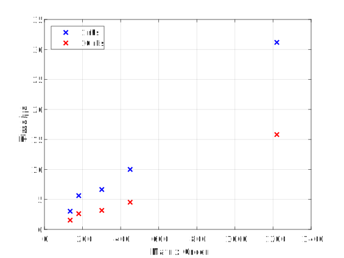
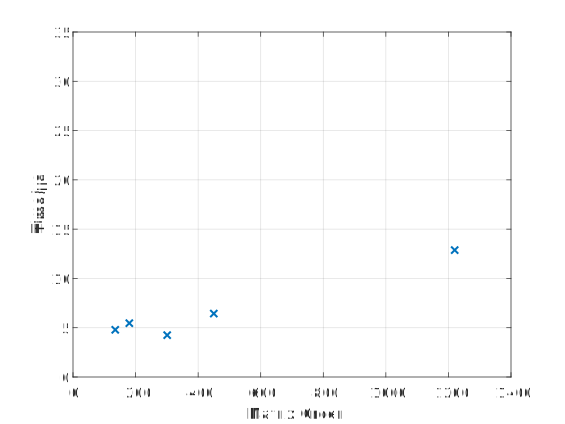

# Acceleration of LU Decomposition on FPGAs

Team Number: xohw22-006
***

## Background
Simulation Program with Integrated Circuit Emphasis or SPICE has now been widely used in the IC design and verification. Solving of sparse matrices often takes up most of the SPICE simulation time. Lower–upper (LU) decomposition is the most commonly used method to solve matrices. It factorizes a matrix into two factors – a lower triangular matrix L and an upper triangular matrix U. In this way, we only need to solve triangular systems to get results. However, the sparse-matrix computation is hard to parallelize on regular processors due to the irregular structure of the matrices. Modern FPGAs, however, have the potential to compute these hard-to-parallelise problems more efficiently due to its flexible reconfigurability.

## Team and Project Information
- University name: the University of Edinburgh
- Supervisor: [Dr Danial Chitnis](https://github.com/danchitnis) (email: [d.chitnis@ed.ac.uk](mailto:d.chitnis@ed.ac.uk))
- Student: [Yichen Zhang](https://github.com/psdzzm) (email: [s2130520@ed.ac.uk](mailto:s2130520@ed.ac.uk))
- Board: Alveo U280 Data Center Accelerator Card
- Software version: v2021.2
- Video link: [https://youtu.be/b9Mz6KtWnw8](https://youtu.be/b9Mz6KtWnw8)
- Report: [report_xohw22-006.pdf](report_xohw22-006.pdf)

## Experimental Results
Matrices used for test
|      Matrix     | Order |  NNZ | Sparsity | Pattern Symmetry | Numeric Symmetry |
|:---------------:|:-----:|:----:|:--------:|:----------------:|:----------------:|
|     rajat11     |  135  |  665 |  3.65\%  |      89.10\%     |       63\%       |
|     rajat14     |  180  | 1475 |  4.55\%  |       100\%      |      2.50\%      |
|     rajat05     |  301  | 1250 |  1.38\%  |       77\%       |      70.60\%     |
| oscil\_dcop\_01 |  430  | 1544 |  0.84\%  |      97.60\%     |      69.80\%     |
|  fpga\_dcop\_01 |  1220 | 5892 |  0.40\%  |      81.80\%     |      27.30\%     |

CPU

FPGA

For smaller matrices, FPGA tends to take longer time to solve per right hand side vectors than CPU. However, when the matrices becomes larger, FPGA tends to be faster than CPU, with a speedup of about 1.2.

## File Organisation
- Matrix_Sample/
  Some matrices used for test.
- myKLU/
  Software version for KLU decomposition
- Vitis/myKLU/host
  Host code for FPGA implementation
- Vitis/myKLU/host
  Kernel code for FPGA implementation

## Build

Board used: Alveo U280 Data Center Accelerator Card

Vitis Version: v2021.2

Instructions to build and test project

For the CPU version:
- Step 1: Go to directory ./myKLU
- Step 2: Check if clang is installed. If not, modify `Makefile` to use appropriate compiler. Typically `GCC` is acceptable.
- Step 3: To make static library only, run `make library`
- Step 4: To run software version of LU decomposition, run `make klu_kernel`. The default matrix file should be put in the same directory as the executable program.
- Step 5: To benchmark it with matrices in directory ../Matrix_Sample, run `make klu_bench`

For the FPGA version:
- Step 1: Import the project to Vitis 2021.2.
- Step 2: Compile the CPU version above first, FPGA version requires the results from CPU version to verify that the results are correct.
- Step 3: Check the host C/C++ build settings. Ensure the include and lib settings are correct. The include path should include the directory of `./myKLU/include` and `./myKLU/myKLU` of the Software version. The lib should include the path of `./myKLU/lib` of the Software version and require the library `libklu.a`, `libamd.a`, `libbtf.a`, and `libsuitesparseconfig.a`.
- Step 4: Build the project.